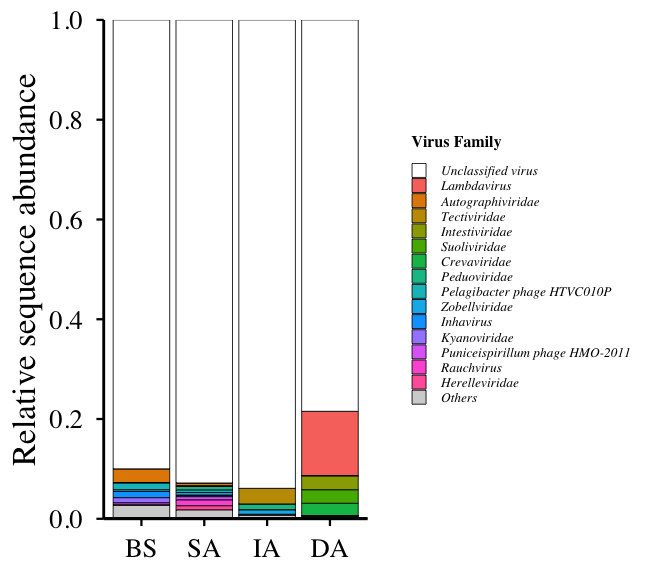
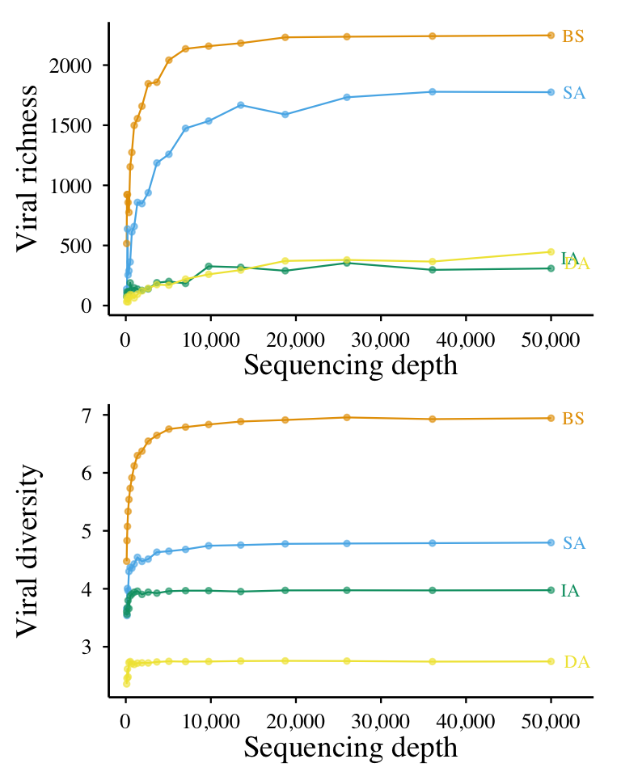
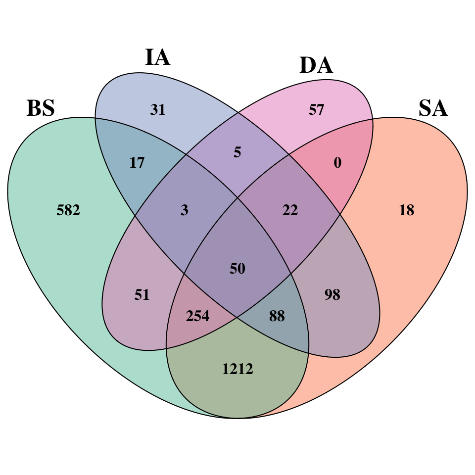
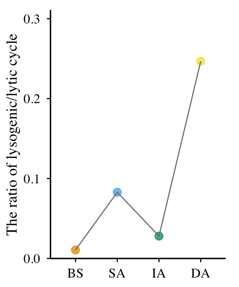
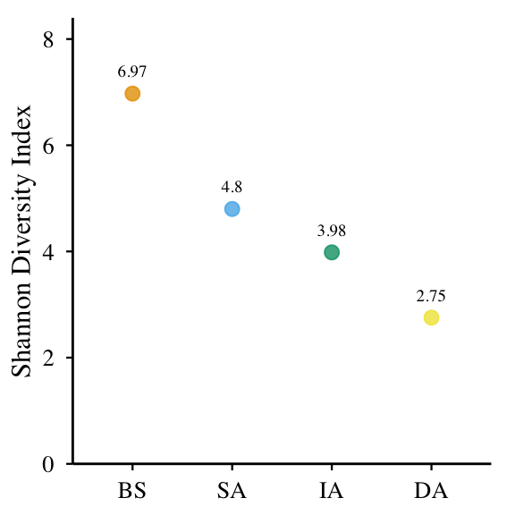
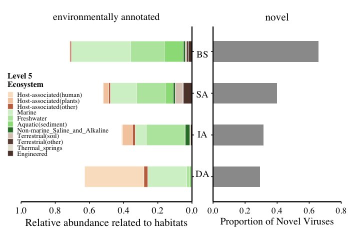
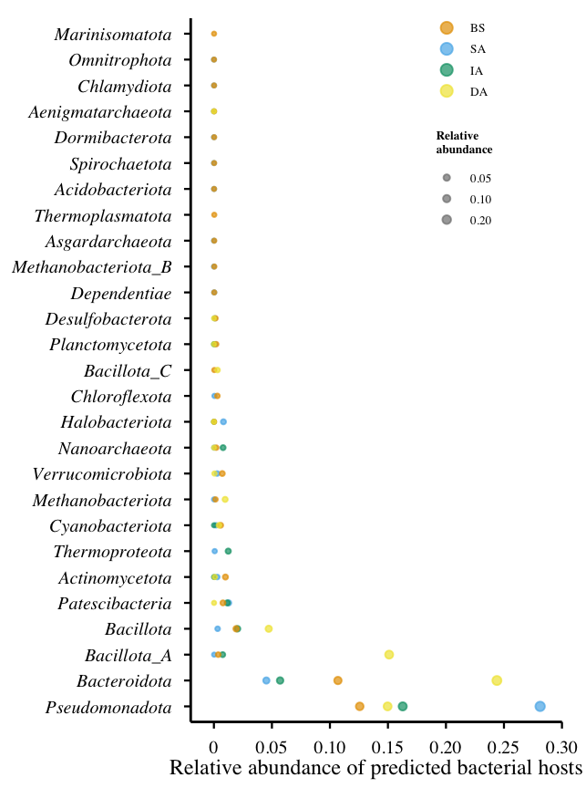

# 02-fig2-viral diversity
Cunli Pan, Jinlong Ru
2025-12-20

- [<span class="toc-section-number">1</span> Tasks](#tasks)
  - [<span class="toc-section-number">1.1</span> Load TSE + Define
    Theme](#load-tse--define-theme)
  - [<span class="toc-section-number">1.2</span> Figure 2a - Viral
    Family Composition](#figure-2a---viral-family-composition)
  - [<span class="toc-section-number">1.3</span> Figure 2b - Rarefaction
    Curves](#figure-2b---rarefaction-curves)
  - [<span class="toc-section-number">1.4</span> Figure 2c - Venn
    Diagram](#figure-2c---venn-diagram)
  - [<span class="toc-section-number">1.5</span> Figure 2d -
    Lysogenic/Lytic Ratio](#figure-2d---lysogeniclytic-ratio)
  - [<span class="toc-section-number">1.6</span> Figure 2e - Shannon
    Diversity Index](#figure-2e---shannon-diversity-index)
  - [<span class="toc-section-number">1.7</span> Figure 2f -
    Environmental Source and Novel Genus
    Proportion](#figure-2f---environmental-source-and-novel-genus-proportion)
  - [<span class="toc-section-number">1.8</span> Figure 2g - Host Phylum
    Prediction](#figure-2g---host-phylum-prediction)

**Updated: 2026-01-29 15:41:00 CET.**

The purpose of this document is to analyze and visualize viral alpha and
beta diversity across different sample groups (depths), utilizing
rarefaction curves, Venn diagrams, and taxonomic composition bar plots
to reveal community structural differences.

<details class="code-fold">
<summary>Code</summary>

``` r
suppressPackageStartupMessages({
  library(here)

  # TreeSE and mia ecosystem
  library(TreeSummarizedExperiment)
  library(mia)
  library(scater)

  # Tidyverse
  library(tidyverse)
  library(data.table)

  # Visualization
  library(ggplot2)
  library(patchwork)
  library(scales)
  library(RColorBrewer)
  library(VennDiagram)
  library(ggrepel)

  # Diversity analysis
  library(vegan)
})

# Load package utility functions
devtools::load_all(here::here())
```

</details>

## Tasks

### Load TSE + Define Theme

<details class="code-fold">
<summary>Code</summary>

``` r
##| label: load-tse
#| message: true

# Load TSE
tse_path <- here("data", "01-tse-construction", "tse.rds")
stopifnot(file.exists(tse_path))
tse <- readRDS(tse_path)

message("✅ TSE loaded: ", nrow(tse), " vOTUs × ", ncol(tse), " samples")
```

</details>

    ✅ TSE loaded: 2488 vOTUs × 4 samples

<details class="code-fold">
<summary>Code</summary>

``` r
# Global color scheme
sample_colors <- c(
  "BS" = "#E69F00",  # Orange
  "SA" = "#56B4E9",  # Light blue
  "IA" = "#009E73",  # Green
  "DA" = "#F0E442"   # Yellow
)

# Consistent theme for all Figure 2 panels
# Using theme_fig2() from R/utils.R
```

</details>

### Figure 2a - Viral Family Composition

<details class="code-fold">
<summary>Code</summary>

``` r
message("📊 Figure 2a: Viral Family Composition")
```

</details>

    📊 Figure 2a: Viral Family Composition

<details class="code-fold">
<summary>Code</summary>

``` r
# Extract data
tpm_mat <- assays(tse)$tpm
family_data <- rowData(tse)$family

# Create long-format data
df_composition <- as.data.frame(tpm_mat) %>%
  rownames_to_column("vOTU_id") %>%
  pivot_longer(-vOTU_id, names_to = "sample_id", values_to = "TPM") %>%
 dplyr::left_join(
    data.frame(vOTU_id = rownames(tse), family = as.character(family_data)),
    by = "vOTU_id"
  ) %>%
 dplyr::left_join(
    data.frame(sample_id = colnames(tse), sample_group = colData(tse)$sample_group),
    by = "sample_id"
  ) %>%
  mutate(
    family = str_remove(family, "^\\[?[Ff]amily\\]?_?"),
    family = if_else(is.na(family) | family == "", "Unclassified virus", family)
  )

# Summarize and select top 15 families
df_summary <- df_composition %>%
  group_by(sample_group, family) %>%
  summarise(TPM = sum(TPM, na.rm = TRUE), .groups = "drop")

top15_families <- df_summary %>%
  group_by(family) %>%
  summarise(total_TPM = sum(TPM), .groups = "drop") %>%
  arrange(desc(total_TPM)) %>%
  slice_head(n = 15) %>%
  pull(family)

# Calculate relative abundance
plot_data <- df_summary %>%
  mutate(family_group = if_else(family %in% top15_families, family, "Others")) %>%
  group_by(sample_group, family_group) %>%
  summarise(TPM = sum(TPM), .groups = "drop") %>%
  group_by(sample_group) %>%
  mutate(rel_abund = TPM / sum(TPM)) %>%
  ungroup()

# Order families
family_order <- plot_data %>%
  filter(!family_group %in% c("Unclassified virus", "Others")) %>%
  group_by(family_group) %>%
  summarise(mean_abund = mean(rel_abund), .groups = "drop") %>%
  arrange(desc(mean_abund)) %>%
  pull(family_group)

family_order <- c("Unclassified virus", family_order, "Others")
plot_data$family_group <- factor(plot_data$family_group, levels = family_order)

# Color scheme
color_list <- c("Unclassified virus" = "white", "Others" = "lightgray")
other_fams <- setdiff(family_order, c("Unclassified virus", "Others"))
palette_colors <- scales::hue_pal()(length(other_fams))
names(palette_colors) <- other_fams
fill_colors <- c(color_list, palette_colors)

# Create plot
p_fig2a <- ggplot(plot_data, aes(x = sample_group, y = rel_abund, fill = family_group)) +
  geom_bar(stat = "identity", color = "black", linewidth = 0.3) +
  geom_hline(yintercept = 0, color = "black", linewidth = 1.2) +
  scale_fill_manual(values = fill_colors) +
  scale_y_continuous(
    limits = c(0, 1),
    breaks = seq(0, 1, 0.2),
    expand = expansion(mult = c(0, 0))
  ) +
  labs(x = NULL, y = "Relative sequence abundance", fill = "Virus Family") +
  theme_fig2() +
  theme(
    axis.title.y = element_text(size = 25, face = "plain"),
    legend.position = "right",
    legend.text = element_text(size = 10, face = "italic"),
    legend.key.size = unit(0.4, "cm"),
    panel.background = element_rect(fill = "white", color = NA),
    plot.background = element_rect(fill = "white", color = NA)
  )

print(p_fig2a)
```

</details>



<details class="code-fold">
<summary>Code</summary>

``` r
# Save
ggsave(path_target("Fig2a.png"), plot = p_fig2a, width = 7, height = 6, dpi = 300)
write_csv(plot_data, path_target("Fig2a_data.csv"))

message("✅ Figure 2a completed")
```

</details>

    ✅ Figure 2a completed

### Figure 2b - Rarefaction Curves

per-group rarefaction curves with end-point labels

<details class="code-fold">
<summary>Code</summary>

``` r
message("📊 Figure 2b: Rarefaction Curves")

# Extract count data
count_mat <- assays(tse)$counts

# Calculate rarefaction curves
# Using calculate_rarefaction() from R/utils.R

# Run rarefaction
rarefaction_data <- calculate_rarefaction(count_mat, n_points = 20, max_depth = 50000)

# Add sample group info
rarefaction_data <- rarefaction_data %>%
  dplyr::left_join(
    data.frame(
      sample_id = colnames(tse),
      sample_group = colData(tse)$sample_group
    ),
    by = "sample_id"
  )

# ===== label positions at the right end =====
label_positions <- rarefaction_data %>%
  dplyr::group_by(sample_group) %>%
  dplyr::filter(sequencing_depth == max(sequencing_depth)) %>%
  dplyr::summarise(
    sequencing_depth  = max(sequencing_depth),
    chao1_richness    = chao1_richness[which.max(sequencing_depth)],
    shannon_diversity = shannon_diversity[which.max(sequencing_depth)],
    .groups = "drop"
  )

# Chao1: vertical offset only for IA / DA
label_positions_chao1 <- label_positions %>%
  dplyr::mutate(
    chao1_y_adj = dplyr::case_when(
      sample_group == "IA" ~ chao1_richness + 0.04 * max(chao1_richness, na.rm = TRUE),
      sample_group == "DA" ~ chao1_richness - 0.04 * max(chao1_richness, na.rm = TRUE),
      TRUE ~ chao1_richness
    )
  )

# ===== Plot 1: Chao1 richness =====
plot_chao1 <- ggplot(
  rarefaction_data,
  aes(
    x = sequencing_depth,
    y = chao1_richness,
    color = sample_group,
    group = sample_group
  )
) +
  geom_line(size = 0.8) +
  geom_point(size = 2, alpha = 0.6) +
  geom_text(
    data = label_positions_chao1,
    aes(
      x = sequencing_depth,
      y = chao1_y_adj,
      label = sample_group,
      color = sample_group
    ),
    hjust = -0.5,
    size = 6,
    family = "Times",
    show.legend = FALSE
  ) +
  scale_color_manual(values = sample_colors, guide = "none") +
  scale_x_continuous(
    limits = c(-2000, max(rarefaction_data$sequencing_depth) * 1.10),
    expand = c(0, 0),
    breaks = c(0, 10000, 20000, 30000, 40000, 50000),
    labels = scales::comma
  ) +
  labs(
    x = "Sequencing depth",
    y = "Viral richness"
  ) +
  theme_fig2() +
  theme(
    axis.title.x = element_text(size = 28, face = "plain"),
     axis.title.y = element_text(size = 28, face = "plain")
  )

# ===== Plot 2: Shannon diversity =====
plot_shannon <- ggplot(
  rarefaction_data,
  aes(
    x = sequencing_depth,
    y = shannon_diversity,
    color = sample_group,
    group = sample_group
  )
) +
  geom_line(size = 0.8) +
  geom_point(size = 2, alpha = 0.6) +
  geom_text(
    data = label_positions,
    aes(
      x = sequencing_depth,
      y = shannon_diversity,
      label = sample_group,
      color = sample_group
    ),
    hjust = -0.5,
    size = 6,
    family = "Times",
    show.legend = FALSE
  ) +
  scale_color_manual(values = sample_colors, guide = "none") +
  scale_x_continuous(
    limits = c(-2000, max(rarefaction_data$sequencing_depth) * 1.10),
    expand = c(0, 0),
    breaks = c(0, 10000, 20000, 30000, 40000, 50000),
    labels = scales::comma
  ) +
  labs(
    x = "Sequencing depth",
    y = "Viral diversity"
  ) +
  theme_fig2() +
  theme(
    axis.title.x = element_text(size = 28, face = "plain"),
     axis.title.y = element_text(size = 28, face = "plain")
  )

# Combine plots
p_fig2b <- plot_chao1 / plot_shannon

print(p_fig2b)
```

</details>



<details class="code-fold">
<summary>Code</summary>

``` r
# Save
ggsave(path_target("Fig2b_combined.png"), plot = p_fig2b, width = 8, height = 10, dpi = 300)
write_csv(rarefaction_data, path_target("Fig2b_rarefaction_data.csv"))

message("✅ Figure 2b completed")
```

</details>

### Figure 2c - Venn Diagram

<details class="code-fold">
<summary>Code</summary>

``` r
message("📊 Figure 2c: Venn Diagram")
```

</details>

    📊 Figure 2c: Venn Diagram

<details class="code-fold">
<summary>Code</summary>

``` r
# Extract TPM data
tpm_mat <- assays(tse)$tpm

# Get viruses present in each sample group (TPM > 0)
# Using get_viruses_by_group() from R/utils.R

sample_groups <- colData(tse)$sample_group
names(sample_groups) <- colnames(tse)

BS_viruses <- get_viruses_by_group(tpm_mat, sample_groups, "BS")
SA_viruses <- get_viruses_by_group(tpm_mat, sample_groups, "SA")
IA_viruses <- get_viruses_by_group(tpm_mat, sample_groups, "IA")
DA_viruses <- get_viruses_by_group(tpm_mat, sample_groups, "DA")

# Calculate shared viruses
all_four <- Reduce(intersect, list(BS_viruses, SA_viruses, IA_viruses, DA_viruses))
sa_ia_da_shared <- Reduce(intersect, list(SA_viruses, IA_viruses, DA_viruses))

# Create Venn diagram
venn_colors <- RColorBrewer::brewer.pal(4, "Set2")

venn.plot <- VennDiagram::venn.diagram(
  x = list(
    BS = BS_viruses,
    SA = SA_viruses,
    IA = IA_viruses,
    DA = DA_viruses
  ),
  category.names = c("BS", "SA", "IA", "DA"),
  filename = NULL,
  fill = venn_colors,
  alpha = 0.5,
  cex = 2,
  fontface = "bold",
  fontfamily = "Times",
  cat.cex = 3,
  cat.fontface = "bold",
  cat.fontfamily = "Times",
  cat.dist = c(0.2, 0.2, 0.1, 0.085),
  lwd = 2,
  lty = 'solid',
  col = "black",
  scaled = TRUE,
  euler.d = TRUE,
  sep.dist = 0.05,
  rotation.degree = 0
)

# Display in RStudio Plots pane
grid::grid.newpage()
grid::grid.draw(venn.plot)
```

</details>



<details class="code-fold">
<summary>Code</summary>

``` r
# Save PNG version
png(path_target("Fig2c_Venn_Diagram.png"), width = 10, height = 10, units = "in", res = 300)
grid::grid.draw(venn.plot)
dev.off()
```

</details>

    quartz_off_screen 
                    2 

<details class="code-fold">
<summary>Code</summary>

``` r
# Save virus lists
write_csv(tibble(vOTU_id = BS_viruses), path_target("Fig2c_BS_viruses.csv"))
write_csv(tibble(vOTU_id = SA_viruses), path_target("Fig2c_SA_viruses.csv"))
write_csv(tibble(vOTU_id = IA_viruses), path_target("Fig2c_IA_viruses.csv"))
write_csv(tibble(vOTU_id = DA_viruses), path_target("Fig2c_DA_viruses.csv"))
write_csv(tibble(vOTU_id = all_four), path_target("Fig2c_all_four_shared.csv"))
write_csv(tibble(vOTU_id = sa_ia_da_shared), path_target("Fig2c_SA_IA_DA_core.csv"))

message("✅ Figure 2c completed (BS:", length(BS_viruses),
        " SA:", length(SA_viruses),
        " IA:", length(IA_viruses),
        " DA:", length(DA_viruses),
        " All 4:", length(all_four), ")")
```

</details>

    ✅ Figure 2c completed (BS:2257 SA:1742 IA:314 DA:442 All 4:50)

### Figure 2d - Lysogenic/Lytic Ratio

<details class="code-fold">
<summary>Code</summary>

``` r
message("📊 Figure 2d: Lysogenic/Lytic Ratio")
```

</details>

    📊 Figure 2d: Lysogenic/Lytic Ratio

<details class="code-fold">
<summary>Code</summary>

``` r
# Extract lifestyle and TPM data
lifestyle_data <- rowData(tse)$lifestyle
tpm_mat <- assays(tse)$tpm

# Create data frame
df_lifestyle <- as.data.frame(tpm_mat) %>%
  rownames_to_column("vOTU_id") %>%
  pivot_longer(-vOTU_id, names_to = "sample_id", values_to = "TPM") %>%
  dplyr::left_join(
    data.frame(
      vOTU_id = rownames(tse),
      lifestyle = as.character(lifestyle_data)
    ),
    by = "vOTU_id"
  ) %>%
  dplyr::left_join(
    data.frame(
      sample_id = colnames(tse),
      sample_group = colData(tse)$sample_group
    ),
    by = "sample_id"
  ) %>%
  mutate(
    lifestyle = recode(lifestyle,
                      "temperate" = "lysogenic",
                      "virulent" = "lytic")
  )

# Calculate total abundance by lifestyle
lifestyle_abundance <- df_lifestyle %>%
  filter(lifestyle %in% c("lysogenic", "lytic")) %>%
  group_by(sample_group, lifestyle) %>%
  summarise(total_abundance = sum(TPM), .groups = "drop")

# Calculate ratio
ratio_data <- lifestyle_abundance %>%
  pivot_wider(names_from = lifestyle, values_from = total_abundance) %>%
  mutate(lysogenic_lytic_ratio = lysogenic / lytic) %>%
  select(sample_group, lysogenic, lytic, lysogenic_lytic_ratio)

# Create plot
p_fig2d <- ggplot(ratio_data, aes(x = sample_group, y = lysogenic_lytic_ratio,
                                   color = sample_group)) +
  geom_point(size = 5, alpha = 0.8) +
  geom_line(aes(group = 1), color = "gray50", size = 0.8, linetype = "solid") +
  scale_y_continuous(
    limits = c(0, max(ratio_data$lysogenic_lytic_ratio) * 1.2),
    breaks = seq(0, 0.4, 0.1),
    expand = expansion(mult = c(0, 0.05))
  ) +
  scale_color_manual(values = sample_colors) +
  labs(
    x = NULL,
    y = "The ratio of lysogenic/lytic cycle"
  ) +
  theme_fig2() +
  theme(legend.position = "none")

print(p_fig2d)
```

</details>



<details class="code-fold">
<summary>Code</summary>

``` r
# Save
ggsave(path_target("Fig2d.png"), plot = p_fig2d, width = 5, height = 6, dpi = 300)
write_csv(ratio_data, path_target("Fig2d_ratio_data.csv"))

message("✅ Figure 2d completed")
```

</details>

    ✅ Figure 2d completed

### Figure 2e - Shannon Diversity Index

<details class="code-fold">
<summary>Code</summary>

``` r
message("📊 Figure 2e: Shannon Diversity Index")
```

</details>

    📊 Figure 2e: Shannon Diversity Index

<details class="code-fold">
<summary>Code</summary>

``` r
# Calculate Shannon diversity using vegan
count_mat <- assays(tse)$counts
count_mat_t <- t(count_mat)  # vegan expects samples in rows

shannon_diversity <- vegan::diversity(count_mat_t, index = "shannon")

# Create data frame
alpha_diversity <- tibble(
  sample_id = names(shannon_diversity),
  shannon = shannon_diversity
) %>%
  dplyr::left_join(
    data.frame(
      sample_id = colnames(tse),
      sample_group = colData(tse)$sample_group
    ),
    by = "sample_id"
  )

# Create plot
p_fig2e <- ggplot(alpha_diversity, aes(x = sample_group, y = shannon,
                                        color = sample_group)) +
  geom_point(size = 5, alpha = 0.8) +
  geom_text(aes(label = round(shannon, 2)), vjust = -1.5, size = 5,
            family = "Times", color = "black") +
  scale_y_continuous(
    limits = c(0, 8),
    expand = expansion(mult = c(0, 0.05))
  ) +
  scale_color_manual(values = sample_colors) +
  labs(
    x = NULL,
    y = "Shannon Diversity Index"
  ) +
  theme_fig2() +
  theme(legend.position = "none")

print(p_fig2e)
```

</details>



<details class="code-fold">
<summary>Code</summary>

``` r
# Save
ggsave(path_target("Fig2e.png"), plot = p_fig2e, width = 6, height = 6, dpi = 300)
write_csv(alpha_diversity, path_target("Fig2e_shannon_data.csv"))

message("✅ Figure 2e completed")
```

</details>

    ✅ Figure 2e completed

### Figure 2f - Environmental Source and Novel Genus Proportion

<details class="code-fold">
<summary>Code</summary>

``` r
message("📊 Figure 2f: Environmental Source and Novel Genus Proportion")
```

</details>

    📊 Figure 2f: Environmental Source and Novel Genus Proportion

<details class="code-fold">
<summary>Code</summary>

``` r
# ========== Left Panel: Ecosystem Classification ==========
# Extract ecosystem and TPM data
eco_data <- rowData(tse)$eco_level5
tpm_mat <- assays(tse)$tpm

# Convert TPM matrix to long format
tpm_long <- as.data.frame(tpm_mat) %>%
  rownames_to_column("vOTU_id") %>%
  pivot_longer(-vOTU_id, names_to = "sample_id", values_to = "TPM")

# Add sample_group info (使用和其他图完全一样的方式)
tpm_long <- tpm_long %>%
  dplyr::left_join(
    data.frame(
      sample_id = colnames(tse),
      sample_group = colData(tse)$sample_group
    ),
    by = "sample_id"
  )

# Calculate total TPM per sample_group (all viruses) - 分母保持不变
sample_total_tpm_all <- tpm_long %>%
  group_by(sample_group) %>%
  summarise(total_tpm_all = sum(TPM, na.rm = TRUE), .groups = "drop")

# 处理生态注释：拆分多重注释并计算权重 (关键修改)
eco_clean <- data.frame(
  vOTU_id = rownames(tse),
  eco_level5 = as.character(eco_data),
  stringsAsFactors = FALSE
) %>%
  filter(!is.na(eco_level5) & eco_level5 != "") %>%
  tidyr::separate_rows(eco_level5, sep = ";") %>%
  mutate(eco_level5 = trimws(eco_level5)) %>%
  # 标准化名称（确保和颜色配置匹配）
  mutate(eco_level5 = dplyr::case_when(
    eco_level5 == "Host-associated:human" ~ "Host-associated(human)",
    eco_level5 == "Host-associated:plants" ~ "Host-associated(plants)",
    eco_level5 == "Host-associated:other" ~ "Host-associated(other)",
    eco_level5 == "Aquatic:sediment" ~ "Aquatic(sediment)",
    eco_level5 == "Terrestrial:soil" ~ "Terrestrial(soil)",
    eco_level5 == "Terrestrial:other" ~ "Terrestrial(other)",
    TRUE ~ eco_level5
  )) %>%
  group_by(vOTU_id) %>%
  mutate(weight = 1 / n()) %>%  # 如果有2个生态系统，每个权重0.5
  ungroup()

# 合并并应用权重
df_eco_weighted <- tpm_long %>%
  dplyr::inner_join(eco_clean, by = "vOTU_id") %>%
  mutate(weighted_TPM = TPM * weight)  # 应用权重

# Calculate TPM per ecosystem (使用加权后的TPM)
abundance_by_eco <- df_eco_weighted %>%
  group_by(sample_group, eco_level5) %>%
  summarise(level5_tpm = sum(weighted_TPM, na.rm = TRUE), .groups = "drop")

# Calculate relative abundance (分母用原来的 total_tpm_all)
abundance_by_eco <- abundance_by_eco %>%
  dplyr::left_join(sample_total_tpm_all, by = "sample_group") %>%
  mutate(relative_abundance = level5_tpm / total_tpm_all)

# Define ecosystem order and colors
level5_order <- c(
  "Host-associated(human)",
  "Host-associated(plants)",
  "Host-associated(other)",
  "Marine",
  "Freshwater",
  "Aquatic(sediment)",
  "Non-marine_Saline_and_Alkaline",
  "Terrestrial(soil)",
  "Terrestrial(other)",
  "Thermal_springs",
  "Engineered"
)

host_colors <- c("#F9E2C8", "#F4CCAC", "#C4714F")
water_colors <- c("#D4F0CD", "#B8E6AD", "#99DD87", "#2E7D32")
terrestrial_colors <- c("#D9C9BD", "#6D4C41")
special_colors <- c("#E8E4D8", "#5D4037")
all_colors <- c(host_colors, water_colors, terrestrial_colors, special_colors)
color_map <- setNames(all_colors, level5_order)

# Prepare plot data
plot_eco <- abundance_by_eco %>%
  mutate(
    sample_group = fct_rev(factor(sample_group, levels = c("BS", "SA", "IA", "DA"))),
    eco_level5 = factor(eco_level5, levels = level5_order)
  )

# Create left panel (ecosystem)
p_left <- ggplot(plot_eco, aes(x = sample_group, y = relative_abundance, fill = eco_level5)) +
  geom_col(position = "stack", width = 0.5, color = "white", linewidth = 0.2) +
  coord_flip() +
  scale_y_reverse(
    limits = c(1, 0),
    breaks = seq(1, 0, -0.2),
    expand = c(0, 0)
  ) +
  scale_x_discrete(position = "top") +
  scale_fill_manual(
    values = color_map,
    name = "Level 5\nEcosystem",
    breaks = level5_order,
    na.value = "grey50"
  ) +
  labs(
    x = NULL,
    y = "Relative abundance related to habitats",
    title = "environmentally annotated"
  ) +
  theme_minimal(base_size = 12) +
  theme(
    text = element_text(family = "Times"),
    axis.text.x = element_text(color = "black", size = 14),
    axis.text.y = element_blank(),
    axis.title.x = element_text(size = 16, face = "plain", hjust = 0.5, vjust = 0.5),
    axis.line.x = element_line(color = "black", linewidth = 0.8),
    axis.line.y = element_line(color = "black", linewidth = 0.8),
    axis.ticks.x = element_line(color = "black"),
    axis.ticks.y = element_line(color = "black"),
    plot.title = element_text(hjust = 0.5, size = 15, face = "plain"),
    legend.position = "left",
    legend.text = element_text(size = 10),
    legend.title = element_text(size = 12, face = "bold"),
    legend.key.size = unit(0.3, "cm"),
    legend.box.margin = margin(r = -150),
    panel.grid = element_blank(),
    plot.margin = unit(c(5, 0, 5, 0), "mm")
  )

# ========== Right Panel: Novel Genus Proportion ==========
# Extract novel genus data
novel_data <- rowData(tse)$vc_novel_genus

# Calculate novel proportion per sample_group
df_novel <- as.data.frame(tpm_mat) %>%
  rownames_to_column("vOTU_id") %>%
  pivot_longer(-vOTU_id, names_to = "sample_id", values_to = "TPM") %>%
  dplyr::left_join(
    data.frame(
      vOTU_id = rownames(tse),
      vc_novel_genus = as.logical(novel_data)
    ),
    by = "vOTU_id"
  ) %>%
  dplyr::left_join(
    data.frame(
      sample_id = colnames(tse),
      sample_group = colData(tse)$sample_group
    ),
    by = "sample_id"
  )

# Calculate novel ratio
novel_ratio <- df_novel %>%
  group_by(sample_group) %>%
  summarise(
    total_TPM = sum(TPM, na.rm = TRUE),
    novel_TPM = sum(TPM[vc_novel_genus == TRUE], na.rm = TRUE),
    novel_ratio = novel_TPM / total_TPM,
    .groups = "drop"
  ) %>%
  mutate(sample_group = fct_rev(factor(sample_group, levels = c("BS", "SA", "IA", "DA"))))

# Create right panel (novel proportion)
p_right <- ggplot(novel_ratio, aes(x = novel_ratio, y = sample_group)) +
  geom_col(fill = "#7F7F7F", alpha = 0.8, width = 0.5) +
  scale_x_continuous(
    limits = c(0, 0.8),
    breaks = seq(0, 0.8, 0.2),
    expand = c(0, 0)
  ) +
  scale_y_discrete(limits = levels(novel_ratio$sample_group)) +
  coord_cartesian(clip = "off") +
  labs(
    x = "Proportion of Novel Viruses",
    y = NULL,
    title = "novel"
  ) +
  theme_minimal(base_size = 12) +
  theme(
    text = element_text(family = "Times"),
    axis.line.x = element_line(linewidth = 0.8, color = "black"),
    axis.line.y = element_line(linewidth = 0.8, color = "black"),
    axis.ticks.x = element_line(color = "black"),
    axis.ticks.y = element_line(color = "black"),
    axis.text.y = element_blank(),
    axis.text.x = element_text(color = "black", size = 13),
    axis.title.x = element_text(size = 15, face = "plain", hjust = 0.5),
    plot.title = element_text(hjust = 0.5, size = 16, face = "plain"),
    panel.grid = element_blank(),
    plot.margin = unit(c(5, 8, 5, 0), "mm")
  )

# ========== Y-axis Labels (Middle) ==========
y_axis_labels <- data.frame(
  label = c("BS", "SA", "IA", "DA"),
  y_pos = c(4, 3, 2, 1)
)

p_yaxis <- ggplot(y_axis_labels, aes(x = 0.5, y = y_pos, label = label)) +
  geom_text(size = 5, hjust = 0.5, family = "Times") +
  scale_y_continuous(limits = c(0.5, 4.5)) +
  scale_x_continuous(limits = c(0, 1)) +
  theme_void() +
  theme(plot.margin = unit(c(0, 0, 0, 0), "mm"))

# Combine Panels
p_fig2f <- p_left + p_yaxis + p_right + plot_layout(widths = c(2.0, 0.2, 1.5))

print(p_fig2f)
```

</details>



<details class="code-fold">
<summary>Code</summary>

``` r
# Save
ggsave(path_target("Fig2f_combined.png"), plot = p_fig2f, width = 7.8, height = 5, dpi = 300, bg = "white")
write_csv(plot_eco, path_target("Fig2f_ecosystem_data.csv"))
write_csv(novel_ratio, path_target("Fig2f_novel_ratio_data.csv"))

message("✅ Figure 2f completed")
```

</details>

    ✅ Figure 2f completed

### Figure 2g - Host Phylum Prediction

<details class="code-fold">
<summary>Code</summary>

``` r
message("📊 Figure 2g: Predicted Host Bacteria (Phylum Level)")
```

</details>

    📊 Figure 2g: Predicted Host Bacteria (Phylum Level)

<details class="code-fold">
<summary>Code</summary>

``` r
# Extract host prediction data from metadata
host_genome_edges <- metadata(tse)$host_genome_edges

# Filter high-confidence predictions (>= 80)
host_filtered <- host_genome_edges %>%
  filter(Confidence.score >= 80) %>%
  mutate(
    Phylum = stringr::str_extract(Host.taxonomy, "(?<=p__)[^;]+"),
    Phylum = if_else(is.na(Phylum), "Unclassified", Phylum)
  )

cat("High-confidence host predictions:", nrow(host_filtered), "rows\n")
```

</details>

    High-confidence host predictions: 4179 rows

<details class="code-fold">
<summary>Code</summary>

``` r
cat("Unique vOTUs:", dplyr::n_distinct(host_filtered$vOTU_id), "\n")
```

</details>

    Unique vOTUs: 720 

<details class="code-fold">
<summary>Code</summary>

``` r
cat("Unique phyla:", dplyr::n_distinct(host_filtered$Phylum), "\n")
```

</details>

    Unique phyla: 27 

<details class="code-fold">
<summary>Code</summary>

``` r
# Handle multi-host viruses (weight by 1/n_hosts)
host_count <- host_filtered %>%
  group_by(vOTU_id) %>%
  summarise(n_hosts = dplyr::n_distinct(Phylum), .groups = "drop")

host_weighted <- host_filtered %>%
  dplyr::left_join(host_count, by = "vOTU_id") %>%
  mutate(weight = 1 / n_hosts) %>%
  select(vOTU_id, Phylum, weight) %>%
  distinct()

# Map virus TPM to host phylum
tpm_mat <- assays(tse)$tpm

tpm_long <- as.data.frame(tpm_mat) %>%
  rownames_to_column("vOTU_id") %>%
  pivot_longer(-vOTU_id, names_to = "sample_id", values_to = "TPM") %>%
  filter(TPM > 0)

host_abundance <- tpm_long %>%
  dplyr::inner_join(host_weighted, by = "vOTU_id") %>%
  mutate(weighted_TPM = TPM * weight)
```

</details>

    Warning in dplyr::inner_join(., host_weighted, by = "vOTU_id"): Detected an unexpected many-to-many relationship between `x` and `y`.
    ℹ Row 355 of `x` matches multiple rows in `y`.
    ℹ Row 768 of `y` matches multiple rows in `x`.
    ℹ If a many-to-many relationship is expected, set `relationship =
      "many-to-many"` to silence this warning.

<details class="code-fold">
<summary>Code</summary>

``` r
# Calculate phylum-level abundance
phylum_abundance <- host_abundance %>%
  group_by(sample_id, Phylum) %>%
  summarise(phylum_TPM = sum(weighted_TPM), .groups = "drop")

# Calculate total TPM per sample (all viruses)
sample_total_tpm <- tpm_long %>%
  group_by(sample_id) %>%
  summarise(total_TPM = sum(TPM), .groups = "drop")

# Calculate relative abundance
phylum_rel_abundance <- phylum_abundance %>%
  dplyr::left_join(sample_total_tpm, by = "sample_id") %>%
  mutate(rel_abundance = phylum_TPM / total_TPM) %>%
  select(sample_id, Phylum, rel_abundance)

# Add sample group labels
phylum_rel_abundance <- phylum_rel_abundance %>%
  dplyr::left_join(
    data.frame(
      sample_id = colnames(tse),
      sample_group = colData(tse)$sample_group
    ),
    by = "sample_id"
  )

# Prepare plot data (filter low abundance phyla)
plot_data <- phylum_rel_abundance %>%
  group_by(Phylum) %>%
  mutate(max_abundance = max(rel_abundance)) %>%
  ungroup() %>%
  filter(max_abundance > 0.0001) %>%
  select(-max_abundance)

# Order phyla by total abundance
phylum_order <- plot_data %>%
  group_by(Phylum) %>%
  summarise(total = sum(rel_abundance), .groups = "drop") %>%
  arrange(desc(total)) %>%
  pull(Phylum)

plot_data <- plot_data %>%
  mutate(
    Phylum = factor(Phylum, levels = phylum_order),
    sample_group = factor(sample_group, levels = c("BS", "SA", "IA", "DA"))
  )

# Create plot
p_fig2g <- ggplot(plot_data, aes(x = rel_abundance, y = Phylum)) +
  geom_point(aes(color = sample_group, size = rel_abundance), alpha = 0.7) +
  scale_color_manual(
    values = sample_colors,
    name = NULL,
    guide = guide_legend(override.aes = list(size = 4), order = 1)
  ) +
  scale_size_continuous(
    range = c(1, 3),
    name = "Relative\nabundance",
    breaks = c(0.05, 0.1, 0.2, 0.3),
    labels = c("0.05", "0.10", "0.20", "0.30"),
    guide = guide_legend(order = 2, override.aes = list(color = "grey50"))
  ) +
  scale_x_continuous(
    breaks = seq(0, 0.30, 0.05),
    labels = c("0", "0.05", "0.10", "0.15", "0.20", "0.25", "0.30"),
    expand = c(0, 0),
    limits = c(-0.02, 0.30)
  ) +
  labs(
    x = "Relative abundance of predicted bacterial hosts",
    y = NULL
  ) +
  theme_fig2() +
  theme(
    axis.text.y = element_text(face = "italic", size = 15),
    axis.text.x = element_text(size = 15),
    axis.title.x = element_text(size = 18),
    legend.position = c(0.85, 0.85),
    legend.justification = c(1, 0.5),
    legend.background = element_blank(),
    legend.key = element_blank(),
    legend.text = element_text(size = 10),
    legend.title = element_text(size = 10, face = "bold"),
    legend.spacing.y = unit(0.05, "cm"),
    legend.box = "vertical",
    legend.box.spacing = unit(0.3, "cm")
  )

print(p_fig2g)
```

</details>



<details class="code-fold">
<summary>Code</summary>

``` r
# Save plot
ggsave(path_target("Fig2g.png"), plot = p_fig2g, width = 6.7, height = 9, dpi = 300)
write_csv(plot_data, path_target("Fig2g_host_phylum_data.csv"))

# Create Table S1 (wide format)
table_s1 <- phylum_rel_abundance %>%
  select(Phylum, sample_group, rel_abundance) %>%
  pivot_wider(names_from = sample_group, values_from = rel_abundance, values_fill = 0) %>%
  arrange(desc(BS + SA + IA + DA)) %>%
  select(Phylum, BS, SA, IA, DA)

write_csv(table_s1, path_target("Fig2g_Table_S1_host_phylum_abundance.csv"))

message("✅ Figure 2g completed")
```

</details>

    ✅ Figure 2g completed
