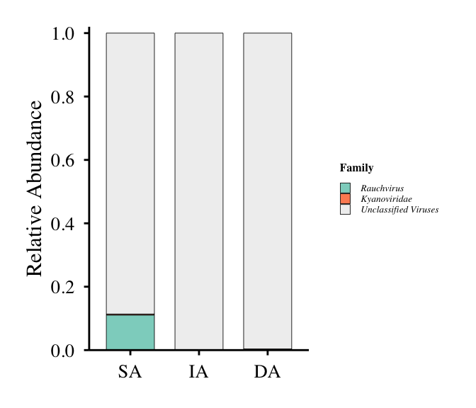
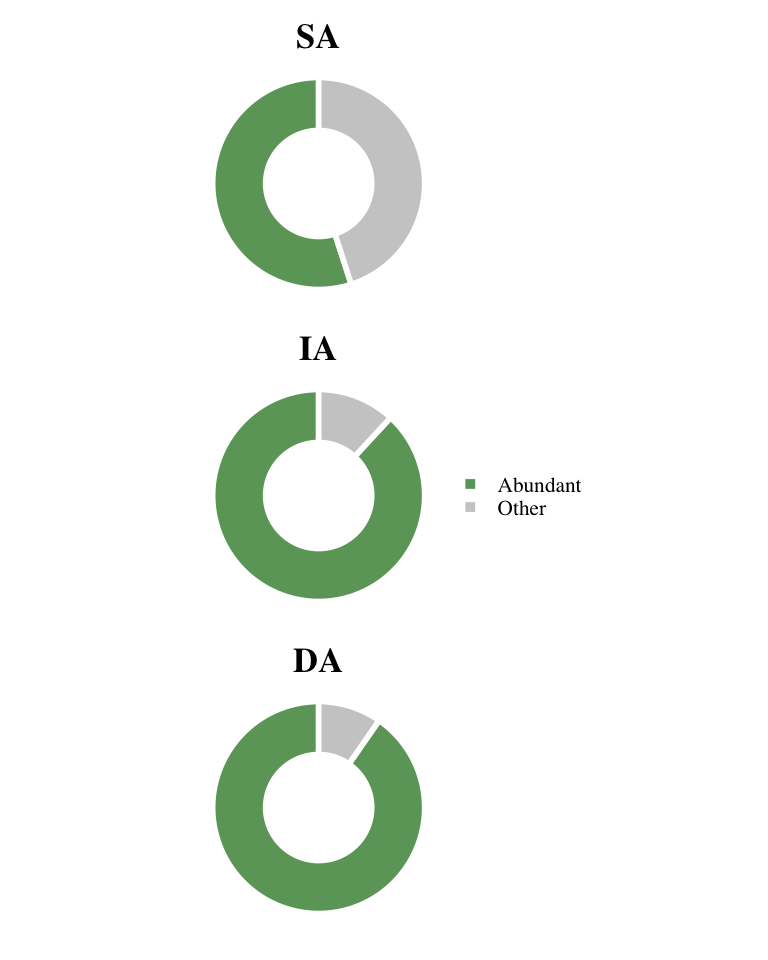

# 03-fig3-core-virome
Cunli Pan, Jinlong Ru
2025-12-20

- [<span class="toc-section-number">1</span> Tasks](#tasks)
  - [<span class="toc-section-number">1.1</span> Task Load
    Data](#task-load-data)
  - [<span class="toc-section-number">1.2</span> Figure 3a: Core Viral
    Family Composition](#figure-3a-core-viral-family-composition)
    - [<span class="toc-section-number">1.2.1</span> Identify Core vOTUs
      and Prepare Data](#identify-core-votus-and-prepare-data)
    - [<span class="toc-section-number">1.2.2</span> Create
      Plot](#create-plot)
  - [<span class="toc-section-number">1.3</span> Figure 3b: Abundant
    Viruses in Core Group](#figure-3b-abundant-viruses-in-core-group)
    - [<span class="toc-section-number">1.3.1</span> Identify Abundant
      vOTUs and Calculate
      Proportions](#identify-abundant-votus-and-calculate-proportions)
    - [<span class="toc-section-number">1.3.2</span> Create Donut
      Chart](#create-donut-chart)

**Updated: 2026-01-29 15:42:25 CET.**

The purpose of this document is to identify and characterize the “core
virome”—viral populations shared across different sample groups and
depths—quantifying their persistent presence and relative abundance
within the aquifer ecosystem.

<details class="code-fold">
<summary>Code</summary>

``` r
suppressPackageStartupMessages({
  library(here)
  library(projthis)
  library(tidyverse)
  library(TreeSummarizedExperiment)
  library(mia)
  library(scales)
  library(RColorBrewer)
})

# Load package utility functions
devtools::load_all(here::here())
```

</details>

## Tasks

### Task Load Data

<details class="code-fold">
<summary>Code</summary>

``` r
# Load TSE
tse <- readRDS(path_source("01-tse-construction", "tse.rds"))

message("✅ TSE loaded: ", nrow(tse), " vOTUs × ", ncol(tse), " samples")
```

</details>

    ✅ TSE loaded: 2488 vOTUs × 4 samples

<details class="code-fold">
<summary>Code</summary>

``` r
message("   Sample groups: ", paste(levels(colData(tse)$sample_group), collapse = ", "))
```

</details>

       Sample groups: BS, SA, IA, DA

### Figure 3a: Core Viral Family Composition

#### Identify Core vOTUs and Prepare Data

<details class="code-fold">
<summary>Code</summary>

``` r
cat("========================================================================\n")
```

</details>

    ========================================================================

<details class="code-fold">
<summary>Code</summary>

``` r
cat("Figure 3a: Core Viral Community Composition\n")
```

</details>

    Figure 3a: Core Viral Community Composition

<details class="code-fold">
<summary>Code</summary>

``` r
cat("========================================================================\n\n")
```

</details>

    ========================================================================

<details class="code-fold">
<summary>Code</summary>

``` r
# Extract TPM assay
tpm_assay <- assay(tse, "tpm")

# Identify vOTUs present in each group (TPM > 0)
SA_viruses <- rownames(tpm_assay)[tpm_assay[, colData(tse)$sample_group == "SA"] > 0]
IA_viruses <- rownames(tpm_assay)[tpm_assay[, colData(tse)$sample_group == "IA"] > 0]
DA_viruses <- rownames(tpm_assay)[tpm_assay[, colData(tse)$sample_group == "DA"] > 0]

# Core vOTUs: SA ∩ IA ∩ DA
core_viruses <- Reduce(base::intersect, list(SA_viruses, IA_viruses, DA_viruses))

cat("Core vOTUs (SA ∩ IA ∩ DA):", length(core_viruses), "\n\n")
```

</details>

    Core vOTUs (SA ∩ IA ∩ DA): 72 

<details class="code-fold">
<summary>Code</summary>

``` r
# Subset TSE to core vOTUs and SA/IA/DA samples
tse_core <- tse[core_viruses, colData(tse)$sample_group %in% c("SA", "IA", "DA")]

# Clean family annotation
rowData(tse_core)$family_clean <- rowData(tse_core)$family %>%
  str_remove("^\\[.*?\\]_?") %>%
  str_trim() %>%
  replace_na("Unclassified Viruses") %>%
  if_else(. == "" | . == "NA", "Unclassified Viruses", .)

# Calculate family-level relative abundance
tpm_core <- assay(tse_core, "tpm")

family_rel_abundance <- as.data.frame(tpm_core) %>%
  rownames_to_column("vOTU_id") %>%
  pivot_longer(-vOTU_id, names_to = "sample_id", values_to = "TPM") %>%
  dplyr::left_join(
    rowData(tse_core) %>%
      as.data.frame() %>%
      rownames_to_column("vOTU_id") %>%
      dplyr::select(vOTU_id, family_clean),
    by = "vOTU_id"
  ) %>%
  dplyr::left_join(
    colData(tse_core) %>%
      as.data.frame() %>%
      rownames_to_column("sample_id") %>%
      dplyr::select(sample_id, sample_group),
    by = "sample_id"
  ) %>%
  group_by(sample_group, family_clean) %>%
  summarise(family_TPM = sum(TPM), .groups = "drop") %>%
  group_by(sample_group) %>%
  mutate(rel_abundance = family_TPM / sum(family_TPM)) %>%
  ungroup() %>%
  dplyr::select(sample_group, family_clean, rel_abundance)

message("✅ Data prepared for plotting")
```

</details>

    ✅ Data prepared for plotting

#### Create Plot

<details class="code-fold">
<summary>Code</summary>

``` r
# Order families by total abundance
family_order <- family_rel_abundance %>%
  group_by(family_clean) %>%
  summarise(total = sum(rel_abundance), .groups = "drop") %>%
  arrange(desc(total)) %>%
  pull(family_clean)

# Put Unclassified at end
if ("Unclassified Viruses" %in% family_order) {
  family_order <- c(setdiff(family_order, "Unclassified Viruses"), "Unclassified Viruses")
}

# Prepare plot data
plot_data <- family_rel_abundance %>%
  mutate(
    family_clean = factor(family_clean, levels = rev(family_order)),
    sample_group = factor(sample_group, levels = c("SA", "IA", "DA"))
  )

# Generate colors
n_families <- length(family_order)
if (n_families <= 12) {
  colors <- brewer.pal(max(3, n_families), "Set3")[1:n_families]
} else {
  colors <- colorRampPalette(brewer.pal(12, "Set3"))(n_families)
}
names(colors) <- family_order

# Special colors
if ("Unclassified Viruses" %in% family_order) colors["Unclassified Viruses"] <- "#F0F0F0"
if ("Rauchovirus" %in% family_order) colors["Rauchovirus"] <- "#8DA0CB"
if ("Kyanoviridae" %in% family_order) colors["Kyanoviridae"] <- "#FC8D62"

# Create plot
p_fig3a <- ggplot(plot_data, aes(x = sample_group, y = rel_abundance, fill = family_clean)) +
  geom_bar(stat = "identity", position = "stack", width = 0.7, color = "black", linewidth = 0.3) +
  scale_fill_manual(values = colors, name = "Family", breaks = family_order) +
  scale_y_continuous(
    labels = function(x) sprintf("%.1f", x),
    limits = c(0, 1),
    breaks = seq(0, 1, 0.2),
    expand = expansion(mult = c(0, 0.02))
  ) +
  labs(x = NULL, y = "Relative Abundance") +
  theme_minimal(base_size = 22) +
  theme(
    text = element_text(family = "Times"),
    axis.text.x = element_text(color = "black", size = 20),
    axis.text.y = element_text(color = "black", size = 20),
    axis.title.y = element_text(size = 23, face = "plain"),
    axis.line = element_line(color = "black"),
    axis.ticks = element_line(color = "black"),
    legend.position = "right",
    legend.text = element_text(size = 10, face = "italic"),
    legend.title = element_text(size = 12, face = "bold"),
    legend.key.size = unit(0.4, "cm"),
    panel.grid = element_blank(),
    panel.border = element_blank(),
    plot.margin = unit(c(10, 10, 10, 10), "mm"),
    panel.background = element_rect(fill = "white", color = NA),
    plot.background = element_rect(fill = "white", color = NA)
  )

print(p_fig3a)
```

</details>



<details class="code-fold">
<summary>Code</summary>

``` r
# Save
ggsave(path_target("Fig3a.png"), plot = p_fig3a, width = 7, height = 6, dpi = 300)
write_csv(tibble(vOTU_id = core_viruses), path_target("Fig3a_core_vOTUs.csv"))
write_csv(family_rel_abundance, path_target("Fig3a_family_composition.csv"))

message("✅ Figure 3a completed!")
```

</details>

    ✅ Figure 3a completed!

### Figure 3b: Abundant Viruses in Core Group

#### Identify Abundant vOTUs and Calculate Proportions

<details class="code-fold">
<summary>Code</summary>

``` r
cat("\n========================================================================\n")
```

</details>


    ========================================================================

<details class="code-fold">
<summary>Code</summary>

``` r
cat("Figure 3b: Abundant Viruses in Core Group\n")
```

</details>

    Figure 3b: Abundant Viruses in Core Group

<details class="code-fold">
<summary>Code</summary>

``` r
cat("========================================================================\n\n")
```

</details>

    ========================================================================

<details class="code-fold">
<summary>Code</summary>

``` r
# Calculate relative abundance per sample (all vOTUs)
tpm_all <- assay(tse, "tpm")

abundance_rel <- as.data.frame(tpm_all) %>%
  rownames_to_column("vOTU_id") %>%
  pivot_longer(-vOTU_id, names_to = "sample_id", values_to = "tpm") %>%
  group_by(sample_id) %>%
  mutate(rel_abundance = tpm / sum(tpm)) %>%
  ungroup()

# Identify abundant vOTUs (≥1% in any sample)
abundant_vOTUs <- abundance_rel %>%
  dplyr::filter(rel_abundance >= 0.01) %>%
  pull(vOTU_id) %>%
  unique()

# Core & Abundant intersection
core_abundant <- base::intersect(core_viruses, abundant_vOTUs)

cat("Core vOTUs:", length(core_viruses), "\n")
```

</details>

    Core vOTUs: 72 

<details class="code-fold">
<summary>Code</summary>

``` r
cat("Abundant vOTUs (≥1%):", length(abundant_vOTUs), "\n")
```

</details>

    Abundant vOTUs (≥1%): 60 

<details class="code-fold">
<summary>Code</summary>

``` r
cat("Core & Abundant:", length(core_abundant), "\n\n")
```

</details>

    Core & Abundant: 17 

<details class="code-fold">
<summary>Code</summary>

``` r
# Calculate proportions by sample group
prop_data <- tibble()
detailed_stats <- tibble()

for (group in c("SA", "IA", "DA")) {
  sample_ids <- rownames(colData(tse))[colData(tse)$sample_group == group]

  # Total TPM of core vOTUs
  core_total <- sum(tpm_all[core_viruses, sample_ids])

  # TPM of abundant & core vOTUs
  abundant_core_in_group <- core_abundant[rowSums(tpm_all[core_abundant, sample_ids, drop = FALSE] > 0) > 0]
  abundant_total <- sum(tpm_all[abundant_core_in_group, sample_ids])

  # Calculate percentage
  abundant_pct <- (abundant_total / core_total) * 100

  cat(sprintf("%s: %.2f%% (%d vOTUs)\n", group, abundant_pct, length(abundant_core_in_group)))

  # Store data
  prop_data <- bind_rows(
    prop_data,
    tibble(
      sample = group,
      category = c("Abundant", "Other"),
      proportion = c(abundant_pct, 100 - abundant_pct)
    )
  )

  detailed_stats <- bind_rows(
    detailed_stats,
    tibble(
      Sample = group,
      Core_vOTUs = length(core_viruses),
      Abundant_Core_vOTUs = length(abundant_core_in_group),
      Percent = round(abundant_pct, 2)
    )
  )
}
```

</details>

    SA: 54.97% (17 vOTUs)
    IA: 88.13% (17 vOTUs)
    DA: 90.34% (17 vOTUs)

<details class="code-fold">
<summary>Code</summary>

``` r
cat("\n")
```

</details>

#### Create Donut Chart

<details class="code-fold">
<summary>Code</summary>

``` r
prop_data <- prop_data %>%
  mutate(
    sample = factor(sample, levels = c("SA", "IA", "DA")),
    category = factor(category, levels = c("Abundant", "Other"))
  )

p_fig3b <- ggplot(prop_data, aes(x = 2, y = proportion, fill = category)) +
  geom_bar(stat = "identity", width = 1, color = "white", linewidth = 2) +
  coord_polar(theta = "y") +
  xlim(0.5, 2.5) +
  facet_wrap(~sample, nrow = 3) +
  scale_fill_manual(
    values = c("Abundant" = "#6BA368", "Other" = "#CCCCCC"),
    name = NULL
  ) +
  theme_void(base_size = 24) +
  theme(
    text = element_text(family = "Times", size = 18),
    strip.text = element_text(size = 26, face = "bold", color = "black"),
    legend.position = "right",
    legend.text = element_text(size = 16),
    legend.title = element_text(size = 16, face = "bold"),
    plot.margin = margin(15, 15, 15, 15)
  )

print(p_fig3b)
```

</details>



<details class="code-fold">
<summary>Code</summary>

``` r
# Save
ggsave(path_target("Fig3b.png"), plot = p_fig3b, width = 8, height = 10, dpi = 300)
write_csv(prop_data, path_target("Fig3b_proportions.csv"))
write_csv(detailed_stats, path_target("Fig3b_statistics.csv"))
write_csv(tibble(vOTU_id = core_abundant), path_target("Fig3b_core_abundant_vOTUs.csv"))

message("✅ Figure 3b completed!")
```

</details>

    ✅ Figure 3b completed!
