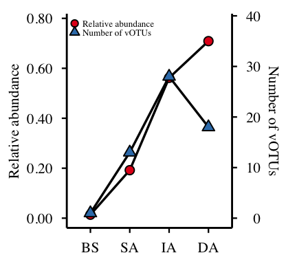
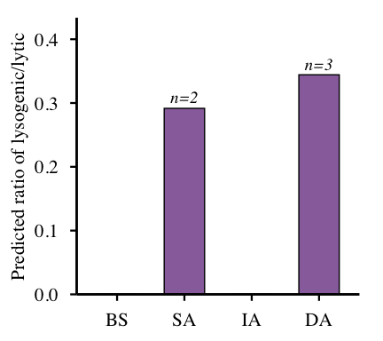
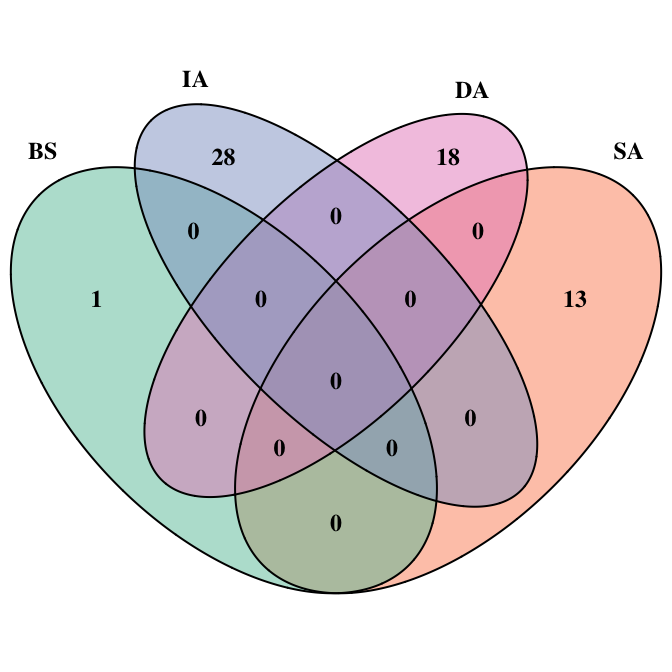
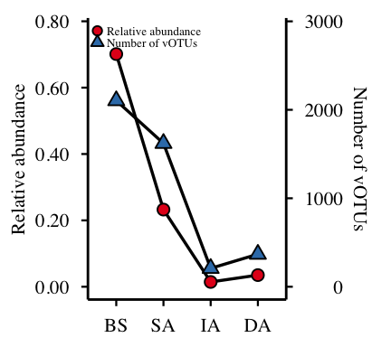
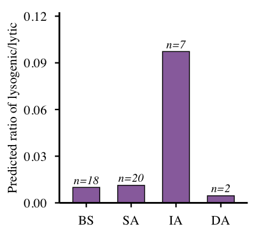
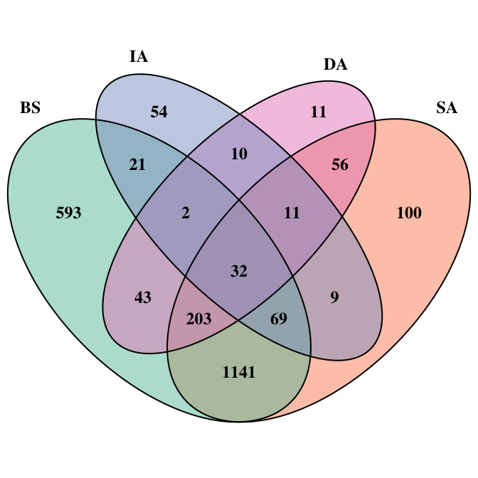

# 04-fig4-abundant-rare-viral
Cunli Pan, Jinlong Ru
2025-12-20

- [<span class="toc-section-number">0.1</span> Load Data](#load-data)
- [<span class="toc-section-number">0.2</span> Prepare Abundance
  Data](#prepare-abundance-data)
- [<span class="toc-section-number">0.3</span> Figure 4a-c: Abundant
  Viruses (≥0.01)](#figure-4a-c-abundant-viruses-001)
  - [<span class="toc-section-number">0.3.1</span> Identify Abundant
    vOTUs](#identify-abundant-votus)
  - [<span class="toc-section-number">0.3.2</span> Fig 4a: Abundance and
    Count](#fig-4a-abundance-and-count)
  - [<span class="toc-section-number">0.3.3</span> Fig 4b:
    Lysogenic/Lytic Ratio](#fig-4b-lysogeniclytic-ratio)
  - [<span class="toc-section-number">0.3.4</span> Fig 4c: Venn
    Diagram](#fig-4c-venn-diagram)
- [<span class="toc-section-number">0.4</span> Figure 4d-f: Rare Viruses
  (\<0.001)](#figure-4d-f-rare-viruses-0001)
- [<span class="toc-section-number">0.5</span> Identify Rare
  vOTUs](#identify-rare-votus)
  - [<span class="toc-section-number">0.5.1</span> Fig 4d: Abundance and
    Count](#fig-4d-abundance-and-count)
  - [<span class="toc-section-number">0.5.2</span> Fig 4e:
    Lysogenic/Lytic Ratio](#fig-4e-lysogeniclytic-ratio)
  - [<span class="toc-section-number">0.5.3</span> Fig 4f: Venn
    Diagram](#fig-4f-venn-diagram)
- [<span class="toc-section-number">0.6</span> Combine Fig4a–c and
  Fig4d–f](#combine-fig4ac-and-fig4df)

**Updated: 2026-01-29 15:42:50 CET.**

The purpose of this document is to partition the viral community into
abundant and rare sub-communities, investigating their distinct
ecological distributions and contribution to the total viral diversity.

<details class="code-fold">
<summary>Code</summary>

``` r
suppressPackageStartupMessages({
  library(here)
  library(projthis)
  library(tidyverse)
  library(TreeSummarizedExperiment)
  library(mia)
  library(VennDiagram)
  library(RColorBrewer)
  library(cowplot)
  library(grid)
  library(gridExtra)
})

# Load package utility functions
devtools::load_all(here::here())

options(dplyr.summarise.inform = FALSE)
```

</details>

### Load Data

<details class="code-fold">
<summary>Code</summary>

``` r
# Load TSE
tse <- readRDS(path_source("01-tse-construction", "tse.rds"))

message("✅ TSE loaded: ", nrow(tse), " vOTUs × ", ncol(tse), " samples")
```

</details>

    ✅ TSE loaded: 2488 vOTUs × 4 samples

<details class="code-fold">
<summary>Code</summary>

``` r
message("   Sample groups: ", paste(levels(colData(tse)$sample_group), collapse = ", "))
```

</details>

       Sample groups: BS, SA, IA, DA

### Prepare Abundance Data

<details class="code-fold">
<summary>Code</summary>

``` r
cat("========================================================================\n")
```

</details>

    ========================================================================

<details class="code-fold">
<summary>Code</summary>

``` r
cat("PREPARING ABUNDANCE DATA\n")
```

</details>

    PREPARING ABUNDANCE DATA

<details class="code-fold">
<summary>Code</summary>

``` r
cat("========================================================================\n\n")
```

</details>

    ========================================================================

<details class="code-fold">
<summary>Code</summary>

``` r
# Extract TPM assay
tpm_assay <- assay(tse, "tpm")

# Calculate relative abundance per sample
abundance_long <- as.data.frame(tpm_assay) %>%
  rownames_to_column("vOTU_id") %>%
  pivot_longer(-vOTU_id, names_to = "sample_id", values_to = "TPM") %>%
  dplyr::left_join(
    colData(tse) %>%
      as.data.frame() %>%
      rownames_to_column("sample_id") %>%
      dplyr::select(sample_id, sample_group),
    by = "sample_id"
  )

# Calculate total TPM per sample group
sample_totals <- abundance_long %>%
  group_by(sample_group) %>%
  summarise(total_TPM = sum(TPM), .groups = "drop")

# Calculate relative abundance (%)
abundance_rel <- abundance_long %>%
  dplyr::left_join(sample_totals, by = "sample_group") %>%
  mutate(rel_abundance = (TPM / total_TPM) )

message("✅ Abundance data prepared\n")
```

</details>

    ✅ Abundance data prepared

### Figure 4a-c: Abundant Viruses (≥0.01)

#### Identify Abundant vOTUs

<details class="code-fold">
<summary>Code</summary>

``` r
cat("========================================================================\n")
```

</details>

    ========================================================================

<details class="code-fold">
<summary>Code</summary>

``` r
cat("FIGURE 4a-c: ABUNDANT VIRAL GROUPS (≥1%)\n")
```

</details>

    FIGURE 4a-c: ABUNDANT VIRAL GROUPS (≥1%)

<details class="code-fold">
<summary>Code</summary>

``` r
cat("========================================================================\n\n")
```

</details>

    ========================================================================

<details class="code-fold">
<summary>Code</summary>

``` r
# Identify abundant vOTUs (≥1% per sample)
abundant_vOTUs <- abundance_rel %>%
  dplyr::filter(rel_abundance >= 0.01) %>%
  dplyr::select(sample_group, vOTU_id, rel_abundance) %>%
  arrange(sample_group, desc(rel_abundance))

cat("Identified", nrow(abundant_vOTUs), "abundant vOTU-sample pairs\n\n")
```

</details>

    Identified 60 abundant vOTU-sample pairs

<details class="code-fold">
<summary>Code</summary>

``` r
# Extract lists per sample group
BS_abundant <- abundant_vOTUs %>% dplyr::filter(sample_group == "BS") %>% pull(vOTU_id)
SA_abundant <- abundant_vOTUs %>% dplyr::filter(sample_group == "SA") %>% pull(vOTU_id)
IA_abundant <- abundant_vOTUs %>% dplyr::filter(sample_group == "IA") %>% pull(vOTU_id)
DA_abundant <- abundant_vOTUs %>% dplyr::filter(sample_group == "DA") %>% pull(vOTU_id)

cat("  BS:", length(BS_abundant), "abundant vOTUs\n")
```

</details>

      BS: 1 abundant vOTUs

<details class="code-fold">
<summary>Code</summary>

``` r
cat("  SA:", length(SA_abundant), "abundant vOTUs\n")
```

</details>

      SA: 13 abundant vOTUs

<details class="code-fold">
<summary>Code</summary>

``` r
cat("  IA:", length(IA_abundant), "abundant vOTUs\n")
```

</details>

      IA: 28 abundant vOTUs

<details class="code-fold">
<summary>Code</summary>

``` r
cat("  DA:", length(DA_abundant), "abundant vOTUs\n\n")
```

</details>

      DA: 18 abundant vOTUs

#### Fig 4a: Abundance and Count

<details class="code-fold">
<summary>Code</summary>

``` r
# Prepare data
fig4a_data <- abundant_vOTUs %>%
  group_by(sample_group) %>%
  summarise(
    total_rel_abundance = sum(rel_abundance),
    n_contigs = n(),
    .groups = "drop"
  ) %>%
  mutate(sample_group = factor(sample_group, levels = c("BS", "SA", "IA", "DA"))) %>%
  arrange(sample_group)

# Scale factor for right Y-axis
max_abundance <- max(fig4a_data$total_rel_abundance)
max_contigs <- max(fig4a_data$n_contigs)
scale_factor <- max_abundance / max_contigs * 0.8

# Create plot
p_fig4a <- ggplot(fig4a_data, aes(x = sample_group)) +
  geom_line(aes(y = total_rel_abundance, group = 1), color = "black", linewidth = 1.2) +
  geom_point(aes(y = total_rel_abundance), size = 4, shape = 21, fill = "#E41A1C", color = "black", stroke = 1) +
  geom_line(aes(y = n_contigs * scale_factor, group = 1), color = "black", linewidth = 1.2) +
  geom_point(aes(y = n_contigs * scale_factor), size = 4, shape = 24, fill = "#377EB8", color = "black", stroke = 1) +
  scale_y_continuous(
    name = "Relative abundance",
    labels = function(x) sprintf("%.2f", x),
    limits = c(0, max_abundance * 1.1),
    sec.axis = sec_axis(~ . / scale_factor, name = "Number of vOTUs")
  ) +
  labs(x = NULL) +
  theme_minimal(base_size = 22) +
  theme(
    text = element_text(family = "Times"),
    legend.position = "none",
    panel.grid = element_blank(),
    axis.line = element_line(color = "black", linewidth = 1),
    axis.ticks = element_line(color = "black", linewidth = 0.8),
    axis.text = element_text(color = "black", size = 16, family = "Times"),
    axis.title.y = element_text(size = 16, face = "plain", family = "Times"),
    axis.title.y.right = element_text(size = 16, face = "plain", family = "Times"),
    plot.margin = margin(15, 20, 10, 10)
  )

# Add legend
p_fig4a <- p_fig4a +
  annotate("point", x = 0.6, y = max_abundance * 1.1, shape = 21, size = 3, fill = "#E41A1C", color = "black", stroke = 1) +
  annotate("text", x = 0.8, y = max_abundance * 1.1, label = "Relative abundance", hjust = 0, size = 3.5, family = "Times") +
  annotate("point", x = 0.6, y = max_abundance * 1.05, shape = 24, size = 3, fill = "#377EB8", color = "black", stroke = 1) +
  annotate("text", x = 0.8, y = max_abundance * 1.05, label = "Number of vOTUs", hjust = 0, size = 3.5, family = "Times")

print(p_fig4a)
```

</details>



<details class="code-fold">
<summary>Code</summary>

``` r
# Save
ggsave(path_target("Fig4a.png"), plot = p_fig4a, width = 4.5, height = 4, dpi = 300)
write_csv(fig4a_data, path_target("Fig4a_data.csv"))

message("✅ Fig 4a completed\n")
```

</details>

    ✅ Fig 4a completed

#### Fig 4b: Lysogenic/Lytic Ratio

<details class="code-fold">
<summary>Code</summary>

``` r
# Get lifestyle data
abundant_lifestyle <- abundant_vOTUs %>%
 dplyr::left_join(
    rowData(tse) %>% as.data.frame() %>% rownames_to_column("vOTU_id") %>% select(vOTU_id, bacphlip_lifestyle),
    by = "vOTU_id"
  ) %>%
  mutate(
    lifestyle_clean = case_when(
      bacphlip_lifestyle == "temperate" ~ "lysogenic",
      bacphlip_lifestyle == "lytic" ~ "lytic",
      TRUE ~ NA_character_
    )
  ) %>%
  filter(!is.na(lifestyle_clean))

# Calculate abundance per lifestyle
lifestyle_abundance <- abundant_lifestyle %>%
  group_by(sample_group, lifestyle_clean) %>%
  summarise(
    total_rel_abundance = sum(rel_abundance),
    n_vOTUs = n(),
    .groups = "drop"
  )

# Calculate ratio
ratio_data <- lifestyle_abundance %>%
  pivot_wider(
    names_from = lifestyle_clean,
    values_from = c(total_rel_abundance, n_vOTUs),
    values_fill = 0
  ) %>%
  mutate(
    lysogenic_lytic_ratio = if_else(
      total_rel_abundance_lytic > 0,
      total_rel_abundance_lysogenic / total_rel_abundance_lytic,
      NA_real_
    ),
    sample_group = factor(sample_group, levels = c("BS", "SA", "IA", "DA"))
  ) %>%
  filter(!is.na(lysogenic_lytic_ratio))

# Create plot
p_fig4b <- ggplot(ratio_data, aes(x = sample_group, y = lysogenic_lytic_ratio)) +
  geom_bar(stat = "identity", fill = "#9970AB", color = "black", width = 0.6, linewidth = 0.5) +
  geom_text(
    aes(label = if_else(n_vOTUs_lysogenic > 0, sprintf("n=%d", n_vOTUs_lysogenic), "")),
    vjust = -0.5, size = 5, fontface = "italic", family = "Times"
  ) +
  scale_y_continuous(
    limits = c(0, max(ratio_data$lysogenic_lytic_ratio) * 1.2),
    expand = expansion(mult = c(0, 0.05))
  ) +
  labs(x = NULL, y = "Predicted ratio of lysogenic/lytic") +
  theme_minimal(base_size = 22) +
  theme(
    text = element_text(family = "Times"),
    legend.position = "none",
    panel.grid = element_blank(),
    axis.line = element_line(color = "black", linewidth = 1),
    axis.ticks = element_line(color = "black", linewidth = 0.8),
    axis.text = element_text(color = "black", size = 16, family = "Times"),
    axis.title.y = element_text(size = 16, face = "plain", family = "Times"),
    plot.margin = margin(15, 20, 10, 10)
  )

print(p_fig4b)
```

</details>



<details class="code-fold">
<summary>Code</summary>

``` r
# Save
ggsave(path_target("Fig4b.png"), plot = p_fig4b, width = 4.5, height = 4, dpi = 300)
write_csv(ratio_data, path_target("Fig4b_ratio_data.csv"))

message("✅ Fig 4b completed\n")
```

</details>

    ✅ Fig 4b completed

#### Fig 4c: Venn Diagram

<details class="code-fold">
<summary>Code</summary>

``` r
# Create Venn diagram with EXACT formatting from original script
venn_plot_abundant <- venn.diagram(
  x = list(
    BS = BS_abundant,
    SA = SA_abundant,
    IA = IA_abundant,
    DA = DA_abundant
  ),
  filename = NULL,
  fill = brewer.pal(4, "Set2"),
  alpha = 0.5,
  cex = 1.5,                    # Size of numbers
  fontface = "bold",
  fontfamily = "Times",
  cat.cex = 1.5,                # Size of labels
  cat.fontface = "bold",
  cat.fontfamily = "Times",
  cat.pos = c(-20, 20, -20, 20),
  cat.dist = c(0.21, 0.21, 0.11, 0.095),
  col = "black",
  lwd = 2,
  lty = 'solid',
  scaled = TRUE,
  euler.d = TRUE,
  sep.dist = 0.05,
  rotation.degree = 0,
  imagetype = "png",
  height = 2000,
  width = 2000,
  resolution = 300,
  main = NULL
)

# ✅ Display in HTML
grid.newpage()
grid.draw(venn_plot_abundant)
```

</details>



<details class="code-fold">
<summary>Code</summary>

``` r
# Save to files
png(path_target("Fig4c.png"), width = 2000, height = 2000, res = 300)
grid.draw(venn_plot_abundant)
dev.off()
```

</details>

    quartz_off_screen 
                    2 

<details class="code-fold">
<summary>Code</summary>

``` r
message("✅ Fig 4c completed\n")
```

</details>

    ✅ Fig 4c completed

### Figure 4d-f: Rare Viruses (\<0.001)

### Identify Rare vOTUs

<details class="code-fold">
<summary>Code</summary>

``` r
cat("\n========================================================================\n")
```

</details>


    ========================================================================

<details class="code-fold">
<summary>Code</summary>

``` r
cat("FIGURE 4d-f: RARE VIRAL GROUPS (<0.1%)\n")
```

</details>

    FIGURE 4d-f: RARE VIRAL GROUPS (<0.1%)

<details class="code-fold">
<summary>Code</summary>

``` r
cat("========================================================================\n\n")
```

</details>

    ========================================================================

<details class="code-fold">
<summary>Code</summary>

``` r
# Identify rare vOTUs (<0.1% per sample)
rare_vOTUs <- abundance_rel %>%
  dplyr::filter(rel_abundance < 0.001 & rel_abundance > 0) %>%
  dplyr::select(sample_group, vOTU_id, rel_abundance) %>%
  arrange(sample_group, desc(rel_abundance))

cat("Identified", nrow(rare_vOTUs), "rare vOTU-sample pairs\n\n")
```

</details>

    Identified 4301 rare vOTU-sample pairs

<details class="code-fold">
<summary>Code</summary>

``` r
# Extract lists per sample group
BS_rare <- rare_vOTUs %>% dplyr::filter(sample_group == "BS") %>% pull(vOTU_id)
SA_rare <- rare_vOTUs %>% dplyr::filter(sample_group == "SA") %>% pull(vOTU_id)
IA_rare <- rare_vOTUs %>% dplyr::filter(sample_group == "IA") %>% pull(vOTU_id)
DA_rare <- rare_vOTUs %>% dplyr::filter(sample_group == "DA") %>% pull(vOTU_id)

cat("  BS:", length(BS_rare), "rare vOTUs\n")
```

</details>

      BS: 2104 rare vOTUs

<details class="code-fold">
<summary>Code</summary>

``` r
cat("  SA:", length(SA_rare), "rare vOTUs\n")
```

</details>

      SA: 1621 rare vOTUs

<details class="code-fold">
<summary>Code</summary>

``` r
cat("  IA:", length(IA_rare), "rare vOTUs\n")
```

</details>

      IA: 208 rare vOTUs

<details class="code-fold">
<summary>Code</summary>

``` r
cat("  DA:", length(DA_rare), "rare vOTUs\n\n")
```

</details>

      DA: 368 rare vOTUs

#### Fig 4d: Abundance and Count

<details class="code-fold">
<summary>Code</summary>

``` r
# Prepare data
fig4d_data <- rare_vOTUs %>%
  group_by(sample_group) %>%
  summarise(
    total_rel_abundance = sum(rel_abundance),
    n_contigs = n(),
    .groups = "drop"
  ) %>%
  mutate(sample_group = factor(sample_group, levels = c("BS", "SA", "IA", "DA"))) %>%
  arrange(sample_group)

print(fig4d_data)
```

</details>

    # A tibble: 4 × 3
      sample_group total_rel_abundance n_contigs
      <fct>                      <dbl>     <int>
    1 BS                        0.701       2104
    2 SA                        0.233       1621
    3 IA                        0.0144       208
    4 DA                        0.0351       368

<details class="code-fold">
<summary>Code</summary>

``` r
# Scale factor for right Y-axis
max_abundance_rare <- max(fig4d_data$total_rel_abundance)
max_contigs_rare <- max(fig4d_data$n_contigs)
scale_factor_rare <- max_abundance_rare / max_contigs_rare * 0.8

# Create plot with BLACK lines + colored points (same style as Fig 4a)
p_fig4d <- ggplot(fig4d_data, aes(x = sample_group)) +
  # Line 1: Relative abundance - BLACK line with RED points
  geom_line(aes(y = total_rel_abundance, group = 1),
            color = "black", linewidth = 1.2) +
  geom_point(aes(y = total_rel_abundance),
             size = 4, shape = 21, fill = "#E41A1C", color = "black", stroke = 1) +

  # Line 2: Number of contigs - BLACK line with BLUE points
  geom_line(aes(y = n_contigs * scale_factor_rare, group = 1),
            color = "black", linewidth = 1.2) +
  geom_point(aes(y = n_contigs * scale_factor_rare),
             size = 4, shape = 24, fill = "#377EB8", color = "black", stroke = 1) +

  # Dual Y-axes
  scale_y_continuous(
    name = "Relative abundance",
    labels = function(x) sprintf("%.2f", x),
    limits = c(0, max_abundance_rare * 1.1),
    sec.axis = sec_axis(~ . / scale_factor_rare, name = "Number of vOTUs")
  ) +

  labs(x = NULL) +

  theme_minimal(base_size = 22) +
  theme(
    text = element_text(family = "Times"),
    legend.position = "none",
    panel.grid = element_blank(),
    axis.line = element_line(color = "black", linewidth = 1),
    axis.ticks = element_line(color = "black", linewidth = 0.8),
    axis.text = element_text(color = "black", size = 16, family = "Times"),
    axis.title.y = element_text(size = 16, face = "plain", family = "Times"),
    axis.title.y.right = element_text(size = 16, face = "plain", family = "Times"),
    axis.title.x = element_blank(),
    plot.margin = margin(15, 20, 10, 10)
  )

# Add custom legend
p_fig4d <- p_fig4d +
  annotate("point", x = 0.6, y = max_abundance_rare * 1.1,
           shape = 21, size = 3, fill = "#E41A1C", color = "black", stroke = 1) +
  annotate("text", x = 0.8, y = max_abundance_rare * 1.1,
           label = "Relative abundance", hjust = 0, size = 3.5, family = "Times") +
  annotate("point", x = 0.6, y = max_abundance_rare * 1.05,
           shape = 24, size = 3, fill = "#377EB8", color = "black", stroke = 1) +
  annotate("text", x = 0.8, y = max_abundance_rare * 1.05,
           label = "Number of vOTUs", hjust = 0, size = 3.5, family = "Times")

print(p_fig4d)
```

</details>



<details class="code-fold">
<summary>Code</summary>

``` r
# Save
ggsave(path_target("Fig4d.png"), plot = p_fig4d, width = 4.5, height = 4, dpi = 300)
write_csv(fig4d_data, path_target("Fig4d_data.csv"))

message("✅ Fig 4d completed\n")
```

</details>

    ✅ Fig 4d completed

#### Fig 4e: Lysogenic/Lytic Ratio

<details class="code-fold">
<summary>Code</summary>

``` r
# Get lifestyle data for rare vOTUs
rare_lifestyle <- rare_vOTUs %>%
  dplyr::left_join(
    rowData(tse) %>%
      as.data.frame() %>%
      rownames_to_column("vOTU_id") %>%
      dplyr::select(vOTU_id, bacphlip_lifestyle),
    by = "vOTU_id"
  ) %>%
  mutate(
    lifestyle_clean = case_when(
      bacphlip_lifestyle == "temperate" ~ "lysogenic",
      bacphlip_lifestyle == "lytic" ~ "lytic",
      TRUE ~ NA_character_
    )
  ) %>%
  dplyr::filter(!is.na(lifestyle_clean))

cat("Rare vOTUs with lifestyle annotation:\n")
```

</details>

    Rare vOTUs with lifestyle annotation:

<details class="code-fold">
<summary>Code</summary>

``` r
lifestyle_table_rare <- table(rare_lifestyle$sample_group, rare_lifestyle$lifestyle_clean)
print(lifestyle_table_rare)
```

</details>

        
         lysogenic lytic
      BS        18  2086
      SA        20  1601
      IA         7   201
      DA         2   366

<details class="code-fold">
<summary>Code</summary>

``` r
cat("\n")
```

</details>

<details class="code-fold">
<summary>Code</summary>

``` r
# Calculate abundance per lifestyle
lifestyle_abundance_rare <- rare_lifestyle %>%
  group_by(sample_group, lifestyle_clean) %>%
  summarise(
    total_rel_abundance = sum(rel_abundance),
    n_vOTUs = n(),
    .groups = "drop"
  )

cat("Lifestyle abundance summary:\n")
```

</details>

    Lifestyle abundance summary:

<details class="code-fold">
<summary>Code</summary>

``` r
print(lifestyle_abundance_rare)
```

</details>

    # A tibble: 8 × 4
      sample_group lifestyle_clean total_rel_abundance n_vOTUs
      <fct>        <chr>                         <dbl>   <int>
    1 BS           lysogenic                  0.00690       18
    2 BS           lytic                      0.694       2086
    3 SA           lysogenic                  0.00259       20
    4 SA           lytic                      0.230       1601
    5 IA           lysogenic                  0.00128        7
    6 IA           lytic                      0.0132       201
    7 DA           lysogenic                  0.000159       2
    8 DA           lytic                      0.0349       366

<details class="code-fold">
<summary>Code</summary>

``` r
cat("\n")
```

</details>

<details class="code-fold">
<summary>Code</summary>

``` r
# Calculate ratio
ratio_data_rare <- lifestyle_abundance_rare %>%
  pivot_wider(
    names_from = lifestyle_clean,
    values_from = c(total_rel_abundance, n_vOTUs),
    values_fill = 0
  ) %>%
  mutate(
    lysogenic_lytic_ratio = if_else(
      total_rel_abundance_lytic > 0,
      total_rel_abundance_lysogenic / total_rel_abundance_lytic,
      NA_real_
    ),
    sample_group = factor(sample_group, levels = c("BS", "SA", "IA", "DA"))
  ) %>%
  dplyr::filter(!is.na(lysogenic_lytic_ratio))

cat("Lysogenic/Lytic ratio (abundance-based):\n")
```

</details>

    Lysogenic/Lytic ratio (abundance-based):

<details class="code-fold">
<summary>Code</summary>

``` r
print(ratio_data_rare %>%
  dplyr::select(sample_group, lysogenic_lytic_ratio,
         n_vOTUs_lysogenic, n_vOTUs_lytic,
         total_rel_abundance_lysogenic, total_rel_abundance_lytic))
```

</details>

    # A tibble: 4 × 6
      sample_group lysogenic_lytic_ratio n_vOTUs_lysogenic n_vOTUs_lytic
      <fct>                        <dbl>             <int>         <int>
    1 BS                         0.00994                18          2086
    2 SA                         0.0112                 20          1601
    3 IA                         0.0973                  7           201
    4 DA                         0.00455                 2           366
    # ℹ 2 more variables: total_rel_abundance_lysogenic <dbl>,
    #   total_rel_abundance_lytic <dbl>

<details class="code-fold">
<summary>Code</summary>

``` r
cat("\n")
```

</details>

<details class="code-fold">
<summary>Code</summary>

``` r
# Create bar chart (same style as Fig 4b)
p_fig4e <- ggplot(ratio_data_rare, aes(x = sample_group, y = lysogenic_lytic_ratio)) +
  geom_bar(stat = "identity", fill = "#9970AB", color = "black", width = 0.6, linewidth = 0.5) +
  geom_text(
    aes(label = if_else(n_vOTUs_lysogenic > 0, sprintf("n=%d", n_vOTUs_lysogenic), "")),
    vjust = -0.5, size = 5, fontface = "italic", family = "Times"
  ) +
  scale_y_continuous(
    limits = c(0, max(ratio_data_rare$lysogenic_lytic_ratio) * 1.2),
    expand = expansion(mult = c(0, 0.05))
  ) +
  labs(x = NULL, y = "Predicted ratio of lysogenic/lytic") +
  theme_minimal(base_size = 22) +
  theme(
    text = element_text(family = "Times"),
    legend.position = "none",
    panel.grid = element_blank(),
    axis.line = element_line(color = "black", linewidth = 1),
    axis.ticks = element_line(color = "black", linewidth = 0.8),
    axis.text = element_text(color = "black", size = 16, family = "Times"),
    axis.title.y = element_text(size = 16, face = "plain", family = "Times"),
    axis.title.x = element_blank(),
    plot.margin = margin(15, 20, 10, 10)
  )

print(p_fig4e)
```

</details>



<details class="code-fold">
<summary>Code</summary>

``` r
# Save
ggsave(path_target("Fig4e.png"), plot = p_fig4e, width = 4.5, height = 4, dpi = 300)
write_csv(ratio_data_rare, path_target("Fig4e_ratio_data.csv"))

message("✅ Fig 4e completed\n")
```

</details>

    ✅ Fig 4e completed

#### Fig 4f: Venn Diagram

<details class="code-fold">
<summary>Code</summary>

``` r
# Create Venn diagram (same style as Fig 4c)
venn_plot_rare <- venn.diagram(
  x = list(
    BS = BS_rare,
    SA = SA_rare,
    IA = IA_rare,
    DA = DA_rare
  ),
  filename = NULL,
  fill = brewer.pal(4, "Set2"),
  alpha = 0.5,
  cex = 1.5,
  fontface = "bold",
  fontfamily = "Times",
  cat.cex = 1.5,
  cat.fontface = "bold",
  cat.fontfamily = "Times",
  cat.pos = c(-20, 20, -20, 20),
  cat.dist = c(0.21, 0.21, 0.11, 0.095),
  col = "black",
  lwd = 2,
  lty = 'solid',
  scaled = TRUE,
  euler.d = TRUE,
  sep.dist = 0.05,
  rotation.degree = 0,
  imagetype = "png",
  height = 2000,
  width = 2000,
  resolution = 300,
  main = NULL
)

# ✅ Display in HTML (
grid.newpage()
grid.draw(venn_plot_rare)
```

</details>



<details class="code-fold">
<summary>Code</summary>

``` r
# Save to files
png(path_target("Fig4f.png"), width = 2000, height = 2000, res = 300)
grid.draw(venn_plot_rare)
dev.off()
```

</details>

    quartz_off_screen 
                    2 

<details class="code-fold">
<summary>Code</summary>

``` r
message("✅ Fig 4f completed\n")
```

</details>

    ✅ Fig 4f completed

### Combine Fig4a–c and Fig4d–f

<details class="code-fold">
<summary>Code</summary>

``` r
message("🎨 Combining Fig4 panels...")
```

</details>

    🎨 Combining Fig4 panels...

<details class="code-fold">
<summary>Code</summary>

``` r
# 1) Combine abundant panels: Fig4a (p_fig4a), Fig4b (p_fig4b), Fig4c (venn_plot_abundant)

# Convert Venn list to grob (needed for cowplot)
venn_grob_abundant <- grobTree(venn_plot_abundant)

fig4_abc_combined <- plot_grid(
  p_fig4a,
  p_fig4b,
  venn_grob_abundant,
  nrow = 1,
  ncol = 3,
  labels = c("a", "b", "c"),
  label_size = 24,
  label_fontface = "bold",
  label_fontfamily = "Times",
  rel_widths = c(1, 1, 1.2)
)

ggsave(
  path_target("Fig4_abc_combined.pdf"),
  plot = fig4_abc_combined, width = 14, height = 5, dpi = 300
)
ggsave(
  path_target("Fig4_abc_combined.png"),
  plot = fig4_abc_combined, width = 14, height = 5, dpi = 300
)

message("✅ Fig4 a–c combined saved")
```

</details>

    ✅ Fig4 a–c combined saved

<details class="code-fold">
<summary>Code</summary>

``` r
# 2) Combine rare panels: Fig4d (p_fig4d), Fig4e (p_fig4e), Fig4f (venn_plot_rare)

venn_grob_rare <- grobTree(venn_plot_rare)

fig4_def_combined <- plot_grid(
  p_fig4d,
  p_fig4e,
  venn_grob_rare,
  nrow = 1,
  ncol = 3,
  labels = c("d", "e", "f"),
  label_size = 24,
  label_fontface = "bold",
  label_fontfamily = "Times",
  rel_widths = c(1, 1, 1.2)
)

ggsave(
  path_target("Fig4_def_combined.pdf"),
  plot = fig4_def_combined, width = 14, height = 5, dpi = 300
)
ggsave(
  path_target("Fig4_def_combined.png"),
  plot = fig4_def_combined, width = 14, height = 5, dpi = 300
)

message("✅ Fig4 d–f combined saved\n")
```

</details>

    ✅ Fig4 d–f combined saved
