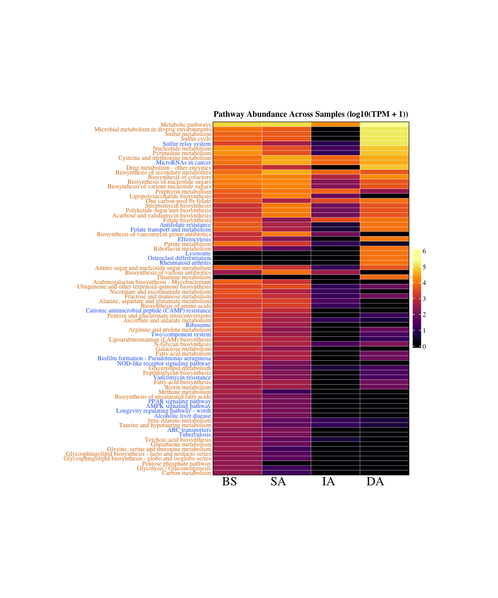
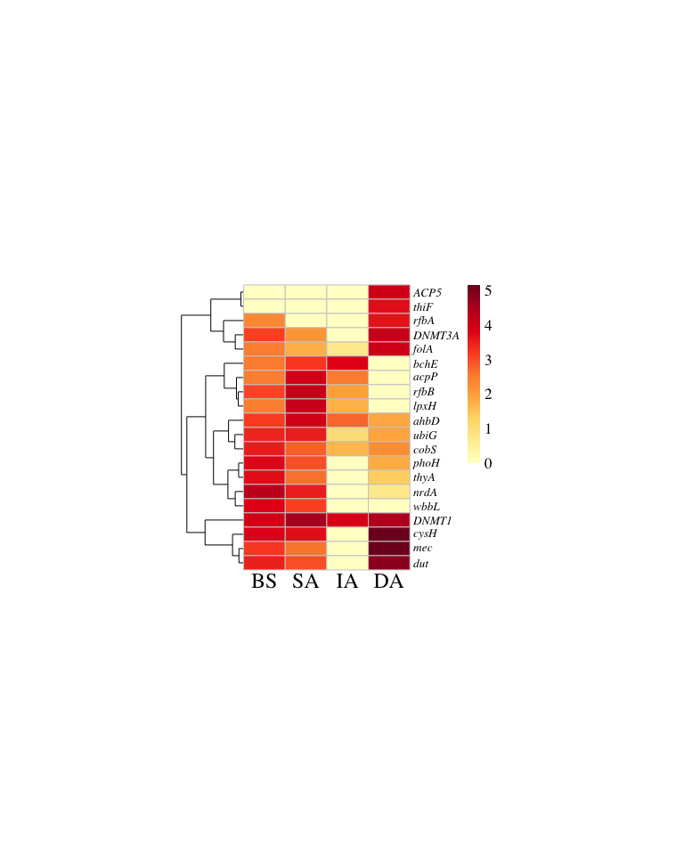

# 05-fig5-heatmap
Cunli Pan, Jinlong Ru
2025-12-20

- [<span class="toc-section-number">1</span> Tasks](#tasks)
  - [<span class="toc-section-number">1.1</span> Task 1:
    Data-extraction](#task-1-data-extraction)
  - [<span class="toc-section-number">1.2</span> Task 2: Annotate
    KEGG](#task-2-annotate-kegg)
  - [<span class="toc-section-number">1.3</span> Task 3:
    Pathway-split-classify](#task-3-pathway-split-classify)
  - [<span class="toc-section-number">1.4</span> Task 4: Merge TPM and
    Metadata](#task-4-merge-tpm-and-metadata)
  - [<span class="toc-section-number">1.5</span> Task 5: Deduplicate and
    Calculate TPM](#task-5-deduplicate-and-calculate-tpm)
  - [<span class="toc-section-number">1.6</span> Task 6: Plot Pathway
    Heatmap](#task-6-plot-pathway-heatmap)
  - [<span class="toc-section-number">1.7</span> Task 7: Plot Top 20 AMG
    Heatmap](#task-7-plot-top-20-amg-heatmap)

**Updated: 2026-01-29 17:22:37 CET.**

The purpose of this document is to construct and visualize a heatmap of
viral functional potential based on KEGG orthology (KO) and pathway
annotations to infer metabolic capabilities of the viral community.

<details class="code-fold">
<summary>Code</summary>

``` r
suppressPackageStartupMessages({
  library(here)
  library(tidyverse)
  library(TreeSummarizedExperiment)
  library(ComplexHeatmap)
  library(circlize)
  library(KEGGREST)
  library(openxlsx)
  library(progress)
  library(viridis)
   library(RColorBrewer)
  library(pheatmap)

})

# Load package utility functions
devtools::load_all(here::here())
```

</details>

## Tasks

### Task 1: Data-extraction

<details class="code-fold">
<summary>Code</summary>

``` r
# ============================================================================
# STEP 1: 从TSE加载数据
# ============================================================================
cat("Part 1: Loading TSE object...\n\n")
```

</details>

    Part 1: Loading TSE object...

<details class="code-fold">
<summary>Code</summary>

``` r
tse_path <- here::here("data", "01-tse-construction", "tse.rds")


# ✅ 加载TSE对象
tse <- readRDS(tse_path)  # ← 这行被漏掉了！


# Extract AMG tables from metadata
amg_dramv <- metadata(tse)$amg_dramv
amg_vibrant <- metadata(tse)$amg_vibrant

message("✅ Extracted AMG data:")
```

</details>

    ✅ Extracted AMG data:

<details class="code-fold">
<summary>Code</summary>

``` r
message("   DRAM-v: ", nrow(amg_dramv), " rows × ", ncol(amg_dramv), " cols")
```

</details>

       DRAM-v: 89 rows × 19 cols

<details class="code-fold">
<summary>Code</summary>

``` r
message("   VIBRANT: ", nrow(amg_vibrant), " rows × ", ncol(amg_vibrant), " cols")
```

</details>

       VIBRANT: 186 rows × 9 cols

<details class="code-fold">
<summary>Code</summary>

``` r
# Check key columns
message("   DRAM-v columns: ", paste(head(colnames(amg_dramv), 5), collapse = ", "), "...")
```

</details>

       DRAM-v columns: vOTU_id, contig_id, protein_id, dbid, db_desc...

<details class="code-fold">
<summary>Code</summary>

``` r
message("   VIBRANT columns: ", paste(head(colnames(amg_vibrant), 5), collapse = ", "), "...")
```

</details>

       VIBRANT columns: vOTU_id, contig_id, protein_id, dbid, db_desc...

<details class="code-fold">
<summary>Code</summary>

``` r
message("\n✅ Task 1 完成！\n")
```

</details>


    ✅ Task 1 完成！

### Task 2: Annotate KEGG

<details class="code-fold">
<summary>Code</summary>

``` r
message("=== Annotate AMG Genes with KEGG ===")

# Extract unique dbids
dramv_ids <- amg_dramv %>%
  dplyr::select(dbid) %>%
  dplyr::filter(!is.na(dbid)) %>%
  dplyr::distinct() %>%
  mutate(source = "DRAM-v")

vibrant_ids <- amg_vibrant %>%
  dplyr::select(dbid) %>%
  dplyr::filter(!is.na(dbid)) %>%
  dplyr::distinct() %>%
  mutate(source = "VIBRANT")

all_ids <- bind_rows(dramv_ids, vibrant_ids) %>%
  dplyr::distinct(dbid)

message("Total unique dbids: ", nrow(all_ids))

# KEGG annotation function
# Using get_kegg_info() from R/utils.R

# Annotate all dbids
annotations <- purrr::map_dfr(all_ids$dbid, get_kegg_info)

message("Annotation completed: ", nrow(annotations), " dbids")
message("  With pathway: ", sum(!is.na(annotations$Pathway)))

# Merge annotations
dramv_annotated <- dplyr::left_join(amg_dramv, annotations, by = "dbid")
vibrant_annotated <- dplyr::left_join(amg_vibrant, annotations, by = "dbid")

# Export
write.xlsx(annotations, path_target("all_kegg_annotations.xlsx"))
write.xlsx(dramv_annotated, path_target("dramv_with_annotations.xlsx"))
write.xlsx(vibrant_annotated, path_target("vibrant_with_annotations.xlsx"))

message("✅ Task 2 completed")
```

</details>

### Task 3: Pathway-split-classify

<details class="code-fold">
<summary>Code</summary>

``` r
message("=== Pathway Splitting and Classification ===")

# Read annotated AMG tables
dramv_anno <- read.xlsx(path_target("dramv_with_annotations.xlsx"))
vibrant_anno <- read.xlsx(path_target("vibrant_with_annotations.xlsx"))

# Combine and add source label
combined_raw <- bind_rows(
  dramv_anno %>% mutate(Source = "DRAM-v"),
  vibrant_anno %>% mutate(Source = "VIBRANT")
)

original_row_count <- nrow(combined_raw)
message("Original rows: ", original_row_count)

# Split pathways (core step)
long_pathway <- combined_raw %>%
  mutate(
    has_pathway = !is.na(Pathway) & Pathway != "",
    row_id = row_number()
  ) %>%
  mutate(
    Pathway_ID = ifelse(has_pathway, Pathway, NA_character_)
  ) %>%
  separate_rows(Pathway_ID, sep = ";\\s*", convert = FALSE) %>%
  mutate(
    Pathway_ID = str_trim(Pathway_ID),
    Pathway_ID = ifelse(Pathway_ID == "", NA_character_, Pathway_ID),
    is_expanded = ifelse(has_pathway & !is.na(Pathway_ID), TRUE, FALSE)
  )

expanded_row_count <- nrow(long_pathway)
message("Expanded rows: ", expanded_row_count, " (+", expanded_row_count - original_row_count, ")")

# Get unique pathway IDs
pathway_ids <- unique(na.omit(long_pathway$Pathway_ID))
total_ids <- length(pathway_ids)
message("Unique pathways to query: ", total_ids)

# KEGG pathway query function
# Using get_pathway_info() from R/utils.R

# Batch query KEGG API
message("Starting batch KEGG query...")
pathway_annotations <- tibble()

pb <- progress_bar$new(
  format = "[:bar] :percent ETA: :eta",
  total = total_ids,
  clear = FALSE
)

for (i in seq_along(pathway_ids)) {
  id <- pathway_ids[i]
  res <- get_pathway_info(id, i, total_ids)
  pathway_annotations <- bind_rows(pathway_annotations, res)
  pb$tick()

  if (i %% 10 == 0) Sys.sleep(0.3)
}

# Merge pathway annotations
long_pathway_annotated <- long_pathway %>%
  dplyr::left_join(pathway_annotations, by = "Pathway_ID") %>%
  mutate(
    annotation_status = case_when(
      is.na(Pathway_ID) ~ "No Pathway",
      is.na(Pathway_Name) ~ "Missing Annotation",
      str_starts(Pathway_Name, "Unknown") ~ "API Failed",
      TRUE ~ "Annotated"
    )
  )

# Save results
write.xlsx(long_pathway_annotated, path_target("long_pathway_with_annotation.xlsx"))
message("Saved: long_pathway_with_annotation.xlsx")

pathway_class_ref <- pathway_annotations %>%
  dplyr::distinct(Pathway_ID, Pathway_Name, Pathway_Class, Pathway_Top_Category)
write.xlsx(pathway_class_ref, path_target("pathway_classification_reference.xlsx"))
message("Saved: pathway_classification_reference.xlsx")

# Statistics
message("\nFinal statistics:")
message("  Successful queries: ", sum(!str_starts(pathway_annotations$Pathway_Name, "Unknown")), "/", total_ids)
print(table(pathway_annotations$Pathway_Top_Category))
```

</details>


                      Cellular Processes Environmental Information Processing 
                                       3                                    3 
          Genetic Information Processing                       Human Diseases 
                                       2                                    7 
                              Metabolism                   Organismal Systems 
                                      54                                    5 

<details class="code-fold">
<summary>Code</summary>

``` r
message("\n=== Task 3 completed ===\n")
```

</details>

### Task 4: Merge TPM and Metadata

<details class="code-fold">
<summary>Code</summary>

``` r
message("=== Merge TPM and Metadata ===")

# Extract TPM matrix from TSE
tpm_matrix <- assays(tse)$tpm
sample_meta <- colData(tse) %>% as_tibble(rownames = "sample_id")

# Convert TPM to long format
tpm_long <- tpm_matrix %>%
  as.data.frame() %>%
  rownames_to_column("vOTU_id") %>%
  pivot_longer(cols = -vOTU_id, names_to = "sample_id", values_to = "TPM")

# Merge sample metadata
tpm_long_meta <- tpm_long %>%
  dplyr::left_join(sample_meta, by = "sample_id") %>%
   mutate(sample_group = as.character(sample_group))

# Read pathway table
long_pathway <- read.xlsx(path_target("long_pathway_with_annotation.xlsx"))

# Merge all information
final_df <- long_pathway %>%
  dplyr::left_join(tpm_long_meta, by = "vOTU_id")

message("Final merged table: ", nrow(final_df), " rows")

# Save
write.xlsx(final_df, path_target("full_merged_pathway_table.xlsx"))
message("✅ Task 4 completed")
```

</details>

### Task 5: Deduplicate and Calculate TPM

<details class="code-fold">
<summary>Code</summary>

``` r
message("=== Deduplicate and Calculate Pathway Total TPM ===")

# Read full merged table
full_df <- read.xlsx(path_target("full_merged_pathway_table.xlsx"))

# Deduplicate
deduplicated_df <- full_df %>%
  arrange(vOTU_id, dbid, Pathway_ID, sample_id,
          match(Source, c("DRAM-v", "VIBRANT"))) %>%
  dplyr::distinct(vOTU_id, dbid, Pathway_ID, sample_id, .keep_all = TRUE)

message("Deduplicated: ", nrow(full_df), " → ", nrow(deduplicated_df))
write.xlsx(deduplicated_df, path_target("deduplicated_pathway_table.xlsx"))

# Filter valid pathways
filtered_df <- deduplicated_df %>%
  dplyr::filter(!is.na(Pathway_ID), !is.na(Pathway_Name), !is.na(sample_group)) %>%
  dplyr::filter(!is.na(TPM)) %>%
  mutate(Pathway_Group = ifelse(str_starts(Pathway_Top_Category, "Metabolism"),
                                 "Metabolism", "Other"))

message("Valid pathway rows: ", nrow(filtered_df))

# Calculate total TPM per pathway
samples <- c("BS", "SA", "IA", "DA")

heatmap_matrix <- filtered_df %>%
  group_by(Pathway_ID, Pathway_Name, Pathway_Group, sample_group) %>%
  summarise(Total_TPM = sum(TPM, na.rm = TRUE), .groups = "drop") %>%
  pivot_wider(names_from = sample_group, values_from = Total_TPM, values_fill = 0)

final_df_stats <- heatmap_matrix %>%
  mutate(
    Total_TPM = rowSums(across(all_of(samples))),
    Samples_Expressed = rowSums(across(all_of(samples), ~ .x > 0))
  ) %>%
  arrange(desc(Total_TPM))

message("Heatmap matrix: ", nrow(final_df_stats), " pathways")
write.xlsx(final_df_stats, path_target("heatmap_matrix_with_pathway_group.xlsx"))
message("✅ Task 5 completed")
```

</details>

### Task 6: Plot Pathway Heatmap

<details class="code-fold">
<summary>Code</summary>

``` r
message("=== Plot Pathway Heatmap ===")

# Read data
df <- read.xlsx(path_target("heatmap_matrix_with_pathway_group.xlsx"))
samples <- c("BS", "SA", "IA", "DA")

# Extract pathway short name
df <- df %>%
  mutate(Pathway_Short = sub(";.*", "", Pathway_Name))

# Convert to log10(TPM + 1)
df_heatmap <- df %>%
  dplyr::select(Pathway_Short, all_of(samples)) %>%
  mutate(across(all_of(samples), ~log10(. + 1))) %>%
  column_to_rownames("Pathway_Short")

df_heatmap <- df_heatmap[, samples]

message("Plotting: ", nrow(df_heatmap), " pathways × ", ncol(df_heatmap), " samples")

# Read pathway classification
anno_df <- read.xlsx(path_target("pathway_classification_reference.xlsx")) %>%
  mutate(Pathway_Short = sub(";.*", "", Pathway_Name)) %>%
  dplyr::select(Pathway_Short, Pathway_Top_Category)

# Match classification and set colors
matched <- df_heatmap %>%
  rownames_to_column("Pathway_Short") %>%
  dplyr::left_join(anno_df, by = "Pathway_Short")

# Metabolism=orange, Other=blue
label_colors <- ifelse(
  str_starts(matched$Pathway_Top_Category, "Metabolism"),
  "#D97706",  # Orange
  "#2563EB"   # Blue
)

# Convert to matrix
mat <- as.matrix(df_heatmap)

# Plot ComplexHeatmap
ht <- Heatmap(
  mat,
  name = "log10(TPM + 1)",
  col = viridis::inferno(100),
  cluster_rows = FALSE,
  cluster_columns = FALSE,
  width = unit(10, "cm"),
  height = unit(18, "cm"),

  row_names_side = "left",
  row_names_gp = gpar(fontsize = 9, fontfamily = "Times", col = label_colors),
  row_names_max_width = unit(7, "cm"),

  show_column_names = TRUE,
  column_names_side = "bottom",
  column_names_rot = 0,
  column_names_gp = gpar(fontsize = 18, fontfamily = "Times", fontface = "plain"),

  border = TRUE,

  heatmap_legend_param = list(
    title = NULL,
    at = 0:6,
    labels = as.character(0:6),
    legend_height = unit(5, "cm"),
    direction = "vertical",
    grid_height = unit(0.3, "cm"),
    labels_gp = gpar(fontsize = 10, fontfamily = "Times")
  ),

  column_title = "Pathway Abundance Across Samples (log10(TPM + 1))",
  column_title_gp = gpar(fontsize = 12, fontfamily = "Times", fontface = "bold"),

  cell_fun = function(j, i, x, y, width, height, fill) {
    grid.rect(x, y, width, height,
              gp = gpar(col = "white", fill = NA, lwd = 0.3))
  }
)

draw(ht)
```

</details>



<details class="code-fold">
<summary>Code</summary>

``` r
# Save figures
png(path_target("Fig5_pathway_heatmap.png"), width = 1000, height = 1000, res = 120)
draw(ht)
dev.off()
```

</details>

    quartz_off_screen 
                    2 

<details class="code-fold">
<summary>Code</summary>

``` r
pdf(path_target("Fig5_pathway_heatmap.pdf"), width = 12, height = 16)
draw(ht)
dev.off()
```

</details>

    quartz_off_screen 
                    2 

<details class="code-fold">
<summary>Code</summary>

``` r
png(path_target("Fig5_pathway_heatmap_highres.png"), width = 3600, height = 4800, res = 300)
draw(ht)
dev.off()
```

</details>

    quartz_off_screen 
                    2 

<details class="code-fold">
<summary>Code</summary>

``` r
# Save data
write.csv(df_heatmap %>% rownames_to_column("Pathway_Short"),
          path_target("log10_TPM_heatmap_matrix.csv"), row.names = FALSE)

message("✅ Task 6 completed")
```

</details>

### Task 7: Plot Top 20 AMG Heatmap

<details class="code-fold">
<summary>Code</summary>

``` r
message("=== Plot Top 20 AMG Gene Heatmap (Total TPM) ===")

# Read deduplicated pathway table
df <- read.xlsx(path_target("deduplicated_pathway_table.xlsx"))

# Clean data
df_clean <- df %>%
  dplyr::select(dbid, vOTU_id, sample_group, TPM, db_desc) %>%
  dplyr::filter(!is.na(dbid), !is.na(sample_group), !is.na(TPM)) %>%
  dplyr::distinct()

message("Clean data: ", nrow(df_clean), " rows")

# Special gene name mapping
special_map <- tribble(
  ~dbid, ~gene_symbol,
  "K00525", "nrdA",
  "EC:1.17.4.1", "RNR",
  "K00973", "rfbA",
  "K01710", "rfbB",
  "K00560", "thyA",
  "K01520", "dut",
  "K00558", "DNMT1",
  "K17398", "DNMT3A",
  "K00287", "folA"
)

# Extract gene labels
df_labeled <- df_clean %>%
  dplyr::left_join(special_map, by = "dbid") %>%
  mutate(
    auto_label = str_remove_all(db_desc, "\\[.*?\\]") %>%
      str_split(";", simplify = TRUE) %>%
      .[, 1] %>%
      str_trim() %>%
      str_split(",", simplify = TRUE) %>%
      .[, 1] %>%
      str_trim(),
    gene_symbol = if_else(is.na(gene_symbol), auto_label, gene_symbol)
  ) %>%
  dplyr::select(-auto_label)

# Summarize total TPM per gene
gene_summary <- df_labeled %>%
  group_by(gene_symbol, sample_group) %>%
  summarise(Total_TPM = sum(TPM, na.rm = TRUE), .groups = "drop")

# Convert to wide format
gene_matrix <- gene_summary %>%
  pivot_wider(names_from = sample_group, values_from = Total_TPM, values_fill = 0)

# Select Top 20
samples <- c("BS", "SA", "IA", "DA")
available_samples <- intersect(samples, colnames(gene_matrix))

gene_top20_total <- gene_matrix %>%
  mutate(Sum_TPM = rowSums(across(all_of(available_samples)))) %>%
  arrange(desc(Sum_TPM)) %>%
  slice_head(n = 20) %>%
  dplyr::select(-Sum_TPM)

message("Top 20 AMG genes (by total TPM)")

# log10 transformation
gene_log_matrix_total <- gene_top20_total %>%
  dplyr::select(gene_symbol, all_of(available_samples)) %>%
  column_to_rownames("gene_symbol") %>%
  mutate(across(everything(), ~log10(.x + 1)))

gene_log_matrix_total <- gene_log_matrix_total[, available_samples]

# Set row names to italic format
rownames(gene_log_matrix_total) <- paste0("italic('", rownames(gene_log_matrix_total), "')")

# Color scheme
my_colors <- colorRampPalette(RColorBrewer::brewer.pal(9, "YlOrRd"))(100)

# Plot pheatmap
p_amg_total <- pheatmap::pheatmap(
  gene_log_matrix_total,
  color = my_colors,
  cluster_rows = TRUE,
  cluster_cols = FALSE,
  show_colnames = TRUE,
  show_rownames = TRUE,
  labels_row = parse(text = rownames(gene_log_matrix_total)),
  main = "",
  fontsize_row = 10,
  fontsize_col = 18,
  fontsize = 13,
  fontfamily = "Times",
  angle_col = 0,
  cellwidth = 35,
  cellheight = 12,
  border_color = "gray80"
)
```

</details>



<details class="code-fold">
<summary>Code</summary>

``` r
# Save figures
ggsave(path_target("Fig5b_top20_AMG_heatmap.png"),
       plot = p_amg_total, width = 8, height = 10, dpi = 300)
ggsave(path_target("Fig5b_top20_AMG_heatmap.pdf"),
       plot = p_amg_total, width = 8, height = 10)

# Save data
write.csv(gene_log_matrix_total %>% rownames_to_column("Gene"),
          path_target("top20_AMG_total_log10_TPM_matrix.csv"), row.names = FALSE)
write.xlsx(gene_top20_total, path_target("top20_AMG_total_corrected.xlsx"))

message("✅ Task 7 completed")
```

</details>
