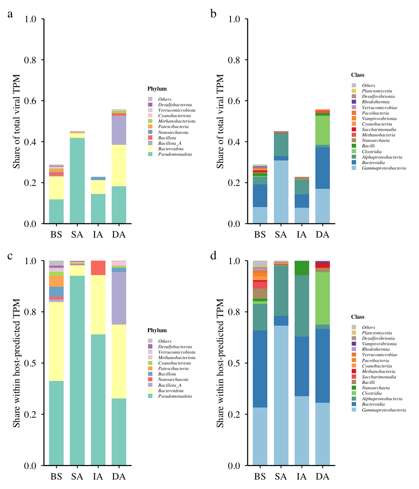

# 05-figs1-host-composition
Cunli Pan, Jinlong Ru
2025-12-20

- [<span class="toc-section-number">1</span> Tasks](#tasks)
  - [<span class="toc-section-number">1.1</span> Task 1: Load TSE object
    and extract data](#task-1-load-tse-object-and-extract-data)
  - [<span class="toc-section-number">1.2</span> Task 2:
    Prepare-data](#task-2-prepare-data)
  - [<span class="toc-section-number">1.3</span> Task 3:
    Define-functions](#task-3-define-functions)
  - [<span class="toc-section-number">1.4</span> Task 4: Calculate
    abundance data](#task-4-calculate-abundance-data)
  - [<span class="toc-section-number">1.5</span> Task 5: Create Figure
    S1 panels](#task-5-create-figure-s1-panels)
  - [<span class="toc-section-number">1.6</span> Task 6: Save
    outputs](#task-6-save-outputs)
  - [<span class="toc-section-number">1.7</span> Export Figure S1 as
    TIFF](#export-figure-s1-as-tiff)

**Updated: 2026-09-02 22:19:26 CET.**

The purpose of this document is to analyze the taxonomic composition of
predicted viral hosts, calculating and visualizing the relative
abundance of different host bacterial phyla across ecosystem depths.

<details class="code-fold">
<summary>Code</summary>

``` r
suppressPackageStartupMessages({
  library(here)
  library(mia)
  library(tidyverse)
  library(data.table)
  library(RColorBrewer)
  library(scales)
  library(patchwork)
})
```

</details>

    Warning: package 'S4Vectors' was built under R version 4.5.3

    Warning: package 'Biobase' was built under R version 4.5.3

<details class="code-fold">
<summary>Code</summary>

``` r
# Load package utility functions
devtools::load_all(here::here())
```

</details>

## Tasks

### Task 1: Load TSE object and extract data

<details class="code-fold">
<summary>Code</summary>

``` r
tse_path <- path_source(
  "01-tse-construction",
  "tse_primary_962.rds"
)

stopifnot(file.exists(tse_path))

tse <- readRDS(tse_path)

stopifnot(
  nrow(tse) == 962,
  ncol(tse) == 4
)
tpm_matrix <- assay(tse, "tpm")
host_genome_edges <- metadata(tse)$host_genome_edges

sample_metadata <- colData(tse) %>%
  as.data.frame() %>%
  rownames_to_column("sample_id") %>%
  dplyr::select(sample_id, sample_group)

message("TSE loaded: ", nrow(tse), " vOTUs, ", ncol(tse), " samples")
```

</details>

    TSE loaded: 962 vOTUs, 4 samples

### Task 2: Prepare-data

<details class="code-fold">
<summary>Code</summary>

``` r
# Filter high-confidence predictions
host_high_conf <- host_genome_edges %>%
  dplyr::filter(
    Confidence.score >= 80,
    vOTU_id %in% rownames(tse)
  )

stopifnot(
  dplyr::n_distinct(host_high_conf$vOTU_id) == 289
)

# Extract taxonomy
host_filtered <- host_high_conf %>%
  mutate(
    Phylum = str_extract(Host.taxonomy, "(?<=p__)[^;]+"),
    Phylum = if_else(is.na(Phylum) | Phylum == "", "Unclassified", Phylum),
    Class = str_extract(Host.taxonomy, "(?<=c__)[^;]+"),
    Class = if_else(is.na(Class) | Class == "", "Unclassified", Class)
  ) %>%
  dplyr::select(vOTU_id, Host.taxonomy, Phylum, Class) %>%
  dplyr::distinct()

# Convert TPM to long format
tpm_long <- tpm_matrix %>%
  as.data.frame() %>%
  rownames_to_column("vOTU_id") %>%
  pivot_longer(cols = -vOTU_id, names_to = "sample_id", values_to = "TPM") %>%
  dplyr::filter(TPM > 0)

# Calculate total TPM per sample
sample_total_tpm <- tpm_long %>%
  group_by(sample_id) %>%
  summarise(total_TPM = sum(TPM), .groups = "drop")

message("Data prepared: ", nrow(host_filtered), " vOTU-host pairs")
```

</details>

    Data prepared: 1864 vOTU-host pairs

### Task 3: Define-functions

<details class="code-fold">
<summary>Code</summary>

``` r
# Functions now loaded from R/utils.R:
# - calculate_host_abundance()
# - calculate_host_abundance_normalized()
# - create_stacked_bar()
```

</details>

### Task 4: Calculate abundance data

<details class="code-fold">
<summary>Code</summary>

``` r
phylum_abundance_orig <- calculate_host_abundance(
  host_filtered, tpm_long, sample_total_tpm, sample_metadata, "Phylum"
)

class_abundance_orig <- calculate_host_abundance(
  host_filtered, tpm_long, sample_total_tpm, sample_metadata, "Class"
)

phylum_abundance_norm <- calculate_host_abundance_normalized(
  host_filtered, tpm_long, sample_metadata, "Phylum"
)

class_abundance_norm <- calculate_host_abundance_normalized(
  host_filtered, tpm_long, sample_metadata, "Class"
)

message("Host abundance calculated")
```

</details>

    Host abundance calculated

### Task 5: Create Figure S1 panels

<details class="code-fold">
<summary>Code</summary>

``` r
p_s1a <- create_stacked_bar(
  phylum_abundance_orig,
  "Phylum",
  10,
  FALSE
) +
  labs(
    y = "Share of total viral TPM"
  )

p_s1b <- create_stacked_bar(
  class_abundance_orig,
  "Class",
  15,
  FALSE
) +
  labs(
    y = "Share of total viral TPM"
  )

p_s1c <- create_stacked_bar(
  phylum_abundance_norm,
  "Phylum",
  10,
  TRUE
) +
  labs(
    y = "Share within host-predicted TPM"
  )

p_s1d <- create_stacked_bar(
  class_abundance_norm,
  "Class",
  15,
  TRUE
) +
  labs(
    y = "Share within host-predicted TPM"
  )

fig_s1_combined <-
  (p_s1a + p_s1b) /
  (p_s1c + p_s1d) +
  plot_annotation(tag_levels = "a")

print(fig_s1_combined)
```

</details>



### Task 6: Save outputs

<details class="code-fold">
<summary>Code</summary>

``` r
figures_dir <- path_target("figures")
data_dir <- path_target("data")
dir.create(figures_dir, recursive = TRUE, showWarnings = FALSE)
dir.create(data_dir, recursive = TRUE, showWarnings = FALSE)

# Save figures
ggsave(file.path(figures_dir, "FigS1a_phylum_original.png"), p_s1a, width = 6, height = 6, dpi = 300)
ggsave(file.path(figures_dir, "FigS1b_class_original.png"), p_s1b, width = 6, height = 6, dpi = 300)
ggsave(file.path(figures_dir, "FigS1c_phylum_normalized.png"), p_s1c, width = 6, height = 6, dpi = 300)
ggsave(file.path(figures_dir, "FigS1d_class_normalized.png"), p_s1d, width = 6, height = 6, dpi = 300)
ggsave(file.path(figures_dir, "FigS1_combined_all_panels.png"), fig_s1_combined, width = 12, height = 12, dpi = 300)

# Save data
write_csv(phylum_abundance_orig, file.path(data_dir, "phylum_abundance_original.csv"))
write_csv(class_abundance_orig, file.path(data_dir, "class_abundance_original.csv"))
write_csv(phylum_abundance_norm, file.path(data_dir, "phylum_abundance_normalized.csv"))
write_csv(class_abundance_norm, file.path(data_dir, "class_abundance_normalized.csv"))

message("Outputs saved to: ", figures_dir)
```

</details>

    Outputs saved to: data/05-figs1-host-composition/figures

### Export Figure S1 as TIFF
