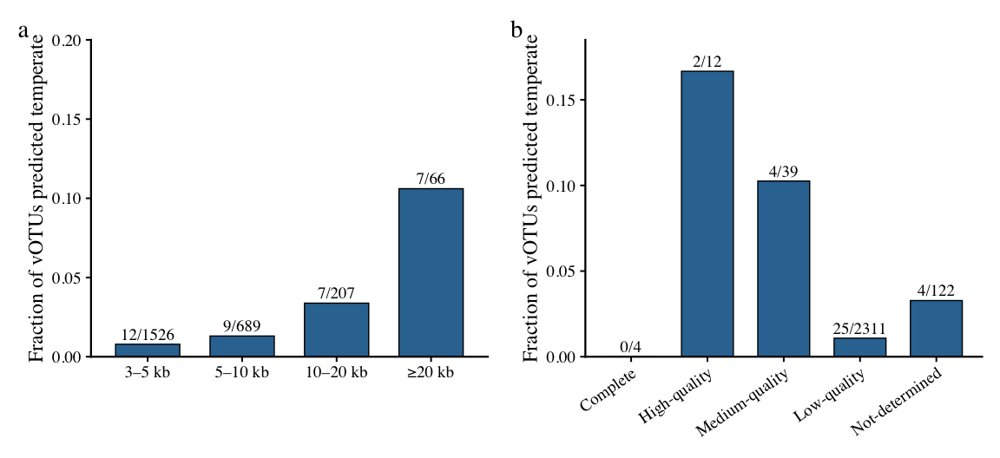

06-figs2-lifestyle
================
today

**Updated: 2026-09-22 15:20:22 CET.**

``` r
suppressPackageStartupMessages({
  library(here)
  library(conflicted)
  library(tidyverse)
  library(data.table)
  library(patchwork)
  devtools::load_all()
})
```

## Tasks

This section is designated for your workflow implementation. **Please
write all your analysis and processing code here.**

Maintaining your code within this section ensures a clean project
structure and facilitates reproducibility. We recommend organizing your
workflow into modular tasks—such as data cleaning, analysis, and
visualization—using distinct code chunks.

<div class="callout-note">

## Example structure

This is an example structure to get you started. You can modify it as
per your needs.

</div>

## Tasks

### Task 1: Load the complete discovery catalogue

``` r
# Figure S2 is a sensitivity analysis of predicted lifestyle
# against contig length and CheckV quality.
#
# Therefore, unlike the main analyses, it uses the complete
# >=3 kb discovery catalogue so that the 3–5 kb group is retained.

tse_discovery <- readRDS(
  here(
    "data",
    "01-tse-construction",
    "tse_discovery_2488.rds"
  )
)

votu_metadata <- SummarizedExperiment::rowData(
  tse_discovery
) %>%
  as.data.frame() %>%
  tibble::rownames_to_column("vOTU_id")

stopifnot(nrow(votu_metadata) == 2488)

stopifnot(
  all(
    c(
      "representative_length_bp",
      "checkv_quality",
      "lifestyle"
    ) %in% colnames(votu_metadata)
  )
)

message(
  "Complete discovery catalogue loaded: ",
  nrow(votu_metadata),
  " vOTUs"
)
```

\###Task 2: Define length and CheckV quality groups

``` r
votu_metadata <- votu_metadata %>%
  dplyr::mutate(
    is_temperate = lifestyle == "temperate",

    length_group = cut(
      representative_length_bp,
      breaks = c(
        3000,
        5000,
        10000,
        20000,
        Inf
      ),
      right = FALSE,
      labels = c(
        "3–5 kb",
        "5–10 kb",
        "10–20 kb",
        "≥20 kb"
      )
    ),

    quality_group = factor(
      checkv_quality,
      levels = c(
        "Complete",
        "High-quality",
        "Medium-quality",
        "Low-quality",
        "Not-determined"
      )
    )
  )

stopifnot(!any(is.na(votu_metadata$length_group)))
stopifnot(!any(is.na(votu_metadata$quality_group)))

message(
  "Length and CheckV quality groups created"
)
```

### Task 3: Calculate predicted temperate fractions

``` r
# Fraction predicted temperate within each contig-length group
length_summary <- votu_metadata %>%
  dplyr::count(
    length_group,
    is_temperate,
    name = "n"
  ) %>%
  tidyr::complete(
    length_group,
    is_temperate,
    fill = list(n = 0)
  ) %>%
  dplyr::group_by(length_group) %>%
  dplyr::summarise(
    n_vOTU = sum(n),
    n_temperate = sum(n[is_temperate]),
    temperate_fraction = n_temperate / n_vOTU,
    .groups = "drop"
  )

# Fraction predicted temperate within each CheckV-quality group
quality_summary <- votu_metadata %>%
  dplyr::count(
    quality_group,
    is_temperate,
    name = "n"
  ) %>%
  tidyr::complete(
    quality_group,
    is_temperate,
    fill = list(n = 0)
  ) %>%
  dplyr::group_by(quality_group) %>%
  dplyr::summarise(
    n_vOTU = sum(n),
    n_temperate = sum(n[is_temperate]),
    temperate_fraction = n_temperate / n_vOTU,
    .groups = "drop"
  )

print(length_summary, n = Inf)
```

    ## # A tibble: 4 × 4
    ##   length_group n_vOTU n_temperate temperate_fraction
    ##   <fct>         <int>       <int>              <dbl>
    ## 1 3–5 kb         1526          12            0.00786
    ## 2 5–10 kb         689           9            0.0131
    ## 3 10–20 kb        207           7            0.0338
    ## 4 ≥20 kb           66           7            0.106

``` r
print(quality_summary, n = Inf)
```

    ## # A tibble: 5 × 4
    ##   quality_group  n_vOTU n_temperate temperate_fraction
    ##   <fct>           <int>       <int>              <dbl>
    ## 1 Complete            4           0             0
    ## 2 High-quality       12           2             0.167
    ## 3 Medium-quality     39           4             0.103
    ## 4 Low-quality      2311          25             0.0108
    ## 5 Not-determined    122           4             0.0328

\###Task 4: Validate the Figure S2 numbers

``` r
# Expected number of vOTUs in each length category
stopifnot(
  identical(
    length_summary$n_vOTU,
    c(
      1526L,
      689L,
      207L,
      66L
    )
  )
)

# Expected number predicted as temperate
stopifnot(
  identical(
    length_summary$n_temperate,
    c(
      12L,
      9L,
      7L,
      7L
    )
  )
)

# Expected number of vOTUs in each CheckV category
stopifnot(
  identical(
    quality_summary$n_vOTU,
    c(
      4L,
      12L,
      39L,
      2311L,
      122L
    )
  )
)

# Expected number predicted as temperate
stopifnot(
  identical(
    quality_summary$n_temperate,
    c(
      0L,
      2L,
      4L,
      25L,
      4L
    )
  )
)

stopifnot(
  sum(length_summary$n_vOTU) == 2488
)

stopifnot(
  sum(length_summary$n_temperate) == 35
)

stopifnot(
  sum(quality_summary$n_vOTU) == 2488
)

stopifnot(
  sum(quality_summary$n_temperate) == 35
)

message(
  "All Figure S2 numerical checks passed"
)
```

\###Task 5: Create Figure S2

``` r
panel_theme <-
  theme_classic(
    base_size = 18,
    base_family = "Times"
  ) +
  theme(
    axis.line = element_line(
      linewidth = 0.8,
      colour = "black"
    ),
    axis.ticks = element_line(
      linewidth = 0.7,
      colour = "black"
    ),
    axis.text = element_text(
      colour = "black"
    ),
    plot.margin = margin(
      10,
      10,
      10,
      10
    )
  )

# Figure S2a:
# predicted temperate fraction by representative contig length
p_figs2a <- ggplot(
  length_summary,
  aes(
    x = length_group,
    y = temperate_fraction
  )
) +
  geom_col(
    width = 0.68,
    fill = "#3274A1",
    colour = "black",
    linewidth = 0.5
  ) +
  geom_text(
    aes(
      label = paste0(
        n_temperate,
        "/",
        n_vOTU
      )
    ),
    vjust = -0.45,
    size = 5,
    family = "Times"
  ) +
  scale_y_continuous(
    limits = c(0, 0.20),
    breaks = seq(0, 0.20, 0.05),
    labels = scales::label_number(accuracy = 0.01),
    expand = expansion(
      mult = c(0, 0)
    )
  ) +
  labs(
    x = NULL,
    y = "Fraction of vOTUs predicted temperate"
  ) +
  panel_theme

# Figure S2b:
# predicted temperate fraction by CheckV quality category
p_figs2b <- ggplot(
  quality_summary,
  aes(
    x = quality_group,
    y = temperate_fraction
  )
) +
  geom_col(
    width = 0.68,
    fill = "#3274A1",
    colour = "black",
    linewidth = 0.5
  ) +
  geom_text(
    aes(
      label = paste0(
        n_temperate,
        "/",
        n_vOTU
      )
    ),
    vjust = -0.45,
    size = 5,
    family = "Times"
  ) +
  scale_y_continuous(
    limits = c(0, 0.185),
    breaks = seq(0, 0.15, 0.05),
    labels = scales::label_number(accuracy = 0.01),
    expand = expansion(
      mult = c(0, 0)
    )
  ) +
  labs(
    x = NULL,
    y = "Fraction of vOTUs predicted temperate"
  ) +
  panel_theme +
  theme(
    axis.text.x = element_text(
      angle = 35,
      hjust = 1
    )
  )

# Combined preview
p_figs2_combined <-
  p_figs2a +
  p_figs2b +
  patchwork::plot_annotation(
    tag_levels = "a"
  )

print(p_figs2_combined)
```

<!-- -->

### Task 6: Save source data, PNG and TIFF files

### Task 7: Quality-stratified replication strategies in the primary catalogue

``` r
# Keep this analysis separate from the 2,488-vOTU Figure S2 objects.
local({
  primary <- readRDS(
    here::here("data", "01-tse-construction", "tse_primary_962.rds")
  )
  metadata <- as.data.frame(SummarizedExperiment::rowData(primary))
  abundance <- SummarizedExperiment::assay(primary, "tpm")
  sample_names <- c("BS", "SA", "IA", "DA")
  sample_index <- match(
    sample_names,
    as.character(SummarizedExperiment::colData(primary)$sample_group)
  )
  stopifnot(
    nrow(primary) == 962L,
    ncol(primary) == 4L,
    !anyNA(sample_index),
    !anyDuplicated(rownames(primary))
  )
  abundance <- abundance[, sample_index, drop = FALSE]
  colnames(abundance) <- sample_names
  quality <- as.character(metadata$checkv_quality)
  strategy <- as.character(metadata$lifestyle)
  quality_levels <- c(
    "Complete", "High-quality", "Medium-quality",
    "Low-quality", "Not-determined"
  )
  stopifnot(
    !anyNA(quality), all(quality %in% quality_levels),
    !anyNA(strategy), all(strategy %in% c("temperate", "virulent")),
    !anyNA(abundance), all(is.finite(abundance)), all(abundance >= 0)
  )
  mq_or_better <- quality %in% quality_levels[1:3]
  stopifnot(sum(mq_or_better) == 55L)

  select_group <- function(group) {
    if (group == "All primary") {
      rep(TRUE, nrow(primary))
    } else if (group == "Medium-quality or better") {
      mq_or_better
    } else {
      quality == group
    }
  }

  # Table S3a: catalogue counts, not TPM-weighted fractions.
  count_groups <- c(quality_levels, "All primary", "Medium-quality or better")
  quality_counts <- do.call(rbind, lapply(count_groups, function(group) {
    keep <- select_group(group)
    n_total <- sum(keep)
    n_temperate <- sum(keep & strategy == "temperate")
    data.frame(
      quality_group = group,
      n_vOTU = n_total,
      n_temperate = n_temperate,
      n_virulent = sum(keep & strategy == "virulent"),
      n_unassigned = 0L,
      temperate_count_fraction = n_temperate / n_total
    )
  }))

  # Table S3b: T/(T+V) within each sample and quality subset.
  tpm_groups <- c("All primary", "Medium-quality or better", quality_levels)
  results <- list()
  for (group in tpm_groups) {
    keep <- select_group(group)
    for (sample in sample_names) {
      a <- abundance[, sample]
      t <- sum(a[keep & strategy == "temperate"])
      v <- sum(a[keep & strategy == "virulent"])
      denominator <- t + v
      results[[length(results) + 1L]] <- data.frame(
        quality_group = group,
        sample = sample,
        n_catalogue = sum(keep),
        n_detected = sum(keep & a > 0),
        n_temperate_detected = sum(keep & a > 0 & strategy == "temperate"),
        n_virulent_detected = sum(keep & a > 0 & strategy == "virulent"),
        temperate_TPM = t,
        virulent_TPM = v,
        classified_TPM = denominator,
        temperate_fraction = if (denominator > 0) t / denominator else NA_real_,
        fraction_of_primary_TPM = denominator / sum(a)
      )
    }
  }
  sample_fractions <- do.call(rbind, results)
  all_rows <- sample_fractions[sample_fractions$quality_group == "All primary", ]
  mq_rows <- sample_fractions[
    sample_fractions$quality_group == "Medium-quality or better", ]
  comparison <- data.frame(
    sample = sample_names,
    primary_temperate_fraction = all_rows$temperate_fraction,
    MQ_or_better_temperate_fraction = mq_rows$temperate_fraction,
    MQ_or_better_n_detected = mq_rows$n_detected,
    MQ_or_better_n_temperate_detected = mq_rows$n_temperate_detected,
    MQ_or_better_fraction_of_primary_TPM = mq_rows$fraction_of_primary_TPM
  )

  # Validate the quality totals and reconcile the mutually exclusive groups.
  stopifnot(
    identical(quality_counts$n_vOTU[1:5], c(4L, 12L, 39L, 874L, 33L)),
    identical(quality_counts$n_temperate[1:5], c(0L, 2L, 4L, 16L, 1L)),
    sum(quality_counts$n_vOTU[1:5]) == 962L,
    sum(quality_counts$n_temperate[1:5]) == 23L,
    all(quality_counts$n_vOTU == quality_counts$n_temperate + quality_counts$n_virulent)
  )
  for (sample in sample_names) {
    rows <- sample_fractions$sample == sample &
      sample_fractions$quality_group %in% quality_levels
    stopifnot(abs(sum(sample_fractions$classified_TPM[rows]) -
      sum(abundance[, sample])) < 1e-7)
  }

  table_dir <- path_target("quality_sensitivity")
  dir.create(table_dir, recursive = TRUE, showWarnings = FALSE)
  utils::write.csv(quality_counts,
    file.path(table_dir, "Table_S3a_quality_counts.csv"), row.names = FALSE)
  utils::write.csv(sample_fractions,
    file.path(table_dir, "Table_S3b_quality_sample_fractions.csv"),
    row.names = FALSE, na = "")
  utils::write.csv(comparison,
    file.path(table_dir, "Table_S3_comparison.csv"), row.names = FALSE)
  source_data <- data.frame(
    vOTU_id = rownames(primary), checkv_quality = quality,
    final_strategy = strategy, MQ_or_better = as.integer(mq_or_better),
    abundance, check.names = FALSE
  )
  utils::write.csv(source_data,
    file.path(table_dir, "Table_S3_source_vOTU_TPM.csv"), row.names = FALSE)

  print(knitr::kable(quality_counts, digits = 4,
    caption = "Table S3a. Quality-stratified predicted replication-strategy counts."))
  print(knitr::kable(comparison, digits = 4,
    caption = "Table S3b. Sensitivity of TPM-weighted predicted temperate fractions."))
  message("Table S3 CSV files written to: ", normalizePath(table_dir))
  message("A missing fraction means T + V = 0 (not estimable), not a zero fraction.")
})
```

    ##
    ##
    ## Table: Table S3a. Quality-stratified predicted replication-strategy counts.
    ##
    ## |quality_group            | n_vOTU| n_temperate| n_virulent| n_unassigned| temperate_count_fraction|
    ## |:------------------------|------:|-----------:|----------:|------------:|------------------------:|
    ## |Complete                 |      4|           0|          4|            0|                   0.0000|
    ## |High-quality             |     12|           2|         10|            0|                   0.1667|
    ## |Medium-quality           |     39|           4|         35|            0|                   0.1026|
    ## |Low-quality              |    874|          16|        858|            0|                   0.0183|
    ## |Not-determined           |     33|           1|         32|            0|                   0.0303|
    ## |All primary              |    962|          23|        939|            0|                   0.0239|
    ## |Medium-quality or better |     55|           6|         49|            0|                   0.1091|
    ##
    ##
    ## Table: Table S3b. Sensitivity of TPM-weighted predicted temperate fractions.
    ##
    ## |sample | primary_temperate_fraction| MQ_or_better_temperate_fraction| MQ_or_better_n_detected| MQ_or_better_n_temperate_detected| MQ_or_better_fraction_of_primary_TPM|
    ## |:------|--------------------------:|-------------------------------:|-----------------------:|---------------------------------:|------------------------------------:|
    ## |BS     |                     0.0193|                          0.0812|                      39|                                 3|                               0.0700|
    ## |SA     |                     0.1616|                          0.4914|                      45|                                 5|                               0.1321|
    ## |IA     |                     0.0386|                          0.1954|                      18|                                 3|                               0.1041|
    ## |DA     |                     0.1892|                          0.5324|                      17|                                 1|                               0.3058|

## Files written

``` r
projthis::proj_dir_info(
  path_target(),
  tz = "CET"
) %>%
  knitr::kable()
```

| path                | type      | size | modification_time   |
|:--------------------|:----------|-----:|:--------------------|
| data                | directory |  224 | 2026-09-19 19:35:47 |
| figures             | directory |  288 | 2026-09-19 19:35:47 |
| quality_sensitivity | directory |  192 | 2026-09-22 13:54:25 |
| tiff_panels         | directory |  256 | 2026-09-19 19:35:47 |
