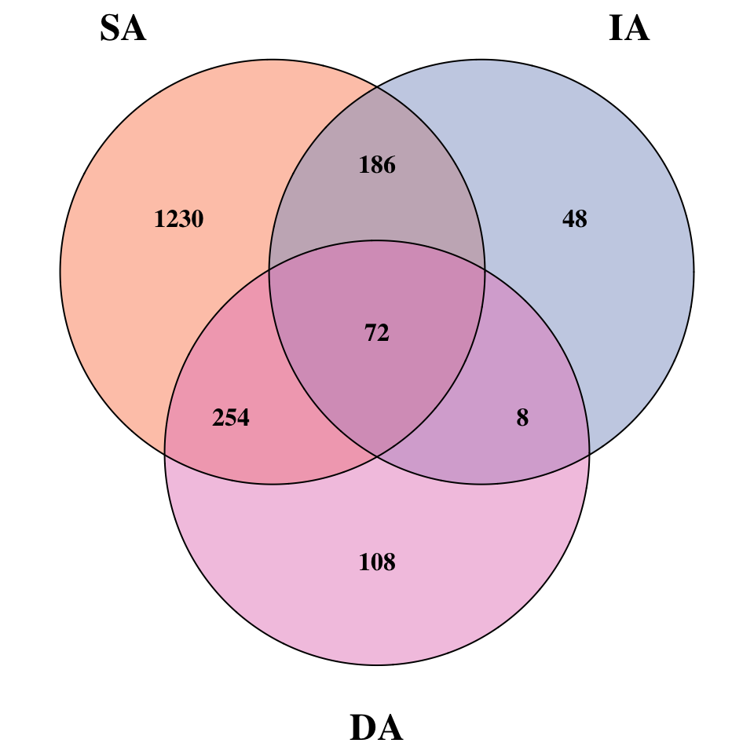

# 07-figs2-venn-diagram
Cunli Pan, Jinlong Ru
2025-12-20

- [<span class="toc-section-number">1</span> Tasks](#tasks)
  - [<span class="toc-section-number">1.1</span> Task 1: Load
    TSE](#task-1-load-tse)
  - [<span class="toc-section-number">1.2</span> Task 2: Prepare
    Data](#task-2-prepare-data)
  - [<span class="toc-section-number">1.3</span> Task 3: Create Venn
    Diagram](#task-3-create-venn-diagram)

**Updated: 2026-01-29 15:46:55 CET.**

The purpose of this document is to create Venn diagrams to visually
compare the overlap of viral populations (vOTUs) between different
sampling depths, highlighting shared and unique viral communities.

<details class="code-fold">
<summary>Code</summary>

``` r
suppressPackageStartupMessages({
  library(here)
  library(mia)           # Load mia first
  library(tidyverse)
  library(VennDiagram)
  library(RColorBrewer)
  library(grid)
})

# Load package utility functions
devtools::load_all(here::here())
```

</details>

## Tasks

### Task 1: Load TSE

<details class="code-fold">
<summary>Code</summary>

``` r
tse <- readRDS(here("data", "01-tse-construction", "tse.rds"))
tpm_matrix <- assay(tse, "tpm")

sample_metadata <- colData(tse) %>%
  as.data.frame() %>%
  rownames_to_column("sample_id") %>%
  dplyr::select(sample_id, sample_group)

message("TSE loaded: ", nrow(tse), " vOTUs, ", ncol(tse), " samples")
```

</details>

    TSE loaded: 2488 vOTUs, 4 samples

### Task 2: Prepare Data

<details class="code-fold">
<summary>Code</summary>

``` r
# Convert to long format and merge metadata
tpm_long <- tpm_matrix %>%
  as.data.frame() %>%
  rownames_to_column("vOTU_id") %>%
  pivot_longer(cols = -vOTU_id, names_to = "sample_id", values_to = "TPM") %>%
  dplyr::left_join(sample_metadata, by = "sample_id")

# Extract vOTUs per aquifer (TPM > 0)
SA_viruses <- tpm_long %>%
  dplyr::filter(sample_group == "SA", TPM > 0) %>%
  pull(vOTU_id) %>%
  unique()

IA_viruses <- tpm_long %>%
  dplyr::filter(sample_group == "IA", TPM > 0) %>%
  pull(vOTU_id) %>%
  unique()

DA_viruses <- tpm_long %>%
  dplyr::filter(sample_group == "DA", TPM > 0) %>%
  pull(vOTU_id) %>%
  unique()

# Calculate core viruses
core_viruses <- Reduce(base::intersect, list(SA_viruses, IA_viruses, DA_viruses))

message("vOTUs identified: SA=", length(SA_viruses),
        ", IA=", length(IA_viruses),
        ", DA=", length(DA_viruses),
        " | Core=", length(core_viruses))
```

</details>

    vOTUs identified: SA=1742, IA=314, DA=442 | Core=72

### Task 3: Create Venn Diagram

<details class="code-fold">
<summary>Code</summary>

``` r
# Color scheme: Set2 palette (colors 2-4)
venn_colors <- RColorBrewer::brewer.pal(4, "Set2")[2:4]

# Create Venn diagram
venn_plot <- VennDiagram::venn.diagram(
  x = list(
    SA = SA_viruses,
    IA = IA_viruses,
    DA = DA_viruses
  ),
  category.names = c("SA", "IA", "DA"),
  filename = NULL,
  fill = venn_colors,
  alpha = 0.5,
  col = "black",
  lwd = 2,
  lty = "solid",
  cex = 2,
  fontface = "bold",
  fontfamily = "Times",
  cat.cex = 3,
  cat.fontface = "bold",
  cat.fontfamily = "Times",
  cat.pos = c(-30, 30, -180),
  cat.dist = c(0.08, 0.08, 0.07),
  main = NULL,
  sub = NULL,
  scaled = TRUE,
  euler.d = TRUE,
  rotation.degree = 0
)

# Display in HTML with square aspect ratio
grid::grid.newpage()
grid::pushViewport(grid::viewport(width = unit(1, "snpc"), height = unit(1, "snpc")))
grid::grid.draw(venn_plot)
grid::popViewport()
```

</details>



<details class="code-fold">
<summary>Code</summary>

``` r
# Save PNG
png(path_target("FigS2_venn_diagram.png"), width = 2000, height = 2000, res = 300)
grid::grid.draw(venn_plot)
dev.off()
```

</details>

    quartz_off_screen 
                    2 

<details class="code-fold">
<summary>Code</summary>

``` r
message("Venn diagram saved: ", path_target("FigS2_venn_diagram.png"))
```

</details>

    Venn diagram saved: /Users/katharine/Library/CloudStorage/OneDrive-HelmholtzZentrumMünchen/Documents/Project 6_Swedish water p0057/p0057projthis/p0057projthis/analyses/data/07-figs2-venn-diagram/FigS2_venn_diagram.png
