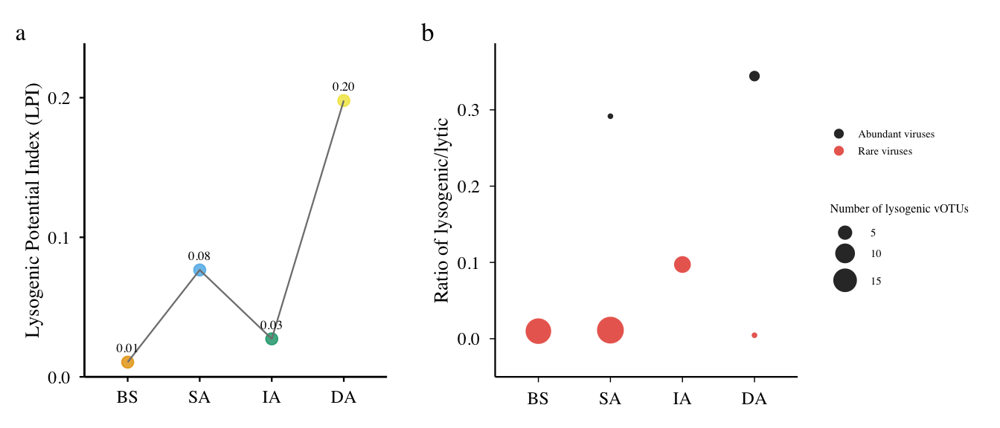

# 08-figs3-lifestyle
Cunli Pan, Jinlong Ru
2025-12-20

- [<span class="toc-section-number">1</span> Tasks](#tasks)
  - [<span class="toc-section-number">1.1</span> Task 1: Load TSE and
    prepare lifestyle data](#task-1-load-tse-and-prepare-lifestyle-data)
  - [<span class="toc-section-number">1.2</span> Task 2: Calculate LPI
    and Abundant/Rare
    ratios](#task-2-calculate-lpi-and-abundantrare-ratios)
  - [<span class="toc-section-number">1.3</span> Task 3: Create and save
    both figures](#task-3-create-and-save-both-figures)

**Updated: 2026-01-29 15:47:25 CET.**

The purpose of this document is to assess viral replication strategies,
quantifying the proportion and distribution of temperate (lysogenic)
versus virulent (lytic) viruses across the aquifer profile.

<details class="code-fold">
<summary>Code</summary>

``` r
suppressPackageStartupMessages({
  library(here)
  library(mia)
  library(tidyverse)
  library(scales)
  library(patchwork)
})

# Load package utility functions
devtools::load_all(here::here())
```

</details>

## Tasks

### Task 1: Load TSE and prepare lifestyle data

<details class="code-fold">
<summary>Code</summary>

``` r
tse <- readRDS(here("data", "01-tse-construction", "tse.rds"))
tpm_matrix <- assay(tse, "tpm")

# Extract sample metadata
sample_metadata <- colData(tse) %>%
  as.data.frame() %>%
  rownames_to_column("sample_id") %>%
  dplyr::select(sample_id, sample_group)

# Extract viral lifestyle annotation
viral_annotation <- rowData(tse) %>%
  as.data.frame() %>%
  rownames_to_column("vOTU_id") %>%
  dplyr::select(vOTU_id, bacphlip_lifestyle) %>%
  mutate(
    lifestyle = case_when(
      bacphlip_lifestyle == "temperate" ~ "lysogenic",
      bacphlip_lifestyle == "lytic" ~ "lytic",
      TRUE ~ NA_character_
    )
  ) %>%
  dplyr::filter(!is.na(lifestyle))

# Convert TPM to long format with lifestyle annotation
tpm_long <- tpm_matrix %>%
  as.data.frame() %>%
  rownames_to_column("vOTU_id") %>%
  pivot_longer(cols = -vOTU_id, names_to = "sample_id", values_to = "TPM") %>%
  dplyr::filter(TPM > 0) %>%
  dplyr::left_join(sample_metadata, by = "sample_id") %>%
  dplyr::left_join(viral_annotation, by = "vOTU_id") %>%
  dplyr::filter(!is.na(lifestyle))

message("TSE loaded: ", nrow(viral_annotation), " vOTUs with lifestyle annotation")
```

</details>

    TSE loaded: 2488 vOTUs with lifestyle annotation

### Task 2: Calculate LPI and Abundant/Rare ratios

<details class="code-fold">
<summary>Code</summary>

``` r
# Calculate LPI (Lysogenic Potential Index)
lifestyle_summary <- tpm_long %>%
  group_by(sample_group, lifestyle) %>%
  summarise(total_TPM = sum(TPM), .groups = "drop")

lpi_data <- lifestyle_summary %>%
  pivot_wider(names_from = lifestyle, values_from = total_TPM, values_fill = 0) %>%
  mutate(
    LPI = lysogenic / (lysogenic + lytic),
    sample_group = factor(sample_group, levels = c("BS", "SA", "IA", "DA"))
  ) %>%
  arrange(sample_group)

# Calculate abundant/rare lifestyle ratios
sample_totals <- tpm_long %>%
  group_by(sample_group) %>%
  summarise(total_TPM = sum(TPM), .groups = "drop")

abundance_rel <- tpm_long %>%
  dplyr::left_join(sample_totals, by = "sample_group", suffix = c("", "_total")) %>%
  mutate(rel_abundance = (TPM / total_TPM) * 100)

# Abundant vOTUs (≥1%)
abundant_data <- abundance_rel %>%
  dplyr::filter(rel_abundance >= 1) %>%
  group_by(sample_group, lifestyle) %>%
  summarise(
    total_rel_abundance = sum(rel_abundance),
    n_vOTUs = n(),
    .groups = "drop"
  ) %>%
  pivot_wider(
    names_from = lifestyle,
    values_from = c(total_rel_abundance, n_vOTUs),
    values_fill = 0
  ) %>%
  mutate(
    ratio = if_else(
      total_rel_abundance_lytic > 0,
      total_rel_abundance_lysogenic / total_rel_abundance_lytic,
      NA_real_
    ),
    n_lysogenic = n_vOTUs_lysogenic,
    category = "Abundant viruses"
  ) %>%
  dplyr::select(sample_group, ratio, n_lysogenic, category)

# Rare vOTUs (<0.1%)
rare_data <- abundance_rel %>%
  dplyr::filter(rel_abundance < 0.1 & rel_abundance > 0) %>%
  group_by(sample_group, lifestyle) %>%
  summarise(
    total_rel_abundance = sum(rel_abundance),
    n_vOTUs = n(),
    .groups = "drop"
  ) %>%
  pivot_wider(
    names_from = lifestyle,
    values_from = c(total_rel_abundance, n_vOTUs),
    values_fill = 0
  ) %>%
  mutate(
    ratio = if_else(
      total_rel_abundance_lytic > 0,
      total_rel_abundance_lysogenic / total_rel_abundance_lytic,
      NA_real_
    ),
    n_lysogenic = n_vOTUs_lysogenic,
    category = "Rare viruses"
  ) %>%
  dplyr::select(sample_group, ratio, n_lysogenic, category)

# Combine abundant and rare data
bubble_data <- bind_rows(abundant_data, rare_data) %>%
  mutate(
    sample_group = factor(sample_group, levels = c("BS", "SA", "IA", "DA")),
    category = factor(category, levels = c("Abundant viruses", "Rare viruses"))
  ) %>%
  dplyr::filter(!is.na(ratio) & ratio > 0)

message("Metrics calculated: LPI and lifestyle ratios")
```

</details>

    Metrics calculated: LPI and lifestyle ratios

### Task 3: Create and save both figures

<details class="code-fold">
<summary>Code</summary>

``` r
# Color schemes
sample_colors <- c(
  "BS" = "#E69F00",
  "SA" = "#56B4E9",
  "IA" = "#009E73",
  "DA" = "#F0E442"
)

category_colors <- c(
  "Abundant viruses" = "#000000",
  "Rare viruses" = "#E74C3C"
)

# FigS3a: LPI Line Plot
p_figs3a <- ggplot(lpi_data, aes(x = sample_group, y = LPI, color = sample_group)) +
  geom_point(size = 5, alpha = 0.8) +
  geom_line(aes(group = 1), color = "gray50", linewidth = 0.8, linetype = "solid") +
  geom_text(
    aes(label = sprintf("%.2f", LPI)),
    vjust = -1.2, size = 4.5, family = "Times", color = "black"
  ) +
  scale_y_continuous(
    limits = c(0, max(lpi_data$LPI, na.rm = TRUE) * 1.15),
    breaks = seq(0, 1, 0.1),
    labels = function(x) sprintf("%.1f", x),
    expand = expansion(mult = c(0, 0.05))
  ) +
  scale_color_manual(values = sample_colors, name = NULL) +
  labs(x = NULL, y = "Lysogenic Potential Index (LPI)") +
  theme_minimal(base_size = 20) +
  theme(
    text = element_text(family = "Times"),
    legend.position = "none",
    panel.grid = element_blank(),
    axis.line = element_line(color = "black", linewidth = 1),
    axis.ticks = element_line(color = "black", linewidth = 0.8),
    axis.text = element_text(color = "black", size = 18),
    axis.title.y = element_text(size = 20, face = "plain"),
    axis.title.x = element_blank(),
    plot.margin = margin(15, 20, 10, 10)
  )

# FigS3b: Bubble Plot
p_figs3b <- ggplot(bubble_data, aes(x = sample_group, y = ratio,
                                     size = n_lysogenic, color = category)) +
  geom_point(alpha = 0.85, shape = 16) +
  scale_y_continuous(
    name = "Ratio of lysogenic/lytic",
    limits = c(-0.05, max(bubble_data$ratio, na.rm = TRUE) * 1.1),
    expand = expansion(mult = c(0, 0.02)),
    breaks = pretty_breaks(n = 5)
  ) +
  scale_size_continuous(
    name = "Number of lysogenic vOTUs",
    breaks = c(1, 5, 10, 15),
    range = c(2, 12)
  ) +
  scale_color_manual(values = category_colors, name = NULL) +
  labs(x = NULL, y = "Ratio of lysogenic/lytic") +
  guides(
    color = guide_legend(override.aes = list(size = 4)),
    size = guide_legend(override.aes = list(color = "black"))
  ) +
  theme_minimal(base_size = 22) +
  theme(
    text = element_text(family = "Times"),
    axis.text = element_text(color = "black", size = 18),
    axis.title.y = element_text(size = 20, face = "plain"),
    axis.title.x = element_blank(),
    axis.line = element_line(color = "black", linewidth = 0.8),
    axis.ticks = element_line(color = "black", linewidth = 0.5),
    legend.position = "right",
    legend.text = element_text(size = 11),
    legend.title = element_text(size = 12),
    panel.grid = element_blank(),
    panel.background = element_rect(fill = "white", color = NA),
    plot.background = element_rect(fill = "white", color = NA),
    plot.margin = margin(15, 15, 15, 15)
  )

# Display combined figure
p_combined <- p_figs3a + p_figs3b + plot_annotation(tag_levels = 'a')
print(p_combined)
```

</details>



<details class="code-fold">
<summary>Code</summary>

``` r
# Save figures
ggsave(path_target("FigS3a_LPI_lineplot.png"), p_figs3a, width = 6, height = 6, dpi = 300)
ggsave(path_target("FigS3b_bubble_lifestyle.png"), p_figs3b, width = 8, height = 6, dpi = 300)
ggsave(path_target("FigS3_combined.png"), p_combined, width = 14, height = 6, dpi = 300)

message("Figures saved: FigS3a, FigS3b, and combined")
```

</details>

    Figures saved: FigS3a, FigS3b, and combined
