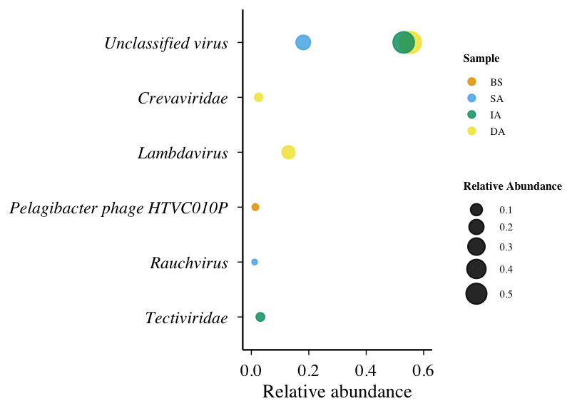
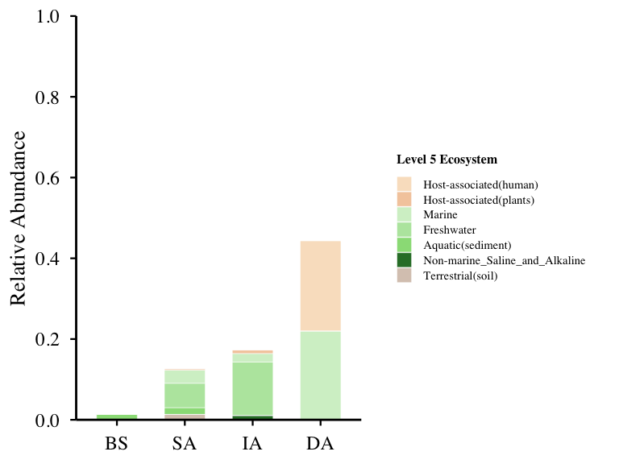
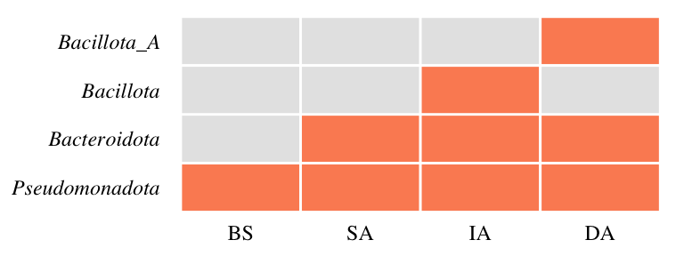

# 09-figs4-abundant-patterns
Cunli Pan, Jinlong Ru
2025-12-20

- [<span class="toc-section-number">1</span> Tasks](#tasks)
  - [<span class="toc-section-number">1.1</span> Task 1: Load
    TSE](#task-1-load-tse)
  - [<span class="toc-section-number">1.2</span> label:
    load-tse](#label-load-tse)
  - [<span class="toc-section-number">1.3</span> Figure S4a: Abundant
    Viral Taxa (Family Level Bubble
    Plot)](#figure-s4a-abundant-viral-taxa-family-level-bubble-plot)
  - [<span class="toc-section-number">1.4</span> Figure S4b - Ecosystem
    Distribution](#figure-s4b---ecosystem-distribution)
  - [<span class="toc-section-number">1.5</span> Task 3: Figure S4c:
    Predicted Bacterial Host of Abundant Viruses
    (Heatmap)](#task-3-figure-s4c-predicted-bacterial-host-of-abundant-viruses-heatmap)

**Updated: 2026-01-29 15:47:42 CET.**

The purpose of this document is to characterize the “abundant
biosphere,” analyzing the distribution patterns, persistence, and host
associations of the most prevalent viral populations.

<details class="code-fold">
<summary>Code</summary>

``` r
suppressPackageStartupMessages({
  library(here)
  library(tidyverse)
  library(data.table)
  library(TreeSummarizedExperiment)
  library(ggplot2)
  library(patchwork)
  library(scales)
  library(forcats)
})

# Load package utility functions
devtools::load_all(here::here())
```

</details>

## Tasks

### Task 1: Load TSE

<details class="code-fold">
<summary>Code</summary>

``` r
tse <- readRDS(path_source("01-tse-construction", "tse.rds"))

# Extract metadata
contig_anno <- metadata(tse)$contig_annotation
imgvr <- metadata(tse)$imgvr_source

message("TSE loaded: ", ncol(tse), " samples, ", nrow(tse), " vOTUs")
```

</details>

    TSE loaded: 4 samples, 2488 vOTUs

### label: load-tse

\#\| message: true

message(“========================================================================”)
message(“Loading TSE object”)
message(“========================================================================”)

### Figure S4a: Abundant Viral Taxa (Family Level Bubble Plot)

<details class="code-fold">
<summary>Code</summary>

``` r
# Extract data from TSE
tpm_mat <- assays(tse)$tpm

family_df <- data.frame(
  vOTU_id = rownames(tse),
  family = as.character(rowData(tse)$family),
  stringsAsFactors = FALSE
)

sample_df <- data.frame(
  sample_id = colnames(tse),
  sample_group = as.character(colData(tse)$sample_group),
  stringsAsFactors = FALSE
)

# Convert to long format and calculate relative abundance
abundance_long <- as.data.frame(tpm_mat) %>%
  rownames_to_column("vOTU_id") %>%
  pivot_longer(cols = -vOTU_id, names_to = "sample_id", values_to = "tpm") %>%
  dplyr::left_join(sample_df, by = "sample_id") %>%
  dplyr::left_join(family_df, by = "vOTU_id")

# Clean family names
abundance_long <- abundance_long %>%
  mutate(
    family = str_remove(family, regex("^(\\[?Family\\]?_?|f__|family_)", ignore_case = TRUE)),
    family = str_trim(family),
    family = if_else(is.na(family) | family == "", "Unclassified virus", family)
  )

# Calculate relative abundance per sample_group
sample_totals <- abundance_long %>%
  group_by(sample_group) %>%
  summarise(total_TPM = sum(tpm, na.rm = TRUE), .groups = "drop")

abundance_rel <- abundance_long %>%
  dplyr::left_join(sample_totals, by = "sample_group") %>%
  mutate(rel_abundance = tpm / total_TPM)

# Identify abundant vOTUs (≥1%)
abundant_vOTUs <- abundance_rel %>%
  dplyr::filter(rel_abundance >= 0.01) %>%
  dplyr::select(sample_group, vOTU_id, family, rel_abundance) %>%
  arrange(sample_group, desc(rel_abundance))

# Prepare plot data
df_sum <- abundant_vOTUs %>%
  group_by(family, sample_group) %>%
  summarise(total_abund = sum(rel_abundance), .groups = "drop")

# Keep top 14 families
top_families <- df_sum %>%
  group_by(family) %>%
  summarise(mean_abund = mean(total_abund), .groups = "drop") %>%
  arrange(desc(mean_abund)) %>%
  slice_head(n = 14) %>%
  pull(family)

df_sum <- df_sum %>%
  dplyr::filter(family %in% top_families) %>%
  mutate(
    sample_group = factor(sample_group, levels = c("BS", "SA", "IA", "DA")),
    family = fct_relevel(family, "Unclassified virus", after = 0)
  )

# Create bubble plot
p_bubble <- ggplot(df_sum, aes(x = total_abund, y = fct_rev(factor(family)), color = sample_group)) +
  geom_point(aes(size = total_abund), alpha = 0.85) +
  scale_size_continuous(
    range = c(2, 10),
    name = "Relative Abundance",
    breaks = pretty(df_sum$total_abund, n = 4)
  ) +
  scale_x_continuous(
    breaks = seq(0, 0.6, by = 0.2),
    limits = c(0, 0.6),
    labels = number_format(accuracy = 0.1)
  ) +
  scale_color_manual(
    values = c("BS" = "#E69F00", "SA" = "#56B4E9", "IA" = "#009E73", "DA" = "#F0E442"),
    name = "Sample"
  ) +
  labs(x = "Relative abundance", y = NULL) +
  theme_minimal(base_size = 22) +
  theme(
    text = element_text(family = "Times"),
    axis.line = element_line(linewidth = 0.8, color = "black"),
    axis.ticks = element_line(linewidth = 0.5, color = "black"),
    panel.grid = element_blank(),
    axis.text.y = element_text(face = "italic", size = 18, color = "black"),
    axis.text.x = element_text(size = 18, color = "black"),
    axis.title.x = element_text(size = 20, face = "plain", color = "black"),
    legend.title = element_text(size = 12, face = "bold"),
    legend.text = element_text(size = 11),
    plot.margin = margin(10, 10, 10, 10)
  )

print(p_bubble)
```

</details>



<details class="code-fold">
<summary>Code</summary>

``` r
# Save
ggsave(path_target("FigS4a_bubble.png"), p_bubble, width = 8.5, height = 6, dpi = 300)
write_csv(df_sum, path_target("FigS4a_bubble_data.csv"))
write_csv(abundant_vOTUs, path_target("FigS4a_abundant_full.csv"))

message("FigS4a completed: ", nrow(abundant_vOTUs), " abundant vOTU-sample pairs")
```

</details>

    FigS4a completed: 60 abundant vOTU-sample pairs

\#\| label: summary \#\| message: true

cat(“========================================================================”)
cat(“FIGURE S4 COMPLETED!”)
cat(“========================================================================”)
cat(“✅ Figure S4a: Abundant Viral Taxa (Bubble Plot)”) cat(” -
Criterion: ≥1% relative abundance per sample group“) cat(” - Display:
Top 14 families“) cat(” - Style: Exactly matching old code“) cat(”“)
cat(”✅ Figure S4b: Ecosystem Distribution (Vertical Bar Chart)“)
cat(” - Criterion: ≥1% relative abundance per sample“) cat(” -
Denominator: Total TPM of ALL viruses“) cat(” - Style: Exactly matching
old code“)
cat(”========================================================================“)

### Figure S4b - Ecosystem Distribution

<details class="code-fold">
<summary>Code</summary>

``` r
# Sample mapping
sample_df <- data.frame(
  sample_id = colnames(tse),
  sample_group = as.character(colData(tse)$sample_group),
  stringsAsFactors = FALSE
)


# Calculate relative abundance per sample
tpm_mat <- assays(tse)$tpm

abundance_long <- as.data.frame(tpm_mat) %>%
  rownames_to_column("vOTU_id") %>%
  pivot_longer(cols = -vOTU_id, names_to = "sample_id", values_to = "TPM") %>%
  dplyr::left_join(sample_df, by = "sample_id")

sample_total_tpm_all <- abundance_long %>%
  group_by(sample_group) %>%
  summarise(total_tpm_all = sum(TPM, na.rm = TRUE), .groups = "drop")

abundance_rel <- abundance_long %>%
  dplyr::left_join(sample_total_tpm_all, by = "sample_group") %>%
  mutate(relative_abundance = TPM / total_tpm_all)

# Identify abundant vOTUs (≥1%)
abundant_votus_list <- abundance_rel %>%
  dplyr::filter(relative_abundance >= 0.01) %>%
  pull(vOTU_id) %>%
  unique()

abundance_abundant <- abundance_rel %>%
  dplyr::filter(vOTU_id %in% abundant_votus_list)

# Extract ecosystem classification
# Using extract_level5_position5() from R/utils.R

imgvr_eco <- imgvr %>%
  dplyr::select(contig_id, eco_class = `Ecosystem classification`) %>%
  mutate(level5 = sapply(eco_class, extract_level5_position5)) %>%
  dplyr::filter(!is.na(level5)) %>%
  dplyr::select(contig_id, level5) %>%
  dplyr::distinct()

# Link ecosystem to vOTUs
data_with_eco <- contig_anno %>%
  dplyr::left_join(imgvr_eco, by = "contig_id") %>%
  dplyr::filter(!is.na(level5))

# Calculate weight for each vOTU (how many ecosystems it belongs to)
votu_eco_count <- data_with_eco %>%
  dplyr::select(vOTU_id, level5) %>%
  dplyr::distinct() %>%
  group_by(vOTU_id) %>%
  summarise(n_ecosystems = dplyr::n_distinct(level5), .groups = "drop")

# Add weight to ecosystem annotations
data_with_eco_weighted <- data_with_eco %>%
  dplyr::select(vOTU_id, level5) %>%
  dplyr::distinct() %>%
  dplyr::left_join(votu_eco_count, by = "vOTU_id") %>%
  mutate(weight = 1 / n_ecosystems)

# Join with abundance data and apply weight
abundance_abundant_eco <- abundance_abundant %>%
  dplyr::inner_join(data_with_eco_weighted, by = "vOTU_id", relationship = "many-to-many") %>%
  mutate(weighted_TPM = TPM * weight)

# Calculate ecosystem abundance using weighted TPM
abundance_by_eco_abundant <- abundance_abundant_eco %>%
  group_by(sample_group, level5) %>%
  summarise(
    level5_tpm = sum(weighted_TPM, na.rm = TRUE),  # ✅ Now using weighted TPM
    n_viruses = dplyr::n_distinct(vOTU_id),
    .groups = "drop"
  )


abundance_by_eco_abundant <- abundance_by_eco_abundant %>%
  dplyr::left_join(sample_total_tpm_all, by = "sample_group") %>%
  mutate(relative_abundance = level5_tpm / total_tpm_all) %>%
  dplyr::select(sample_group, level5, level5_tpm, n_viruses, relative_abundance, total_tpm_all)

# Define Level5 order and colors
level5_order <- c(
  "Host-associated(human)", "Host-associated(plants)", "Host-associated(other)",
  "Marine", "Freshwater", "Aquatic(sediment)", "Non-marine_Saline_and_Alkaline",
  "Terrestrial(soil)", "Terrestrial(other)", "Thermal_springs", "Engineered"
)

host_colors <- c("#F9E2C8", "#F4CCAC", "#C4714F")
water_colors <- c("#D4F0CD", "#B8E6AD", "#99DD87", "#2E7D32")
terrestrial_colors <- c("#D9C9BD", "#6D4C41")
special_colors <- c("#E8E4D8", "#5D4037")
all_colors <- c(host_colors, water_colors, terrestrial_colors, special_colors)
color_map <- setNames(all_colors, level5_order)

# Prepare plot data
plot_data <- abundance_by_eco_abundant %>%
  mutate(
    sample_group = factor(sample_group, levels = c("BS", "SA", "IA", "DA")),
    level5 = factor(level5, levels = level5_order)
  ) %>%
  arrange(sample_group, desc(relative_abundance))

# Create vertical bar chart
fig <- ggplot(plot_data, aes(x = sample_group, y = relative_abundance, fill = level5)) +
  geom_col(position = "stack", width = 0.6, color = "white", linewidth = 0.2) +
  scale_y_continuous(
    limits = c(0, 1),
    breaks = seq(0, 1, 0.2),
    labels = function(x) sprintf("%.1f", x),
    expand = c(0, 0)
  ) +
  scale_fill_manual(
    values = color_map,
    name = "Level 5 Ecosystem",
    breaks = level5_order
  ) +
  labs(x = NULL, y = "Relative Abundance") +
  theme_minimal(base_size = 22) +
  theme(
    text = element_text(family = "Times"),
    axis.text = element_text(color = "black", size = 18),
    axis.title.y = element_text(size = 20, face = "plain"),
    axis.title.x = element_blank(),
    axis.line = element_line(color = "black", linewidth = 1),
    axis.ticks = element_line(color = "black", linewidth = 0.8),
    legend.position = "right",
    legend.text = element_text(size = 11),
    legend.title = element_text(size = 12, face = "bold"),
    legend.key.size = unit(0.5, "cm"),
    panel.grid = element_blank(),
    panel.background = element_rect(fill = "white", color = NA),
    plot.background = element_rect(fill = "white", color = NA),
    plot.margin = margin(15, 20, 10, 10)
  )

print(fig)
```

</details>



<details class="code-fold">
<summary>Code</summary>

``` r
# Save
ggsave(path_target("FigS4b_ecosystem.png"), fig, width = 8, height = 6, dpi = 300)
write_csv(abundance_by_eco_abundant, path_target("FigS4b_ecosystem_data.csv"))

message("FigS4b completed: ", length(abundant_votus_list), " abundant vOTUs")
```

</details>

    FigS4b completed: 60 abundant vOTUs

### Task 3: Figure S4c: Predicted Bacterial Host of Abundant Viruses (Heatmap)

<details class="code-fold">
<summary>Code</summary>

``` r
host_genome <- metadata(tse)$host_genome_edges

CONFIDENCE_THRESHOLD <- 80

host_filtered <- host_genome %>%
  dplyr::filter(Confidence.score >= CONFIDENCE_THRESHOLD) %>%
  mutate(
    Phylum = str_extract(Host.taxonomy, "(?<=p__)[^;]+"),
    Phylum = if_else(is.na(Phylum), "Unclassified", Phylum)
  )

if (!exists("abundant_votus_list")) {
  sample_df <- data.frame(
    sample_id = colnames(tse),
    sample_group = as.character(colData(tse)$sample_group),
    stringsAsFactors = FALSE
  )

  tpm_mat <- assays(tse)$tpm

  abundance_long <- as.data.frame(tpm_mat) %>%
    rownames_to_column("vOTU_id") %>%
    pivot_longer(cols = -vOTU_id, names_to = "sample_id", values_to = "TPM") %>%
    dplyr::left_join(sample_df, by = "sample_id")

  sample_totals <- abundance_long %>%
    group_by(sample_group) %>%
    summarise(total_TPM = sum(TPM, na.rm = TRUE), .groups = "drop")

  abundance_rel <- abundance_long %>%
    dplyr::left_join(sample_totals, by = "sample_group") %>%
    mutate(rel_abundance = TPM / total_TPM)

  abundant_votus_list <- abundance_rel %>%
    dplyr::filter(rel_abundance >= 0.01) %>%
    pull(vOTU_id) %>%
    unique()
}

host_abundant <- host_filtered %>%
  dplyr::filter(vOTU_id %in% abundant_votus_list)

# Calculate weights for multi-Phylum vOTUs
host_count <- host_abundant %>%
  group_by(vOTU_id) %>%
  summarise(n_hosts = dplyr::n_distinct(Phylum), .groups = "drop")

host_weighted <- host_abundant %>%
  dplyr::select(vOTU_id, Phylum) %>%
  dplyr::distinct() %>%
  dplyr::left_join(host_count, by = "vOTU_id") %>%
  mutate(weight = 1 / n_hosts)

sample_df <- data.frame(
  sample_id = colnames(tse),
  sample_group = as.character(colData(tse)$sample_group),
  stringsAsFactors = FALSE
)

tpm_abundant <- as.data.frame(assays(tse)$tpm) %>%
  rownames_to_column("vOTU_id") %>%
  dplyr::filter(vOTU_id %in% abundant_votus_list) %>%
  pivot_longer(cols = -vOTU_id, names_to = "sample_id", values_to = "tpm") %>%
  dplyr::left_join(sample_df, by = "sample_id") %>%
  dplyr::filter(!is.na(sample_group))

host_abundance <- host_weighted %>%
  dplyr::left_join(tpm_abundant, by = "vOTU_id", relationship = "many-to-many")

heatmap_data <- host_abundance %>%
  dplyr::filter(tpm > 0) %>%
  group_by(sample_group, Phylum) %>%
  summarise(
    n_vOTUs_weighted = sum(weight),
    presence = if_else(sum(weight) > 0, 1, 0),
    .groups = "drop"
  )

all_samples <- c("BS", "SA", "IA", "DA")
all_phyla <- unique(host_weighted$Phylum)

heatmap_data_complete <- expand.grid(
  sample_group = all_samples,
  Phylum = all_phyla,
  stringsAsFactors = FALSE
) %>%
  dplyr::left_join(heatmap_data, by = c("sample_group", "Phylum")) %>%
  mutate(
    n_vOTUs_weighted = if_else(is.na(n_vOTUs_weighted), 0, n_vOTUs_weighted),
    presence = if_else(is.na(presence), 0, presence)
  )

phylum_order <- heatmap_data_complete %>%
  group_by(Phylum) %>%
  summarise(total_presence = sum(presence), .groups = "drop") %>%
  arrange(desc(total_presence)) %>%
  pull(Phylum)

heatmap_data_complete <- heatmap_data_complete %>%
  mutate(
    sample_group = factor(sample_group, levels = c("BS", "SA", "IA", "DA")),
    Phylum = factor(Phylum, levels = phylum_order)
  )

p_heatmap <- ggplot(heatmap_data_complete, aes(x = sample_group, y = Phylum)) +
  geom_tile(aes(fill = factor(presence)), color = "white", linewidth = 1) +
  scale_fill_manual(values = c("0" = "gray90", "1" = "#FC8D62"), guide = "none") +
  theme_minimal(base_size = 16) +
  theme(
    text = element_text(family = "Times"),
    axis.text.x = element_text(angle = 0, hjust = 0.5, size = 18, color = "black"),
    axis.text.y = element_text(color = "black", size = 18, face = "italic"),
    axis.title = element_blank(),
    legend.position = "none",
    panel.grid = element_blank(),
    plot.margin = margin(10, 10, 10, 10)
  )

print(p_heatmap)
```

</details>



<details class="code-fold">
<summary>Code</summary>

``` r
ggsave(path_target("FigS4c_host_heatmap.png"), p_heatmap, width = 8, height = 3.0, dpi = 300)
write_csv(heatmap_data_complete, path_target("FigS4c_host_heatmap_data.csv"))

summary_data <- heatmap_data_complete %>%
  group_by(sample_group) %>%
  summarise(
    n_phyla_present = sum(presence > 0),
    n_vOTUs_weighted = sum(n_vOTUs_weighted),
    .groups = "drop"
  )

write_csv(summary_data, path_target("FigS4c_summary.csv"))

message("FigS4c completed: ", dplyr::n_distinct(host_weighted$vOTU_id),
        " abundant vOTUs with host predictions (weighted)")
```

</details>

    FigS4c completed: 26 abundant vOTUs with host predictions (weighted)
