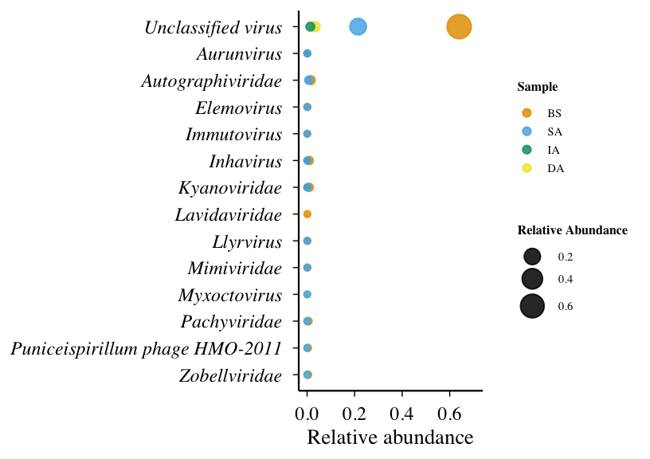
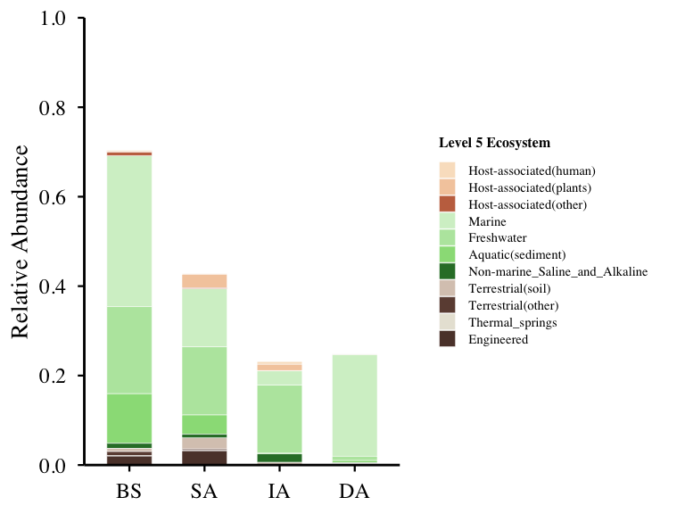

# 10-figs5-rare-patterns
Cunli Pan, Jinlong Ru
2025-12-20

- [<span class="toc-section-number">1</span> Tasks](#tasks)
  - [<span class="toc-section-number">1.1</span> Task 1: Load TSE and
    Extract Metadata](#task-1-load-tse-and-extract-metadata)
  - [<span class="toc-section-number">1.2</span> Task 2: Figure S5a -
    Bubble Plot (Rare)](#task-2-figure-s5a---bubble-plot-rare)
  - [<span class="toc-section-number">1.3</span> Task 3: Figure S5b -
    Ecosystem Distribution](#task-3-figure-s5b---ecosystem-distribution)
  - [<span class="toc-section-number">1.4</span> Task 4: Figure S5c -
    Host Heatmap](#task-4-figure-s5c---host-heatmap)

**Updated: 2026-01-29 15:48:02 CET.**

The purpose of this document is to investigate the “rare biosphere,”
examining the diversity, ecological drivers, and potential persistence
of low-abundance viral populations.

<details class="code-fold">
<summary>Code</summary>

``` r
suppressPackageStartupMessages({
  library(here)
  library(tidyverse)
  library(TreeSummarizedExperiment)
  library(ggplot2)
  library(patchwork)
  library(scales)
})

# Load package utility functions
devtools::load_all(here::here())
```

</details>

## Tasks

### Task 1: Load TSE and Extract Metadata

<details class="code-fold">
<summary>Code</summary>

``` r
tse <- readRDS(path_source("01-tse-construction", "tse.rds"))

contig_anno <- metadata(tse)$contig_annotation
imgvr <- metadata(tse)$imgvr_source

message("TSE loaded: ", ncol(tse), " samples, ", nrow(tse), " vOTUs")
```

</details>

    TSE loaded: 4 samples, 2488 vOTUs

### Task 2: Figure S5a - Bubble Plot (Rare)

<details class="code-fold">
<summary>Code</summary>

``` r
tpm_mat <- assays(tse)$tpm

family_df <- data.frame(
  vOTU_id = rownames(tse),
  family = as.character(rowData(tse)$family),
  stringsAsFactors = FALSE
)

sample_df <- data.frame(
  sample_id = colnames(tse),
  sample_group = as.character(colData(tse)$sample_group),
  stringsAsFactors = FALSE
)

abundance_long <- as.data.frame(tpm_mat) %>%
  rownames_to_column("vOTU_id") %>%
  pivot_longer(cols = -vOTU_id, names_to = "sample_id", values_to = "tpm") %>%
  dplyr::left_join(sample_df, by = "sample_id") %>%
  dplyr::left_join(family_df, by = "vOTU_id")

abundance_long <- abundance_long %>%
  mutate(
    family = str_remove(family, regex("^(\\[?Family\\]?_?|f__|family_)", ignore_case = TRUE)),
    family = str_trim(family),
    family = if_else(is.na(family) | family == "", "Unclassified virus", family)
  )

sample_totals <- abundance_long %>%
  group_by(sample_group) %>%
  summarise(total_TPM = sum(tpm, na.rm = TRUE), .groups = "drop")

abundance_rel <- abundance_long %>%
  dplyr::left_join(sample_totals, by = "sample_group") %>%
  mutate(rel_abundance = tpm / total_TPM)

# Identify RARE vOTUs (< 0.1% = < 0.001)
rare_vOTUs <- abundance_rel %>%
  dplyr::filter(rel_abundance < 0.001 & rel_abundance > 0) %>%
  dplyr::select(sample_group, vOTU_id, family, rel_abundance) %>%
  arrange(sample_group, desc(rel_abundance))

df_sum <- rare_vOTUs %>%
  group_by(family, sample_group) %>%
  summarise(total_abund = sum(rel_abundance), .groups = "drop")

top_families <- df_sum %>%
  group_by(family) %>%
  summarise(mean_abund = mean(total_abund), .groups = "drop") %>%
  arrange(desc(mean_abund)) %>%
  slice_head(n = 14) %>%
  pull(family)

df_sum <- df_sum %>%
  dplyr::filter(family %in% top_families) %>%
  mutate(
    sample_group = factor(sample_group, levels = c("BS", "SA", "IA", "DA")),
    family = forcats::fct_relevel(family, "Unclassified virus", after = 0)
  )

p_bubble <- ggplot(df_sum, aes(x = total_abund, y = forcats::fct_rev(factor(family)), color = sample_group)) +
  geom_point(aes(size = total_abund), alpha = 0.85) +
  scale_size_continuous(
    range = c(2, 10),
    name = "Relative Abundance",
    breaks = pretty(df_sum$total_abund, n = 4)
  ) +
  scale_x_continuous(
    breaks = seq(0, 0.8, by = 0.2),
    limits = c(0, max(df_sum$total_abund) * 1.1),
    labels = number_format(accuracy = 0.1)
  ) +
  scale_color_manual(
    values = c("BS" = "#E69F00", "SA" = "#56B4E9", "IA" = "#009E73", "DA" = "#F0E442"),
    name = "Sample"
  ) +
  labs(x = "Relative abundance", y = NULL) +
  theme_minimal(base_size = 22) +
  theme(
    text = element_text(family = "Times"),
    axis.line = element_line(linewidth = 0.8, color = "black"),
    axis.ticks = element_line(linewidth = 0.5, color = "black"),
    panel.grid = element_blank(),
    axis.text.y = element_text(face = "italic", size = 18, color = "black"),
    axis.text.x = element_text(size = 18, color = "black"),
    axis.title.x = element_text(size = 20, face = "plain", color = "black"),
    legend.title = element_text(size = 12, face = "bold"),
    legend.text = element_text(size = 11),
    plot.margin = margin(10, 10, 10, 10)
  )

print(p_bubble)
```

</details>



<details class="code-fold">
<summary>Code</summary>

``` r
ggsave(path_target("FigS5a_bubble.png"), p_bubble, width = 8.5, height = 6, dpi = 300)
write_csv(df_sum, path_target("FigS5a_bubble_data.csv"))
write_csv(rare_vOTUs, path_target("FigS5a_rare_full.csv"))

message("FigS5a completed: ", nrow(rare_vOTUs), " rare vOTU-sample pairs")
```

</details>

    FigS5a completed: 4301 rare vOTU-sample pairs

### Task 3: Figure S5b - Ecosystem Distribution

<details class="code-fold">
<summary>Code</summary>

``` r
tpm_mat <- assays(tse)$tpm

sample_df <- data.frame(
  sample_id = colnames(tse),
  sample_group = as.character(colData(tse)$sample_group),
  stringsAsFactors = FALSE
)

abundance_long <- as.data.frame(tpm_mat) %>%
  rownames_to_column("vOTU_id") %>%
  pivot_longer(cols = -vOTU_id, names_to = "sample_id", values_to = "TPM") %>%
  dplyr::left_join(sample_df, by = "sample_id")

sample_totals <- abundance_long %>%
  group_by(sample_group) %>%
  summarise(total_TPM = sum(TPM, na.rm = TRUE), .groups = "drop")

abundance_rel <- abundance_long %>%
  dplyr::left_join(sample_totals, by = "sample_group") %>%
  mutate(rel_abundance = TPM / total_TPM)

# Identify RARE vOTUs (< 0.1%)
rare_votus_list <- abundance_rel %>%
  dplyr::filter(rel_abundance < 0.001 & rel_abundance > 0) %>%
  pull(vOTU_id) %>%
  unique()

abundance_rare <- abundance_rel %>%
  dplyr::filter(vOTU_id %in% rare_votus_list)

# Extract ecosystem classification
# Using extract_level5_position5() from R/utils.R

imgvr_eco <- imgvr %>%
  dplyr::select(contig_id, eco_class = `Ecosystem classification`) %>%
  mutate(level5 = sapply(eco_class, extract_level5_position5)) %>%
  dplyr::filter(!is.na(level5)) %>%
  dplyr::select(contig_id, level5) %>%
  dplyr::distinct()

# Link ecosystem to vOTUs (with weighting)
data_with_eco <- contig_anno %>%
  dplyr::left_join(imgvr_eco, by = "contig_id") %>%
  dplyr::filter(!is.na(level5))

# Calculate weights for vOTUs with multiple ecosystems
votu_eco_count <- data_with_eco %>%
  dplyr::select(vOTU_id, level5) %>%
  dplyr::distinct() %>%
  group_by(vOTU_id) %>%
  summarise(n_ecosystems = dplyr::n_distinct(level5), .groups = "drop")

data_with_eco_weighted <- data_with_eco %>%
  dplyr::select(vOTU_id, level5) %>%
  dplyr::distinct() %>%
  dplyr::left_join(votu_eco_count, by = "vOTU_id") %>%
  mutate(weight = 1 / n_ecosystems)

# Join with abundance (many-to-many expected)
abundance_rare_eco <- abundance_rare %>%
  dplyr::inner_join(data_with_eco_weighted, by = "vOTU_id", relationship = "many-to-many") %>%
  mutate(weighted_TPM = TPM * weight)

# Calculate ecosystem abundance (using weighted TPM)
abundance_by_eco_rare <- abundance_rare_eco %>%
  group_by(sample_group, level5) %>%
  summarise(
    level5_tpm = sum(weighted_TPM, na.rm = TRUE),
    n_viruses = dplyr::n_distinct(vOTU_id),
    .groups = "drop"
  )

abundance_by_eco_rare <- abundance_by_eco_rare %>%
  dplyr::left_join(sample_totals, by = "sample_group") %>%
  mutate(relative_abundance = level5_tpm / total_TPM) %>%
  dplyr::select(sample_group, level5, level5_tpm, n_viruses, relative_abundance, total_TPM)

# Define Level5 order and colors
level5_order <- c(
  "Host-associated(human)", "Host-associated(plants)", "Host-associated(other)",
  "Marine", "Freshwater", "Aquatic(sediment)", "Non-marine_Saline_and_Alkaline",
  "Terrestrial(soil)", "Terrestrial(other)", "Thermal_springs", "Engineered"
)

host_colors <- c("#F9E2C8", "#F4CCAC", "#C4714F")
water_colors <- c("#D4F0CD", "#B8E6AD", "#99DD87", "#2E7D32")
terrestrial_colors <- c("#D9C9BD", "#6D4C41")
special_colors <- c("#E8E4D8", "#5D4037")
all_colors <- c(host_colors, water_colors, terrestrial_colors, special_colors)
color_map <- setNames(all_colors, level5_order)

# Prepare plot data
plot_data <- abundance_by_eco_rare %>%
  mutate(
    sample_group = factor(sample_group, levels = c("BS", "SA", "IA", "DA")),
    level5 = factor(level5, levels = level5_order)
  ) %>%
  arrange(sample_group, desc(relative_abundance))

# Create vertical bar chart
fig <- ggplot(plot_data, aes(x = sample_group, y = relative_abundance, fill = level5)) +
  geom_col(position = "stack", width = 0.6, color = "white", linewidth = 0.2) +
  scale_y_continuous(
    limits = c(0, 1),
    breaks = seq(0, 1, 0.2),
    labels = function(x) sprintf("%.1f", x),
    expand = c(0, 0)
  ) +
  scale_fill_manual(
    values = color_map,
    name = "Level 5 Ecosystem",
    breaks = level5_order
  ) +
  labs(x = NULL, y = "Relative Abundance") +
  theme_minimal(base_size = 22) +
  theme(
    text = element_text(family = "Times"),
    axis.text = element_text(color = "black", size = 18),
    axis.title.y = element_text(size = 20, face = "plain"),
    axis.title.x = element_blank(),
    axis.line = element_line(color = "black", linewidth = 1),
    axis.ticks = element_line(color = "black", linewidth = 0.8),
    legend.position = "right",
    legend.text = element_text(size = 11),
    legend.title = element_text(size = 12, face = "bold"),
    legend.key.size = unit(0.5, "cm"),
    panel.grid = element_blank(),
    panel.background = element_rect(fill = "white", color = NA),
    plot.background = element_rect(fill = "white", color = NA),
    plot.margin = margin(15, 20, 10, 10)
  )

print(fig)
```

</details>



<details class="code-fold">
<summary>Code</summary>

``` r
ggsave(path_target("FigS5b_ecosystem.png"), fig, width = 8, height = 6, dpi = 300)
write_csv(abundance_by_eco_rare, path_target("FigS5b_ecosystem_data.csv"))

message("FigS5b completed: ", length(rare_votus_list), " rare vOTUs")
```

</details>

    FigS5b completed: 2355 rare vOTUs

### Task 4: Figure S5c - Host Heatmap

<details class="code-fold">
<summary>Code</summary>

``` r
host_genome <- metadata(tse)$host_genome_edges

CONFIDENCE_THRESHOLD <- 80

host_filtered <- host_genome %>%
  dplyr::filter(Confidence.score >= CONFIDENCE_THRESHOLD) %>%
  mutate(
    Phylum = str_extract(Host.taxonomy, "(?<=p__)[^;]+"),
    Phylum = if_else(is.na(Phylum), "Unclassified", Phylum)
  )

# Use rare vOTU list (from S5a/S5b)
if (!exists("rare_votus_list")) {
  sample_df <- data.frame(
    sample_id = colnames(tse),
    sample_group = as.character(colData(tse)$sample_group),
    stringsAsFactors = FALSE
  )

  tpm_mat <- assays(tse)$tpm

  abundance_long <- as.data.frame(tpm_mat) %>%
    rownames_to_column("vOTU_id") %>%
    pivot_longer(cols = -vOTU_id, names_to = "sample_id", values_to = "TPM") %>%
    dplyr::left_join(sample_df, by = "sample_id")

  sample_totals <- abundance_long %>%
    group_by(sample_group) %>%
    summarise(total_TPM = sum(TPM, na.rm = TRUE), .groups = "drop")

  abundance_rel <- abundance_long %>%
    dplyr::left_join(sample_totals, by = "sample_group") %>%
    mutate(rel_abundance = TPM / total_TPM)

  rare_votus_list <- abundance_rel %>%
    dplyr::filter(rel_abundance < 0.001 & rel_abundance > 0) %>%
    pull(vOTU_id) %>%
    unique()
}

# Filter host predictions for rare vOTUs only
host_rare <- host_filtered %>%
  dplyr::filter(vOTU_id %in% rare_votus_list)

# ============================================================================
# NEW: Calculate weights for vOTUs with multiple Phylum predictions
# ============================================================================

# Step 1: Count how many different Phyla each vOTU has
host_count <- host_rare %>%
  dplyr::select(vOTU_id, Phylum) %>%
  dplyr::distinct() %>%
  group_by(vOTU_id) %>%
  summarise(n_hosts = dplyr::n_distinct(Phylum), .groups = "drop")

# Step 2: Calculate weights (1 / n_hosts)
host_weighted <- host_rare %>%
  dplyr::select(vOTU_id, Phylum) %>%
  dplyr::distinct() %>%
  dplyr::left_join(host_count, by = "vOTU_id") %>%
  mutate(weight = 1 / n_hosts)

# Diagnostic: Check multi-Phylum vOTUs
multi_phylum_votus <- host_count %>% dplyr::filter(n_hosts > 1)
if (nrow(multi_phylum_votus) > 0) {
  message(sprintf("  %d rare vOTUs have predictions for multiple Phyla (weighted)", nrow(multi_phylum_votus)))
} else {
  message("  All rare vOTUs have predictions for only one Phylum")
}
```

</details>

      27 rare vOTUs have predictions for multiple Phyla (weighted)

<details class="code-fold">
<summary>Code</summary>

``` r
# ============================================================================
# Prepare abundance data
# ============================================================================

sample_df <- data.frame(
  sample_id = colnames(tse),
  sample_group = as.character(colData(tse)$sample_group),
  stringsAsFactors = FALSE
)

tpm_rare <- as.data.frame(assays(tse)$tpm) %>%
  rownames_to_column("vOTU_id") %>%
  dplyr::filter(vOTU_id %in% rare_votus_list) %>%
  pivot_longer(cols = -vOTU_id, names_to = "sample_id", values_to = "tpm") %>%
  dplyr::left_join(sample_df, by = "sample_id") %>%
  dplyr::filter(!is.na(sample_group))

# ============================================================================
# Create heatmap data (using WEIGHTED vOTU counts)
# ============================================================================

# Join with weighted host predictions
host_abundance <- host_weighted %>%  # ← Changed: use host_weighted
  dplyr::left_join(tpm_rare, by = "vOTU_id", relationship = "many-to-many")

# Calculate weighted vOTU counts per Phylum
heatmap_data <- host_abundance %>%
  dplyr::filter(tpm > 0) %>%
  group_by(sample_group, Phylum) %>%
  summarise(
    n_vOTUs_weighted = sum(weight),  # ← Changed: use weighted sum
    presence = if_else(sum(weight) > 0, 1, 0),  # ← Changed: based on weighted sum
    .groups = "drop"
  )

# Complete the grid (only rare vOTUs' Phyla)
all_samples <- c("BS", "SA", "IA", "DA")
all_phyla <- unique(host_weighted$Phylum)  # ← Changed: use host_weighted

heatmap_data_complete <- expand.grid(
  sample_group = all_samples,
  Phylum = all_phyla,
  stringsAsFactors = FALSE
) %>%
  dplyr::left_join(heatmap_data, by = c("sample_group", "Phylum")) %>%
  mutate(
    n_vOTUs_weighted = if_else(is.na(n_vOTUs_weighted), 0, n_vOTUs_weighted),  # ← Changed
    presence = if_else(is.na(presence), 0, presence)
  )

# Order phyla by total presence
phylum_order <- heatmap_data_complete %>%
  group_by(Phylum) %>%
  summarise(total_presence = sum(presence), .groups = "drop") %>%
  arrange(desc(total_presence)) %>%
  pull(Phylum)

heatmap_data_complete <- heatmap_data_complete %>%
  mutate(
    sample_group = factor(sample_group, levels = c("BS", "SA", "IA", "DA")),
    Phylum = factor(Phylum, levels = phylum_order)
  )

# Create compact heatmap (horizontal layout)
p_heatmap <- ggplot(heatmap_data_complete, aes(x = sample_group, y = Phylum)) +
  geom_tile(aes(fill = factor(presence)), color = "white", linewidth = 1) +
  scale_fill_manual(
    values = c("0" = "gray90", "1" = "#66C2A5"),
    guide = "none"
  ) +
  theme_minimal(base_size = 16) +
  theme(
    text = element_text(family = "Times"),
    axis.text.x = element_text(angle = 0, hjust = 0.5, size = 18, color = "black"),
    axis.text.y = element_text(color = "black", size = 18, face = "italic"),
    axis.title = element_blank(),
    legend.position = "none",
    panel.grid = element_blank(),
    plot.margin = margin(10, 10, 10, 10)
  )

print(p_heatmap)
```

</details>


<details class="code-fold">
<summary>Code</summary>

``` r
ggsave(path_target("FigS5c_host_heatmap.png"), p_heatmap, width = 8, height = 10, dpi = 300)
write_csv(heatmap_data_complete, path_target("FigS5c_host_heatmap_data.csv"))

summary_data <- heatmap_data_complete %>%
  group_by(sample_group) %>%
  summarise(
    n_phyla_present = sum(presence > 0),
    n_vOTUs_weighted = sum(n_vOTUs_weighted),  # ← Changed: use weighted sum
    .groups = "drop"
  )

write_csv(summary_data, path_target("FigS5c_summary.csv"))

message("FigS5c completed: ", dplyr::n_distinct(host_weighted$vOTU_id),
        " rare vOTUs with host predictions (weighted)")
```

</details>

    FigS5c completed: 640 rare vOTUs with host predictions (weighted)
