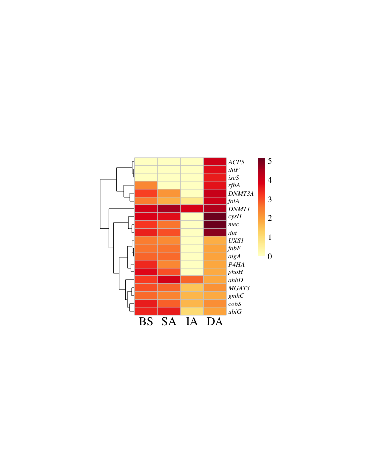

# 11-figS6-amg-DA
Cunli Pan, Jinlong Ru
2025-12-20

- [<span class="toc-section-number">1</span> Tasks](#tasks)
  - [<span class="toc-section-number">1.1</span> Task 1: Plot Top 20 AMG
    Heatmap (Ranked by
    DA)](#task-1-plot-top-20-amg-heatmap-ranked-by-da)

**Updated: 2026-01-29 17:30:50 CET.**

The purpose of this document is to identify differentially abundant
auxiliary metabolic genes (AMGs) across sampling depths, visualizing
their enrichment patterns to infer environment-specific metabolic
adaptations.

<details class="code-fold">
<summary>Code</summary>

``` r
suppressPackageStartupMessages({
  library(here)
  library(tidyverse)
  library(pheatmap)
  library(RColorBrewer)
  library(openxlsx)
})

# Load package utility functions
devtools::load_all(here::here())
```

</details>

    ℹ Loading SwDGVirome

## Tasks

### Task 1: Plot Top 20 AMG Heatmap (Ranked by DA)

<details class="code-fold">
<summary>Code</summary>

``` r
# Read deduplicated pathway table from 05-fig5-heatmap
dedup_path <- path_source("05-fig5-heatmap", "deduplicated_pathway_table.xlsx")

if (!file.exists(dedup_path)) {
  stop("deduplicated_pathway_table.xlsx not found in 05-fig5-heatmap outputs")
}

df <- openxlsx::read.xlsx(dedup_path)

# Clean data (key column names: dbid, vOTU_id, sample_group, TPM, db_desc)
df_clean <- df %>%
  dplyr::select(dbid, vOTU_id, sample_group, TPM, db_desc) %>%
  dplyr::filter(!is.na(dbid), !is.na(sample_group), !is.na(TPM)) %>%
  dplyr::distinct()

message("Clean data: ", nrow(df_clean), " rows")
```

</details>

    Clean data: 992 rows

<details class="code-fold">
<summary>Code</summary>

``` r
# Special gene name mapping (same as Fig5b)
special_map <- tibble::tribble(
  ~dbid, ~gene_symbol,
  "K00525", "nrdA",
  "EC:1.17.4.1", "RNR",
  "K00973", "rfbA",
  "K01710", "rfbB",
  "K00560", "thyA",
  "K01520", "dut",
  "K00558", "DNMT1",
  "K17398", "DNMT3A",
  "K00287", "folA"
)

# Extract gene labels
df_labeled <- df_clean %>%
  dplyr::left_join(special_map, by = "dbid") %>%
  dplyr::mutate(
    auto_label = str_remove_all(db_desc, "\\[.*?\\]") %>%
      str_split(";", simplify = TRUE) %>%
      .[, 1] %>%
      str_trim() %>%
      str_split(",", simplify = TRUE) %>%
      .[, 1] %>%
      str_trim(),
    gene_symbol = if_else(is.na(gene_symbol), auto_label, gene_symbol)
  ) %>%
  dplyr::select(-auto_label)

# Summarize TPM per gene and sample
gene_summary <- df_labeled %>%
  dplyr::group_by(gene_symbol, sample_group) %>%
  dplyr::summarise(Total_TPM = sum(TPM, na.rm = TRUE), .groups = "drop")

# Convert to wide format
gene_matrix <- gene_summary %>%
  tidyr::pivot_wider(names_from = sample_group, values_from = Total_TPM, values_fill = 0)

# Select Top 20 by DA abundance (key difference!)
samples <- c("BS", "SA", "IA", "DA")
available_samples <- intersect(samples, colnames(gene_matrix))

gene_top20_da <- gene_matrix %>%
  dplyr::arrange(desc(DA)) %>%
  dplyr::slice_head(n = 20)

message("Top 20 AMG genes (ranked by DA TPM)")
```

</details>

    Top 20 AMG genes (ranked by DA TPM)

<details class="code-fold">
<summary>Code</summary>

``` r
# log10 transformation
gene_log_matrix_da <- gene_top20_da %>%
  dplyr::select(gene_symbol, all_of(available_samples)) %>%
  tibble::column_to_rownames("gene_symbol") %>%
  dplyr::mutate(across(everything(), ~log10(.x + 1)))

gene_log_matrix_da <- gene_log_matrix_da[, available_samples]

# Set row names to italic format
rownames(gene_log_matrix_da) <- paste0("italic('", rownames(gene_log_matrix_da), "')")

# Color scheme
my_colors <- colorRampPalette(RColorBrewer::brewer.pal(9, "YlOrRd"))(100)

# Plot pheatmap
p_amg_da <- pheatmap::pheatmap(
  gene_log_matrix_da,
  color = my_colors,
  cluster_rows = TRUE,
  cluster_cols = FALSE,
  show_colnames = TRUE,
  show_rownames = TRUE,
  labels_row = parse(text = rownames(gene_log_matrix_da)),
  main = "",
  fontsize_row = 10,
  fontsize_col = 18,
  fontsize = 13,
  fontfamily = "Times",
  angle_col = 0,
  cellwidth = 35,
  cellheight = 12,
  border_color = "gray80"
)
```

</details>



<details class="code-fold">
<summary>Code</summary>

``` r
# Save figures
ggsave(path_target("FigS6_top20_AMG_DA_heatmap.png"),
       plot = p_amg_da, width = 8, height = 10, dpi = 300)
ggsave(path_target("FigS6_top20_AMG_DA_heatmap.pdf"),
       plot = p_amg_da, width = 8, height = 10)

# Save data
write.csv(
  gene_log_matrix_da %>% tibble::rownames_to_column("Gene"),
  path_target("top20_AMG_DA_log10TPM_matrix.csv"),
  row.names = FALSE
)

openxlsx::write.xlsx(
  gene_top20_da,
  path_target("top20_AMG_DA_raw.xlsx"),
  rowNames = FALSE
)

message("✅ FigS6 completed: ", nrow(gene_log_matrix_da), " genes")
```

</details>

    ✅ FigS6 completed: 20 genes
