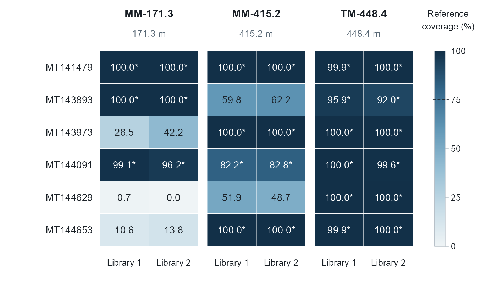

# 12-figs8-public-reference-coverage

2026-09-15

**Updated: 2026-09-15 15:12:18 CET.**

``` r
suppressPackageStartupMessages({
  library(here)
  library(conflicted)
  library(tidyverse)
  library(data.table)
  devtools::load_all()
})
if (!requireNamespace("ragg", quietly = TRUE)) stop("Please install ragg.")
```

## Tasks

### Task 1: Read published coverage records

This QMD redraws published full-reference-contig coverage from an
archived table. It does not rerun nucleotide alignment or read mapping
and does not modify TSE. These external libraries are separate from BS,
SA, IA and DA. Source: Holmfeldt et al. (2021), Communications Biology
4:307, doi:10.1038/s42003-021-01810-1, Supplementary Data 1 (archived
extracted records).

``` r
input_file <- file.path(path_data, "published_reference_coverage.csv")
if (!file.exists(input_file)) stop("Missing input: ", input_file)
coverage <- utils::read.csv(input_file, stringsAsFactors = FALSE, check.names = FALSE)
required <- c("reference_accession", "sample", "contig_coverage_percent", "present_gt75pct")
stopifnot(all(required %in% names(coverage)), !anyNA(coverage[required]))
reference_order <- c("MT141479", "MT143893", "MT143973", "MT144091", "MT144629", "MT144653")
sample_order <- c("MM-171.3_1", "MM-171.3_2", "MM-415.2_1", "MM-415.2_2", "TM-448.4_1", "TM-448.4_2")
stopifnot(nrow(coverage) == 36L,
          setequal(coverage$reference_accession, reference_order),
          setequal(coverage$sample, sample_order),
          !anyDuplicated(paste(coverage$reference_accession, coverage$sample)),
          all(coverage$contig_coverage_percent >= 0 & coverage$contig_coverage_percent <= 100))
detected <- coverage$contig_coverage_percent > 75
stopifnot(all(tolower(as.character(coverage$present_gt75pct)) == tolower(as.character(detected))))
plot_data <- coverage
plot_data$row <- match(plot_data$reference_accession, reference_order)
plot_data$column <- match(plot_data$sample, sample_order)
# Apply the threshold before rounding; asterisks do not represent significance.
plot_data$label <- paste0(sprintf("%.1f", plot_data$contig_coverage_percent), ifelse(detected, "*", ""))
```

### Task 2: Draw the compact heatmap

Titles, source attribution and detection explanations belong in the Word
caption. Keep the original row/column order, percentages, asterisks and
three paired groups.

``` r
panel_width <- 6.85
panel_height <- 4.00
# Blue ramp follows the original figure; endpoints denote 0% and 100%.
colour_ramp <- grDevices::colorRamp(
  c("#EFF4F6", "#C6DCE7", "#95BED4", "#6298B7", "#34688B", "#123048"), space = "rgb")
coverage_colour <- function(x) {
  rgb <- colour_ramp(x / 100)
  grDevices::rgb(rgb[, 1], rgb[, 2], rgb[, 3], maxColorValue = 255)
}
draw_s8 <- function() {
  grid::pushViewport(grid::viewport(gp = grid::gpar(fontfamily = "Arial", col = "#1A2026")))
  on.exit(grid::popViewport())
  left <- .205; bottom <- .13; top <- .82; gap <- .018
  cell_width <- (.645 - 2 * gap) / 6
  cell_height <- (top - bottom) / 6
  centers <- left + (seq_len(6) - .5) * cell_width + rep(0:2, each = 2) * gap
  for (i in seq_len(nrow(plot_data))) {
    d <- plot_data[i, ]
    y <- top - (d$row - .5) * cell_height
    grid::grid.rect(x = centers[d$column], y = y, width = cell_width, height = cell_height,
                    gp = grid::gpar(fill = coverage_colour(d$contig_coverage_percent), col = "white", lwd = .8))
    grid::grid.text(d$label, x = centers[d$column], y = y,
                    gp = grid::gpar(fontsize = 10, col = if (d$contig_coverage_percent >= 75) "white" else "#1A2026"))
  }
  grid::grid.text(reference_order, x = left - .014,
                  y = top - (seq_len(6) - .5) * cell_height, just = "right",
                  gp = grid::gpar(fontsize = 10))
  group_centers <- vapply(1:3, function(i) mean(centers[(2*i-1):(2*i)]), numeric(1))
  grid::grid.text(c("MM-171.3", "MM-415.2", "TM-448.4"), x = group_centers,
                  y = .952, gp = grid::gpar(fontsize = 11, fontface = "bold"))
  grid::grid.text(c("171.3 m", "415.2 m", "448.4 m"), x = group_centers,
                  y = .882, gp = grid::gpar(fontsize = 9.5, col = "#596875"))
  grid::grid.text(rep(c("Library 1", "Library 2"), 3), x = centers, y = .072,
                  gp = grid::gpar(fontsize = 9))
  bar_x <- .905; bar_width <- .022; n <- 256
  bar_y <- bottom + ((seq_len(n) - .5) / n) * (top - bottom)
  grid::grid.rect(x = bar_x, y = bar_y, width = bar_width,
                  height = (top - bottom) / n + .0002,
                  gp = grid::gpar(fill = coverage_colour(seq(0, 100, length.out = n)), col = NA))
  grid::grid.rect(x = bar_x, y = (top + bottom)/2, width = bar_width,
                  height = top - bottom, gp = grid::gpar(fill = NA, col = "#AAB5BE", lwd = .6))
  grid::grid.text("Reference\ncoverage (%)", x = .922, y = .93, gp = grid::gpar(fontsize = 9))
  for (tick in c(0, 25, 50, 75, 100)) {
    y <- bottom + tick / 100 * (top - bottom)
    grid::grid.lines(x = c(bar_x + bar_width/2, bar_x + bar_width/2 + .007), y = c(y, y),
                     gp = grid::gpar(col = "#AAB5BE", lwd = .6))
    grid::grid.text(as.character(tick), x = bar_x + bar_width/2 + .012, y = y,
                    just = "left", gp = grid::gpar(fontsize = 9))
  }
  y75 <- bottom + .75 * (top - bottom)
  grid::grid.lines(x = c(bar_x - bar_width/2 - .003, bar_x + bar_width/2 + .007),
                   y = c(y75, y75), gp = grid::gpar(lty = "dashed", lwd = .8))
}
```

### Task 3: Export Figure S8

``` r
tiff_dir <- path_target("tiff_panels")
preview_dir <- path_target("preview_png")
dir.create(tiff_dir, recursive = TRUE, showWarnings = FALSE)
dir.create(preview_dir, recursive = TRUE, showWarnings = FALSE)
stem <- "FigS8_public_reference_coverage_compact"
save_s8 <- function(filename, tiff = TRUE) {
  if (tiff) {
    ragg::agg_tiff(filename, width = panel_width, height = panel_height, units = "in",
                   res = 600, background = "white", compression = "lzw", bitsize = 8)
  } else {
    ragg::agg_png(filename, width = panel_width, height = panel_height, units = "in",
                  res = 200, background = "white")
  }
  on.exit(grDevices::dev.off(), add = TRUE)
  grid::grid.newpage()
  draw_s8()
}
save_s8(file.path(tiff_dir, paste0(stem, ".tiff")))
save_s8(file.path(preview_dir, paste0(stem, ".png")), tiff = FALSE)
utils::write.csv(plot_data, path_target("FigS8_values_used.csv"), row.names = FALSE)
utils::write.csv(data.frame(file = basename(input_file), md5 = unname(tools::md5sum(input_file))),
                 path_target("FigS8_input_manifest.csv"), row.names = FALSE)
writeLines(capture.output(sessionInfo()), path_target("FigS8_sessionInfo.txt"))
```



## Files written

``` r
projthis::proj_dir_info(path_target(), tz = "CET") %>% knitr::kable()
```

| path                     | type      |  size | modification_time   |
|:-------------------------|:----------|------:|:--------------------|
| FigS8_input_manifest.csv | file      |    83 | 2026-09-15 15:12:24 |
| FigS8_sessionInfo.txt    | file      | 6.83K | 2026-09-15 15:12:24 |
| FigS8_values_used.csv    | file      | 4.31K | 2026-09-15 15:12:24 |
| preview_png              | directory |    96 | 2026-09-15 15:12:24 |
| tiff_panels              | directory |    96 | 2026-09-15 15:12:24 |
